# Backend Architecture

This document describes the rendering backend architecture and the interaction between ivi-homescreen, Flutter Engine, and the underlying graphics APIs.

## Overview

The backend abstraction layer provides multiple rendering implementations:

- **WaylandEglBackend** - OpenGL ES rendering via EGL on Wayland
- **WaylandVulkanBackend** - Vulkan rendering on Wayland  
- **HeadlessBackend** - Software rendering via OSMesa for testing

All backends implement the `Backend` interface defined in `shell/backend/backend.h`.

## Key Components

| Component | File | Purpose |
|-----------|------|---------|
| Backend | `backend.h` | Abstract interface for all backends |
| GlProcessResolver | `gl_process_resolver.cc` | Runtime OpenGL function loader |
| Egl | `wayland_egl/egl.cc` | EGL context and surface management |
| WaylandEglBackend | `wayland_egl/wayland_egl.cc` | EGL backend implementation |
| WaylandVulkanBackend | `wayland_vulkan/wayland_vulkan.cc` | Vulkan backend implementation |
| HeadlessBackend | `headless/headless.cc` | OSMesa software backend |

## Sequence Diagram

The following diagram shows the complete lifecycle including initialization, rendering, and shutdown.

```mermaid
sequenceDiagram
    autonumber
    participant App as ivi-homescreen
    participant Engine as Flutter Engine
    participant Backend as Backend
    participant GL as EGL/OSMesa
    participant VK as Vulkan
    participant Wayland as Wayland

    rect rgb(240, 248, 255)
        Note over App,Wayland: 1. INITIALIZATION
        App->>Wayland: wl_display_connect
        Wayland-->>App: wl_display
        
        alt EGL Backend
            App->>Backend: new WaylandEglBackend
            Backend->>GL: eglGetDisplay + eglInitialize
            Backend->>GL: eglCreateContext x3 main/resource/texture
            Backend->>GL: dlopen libGLESv2 libEGL
        else Vulkan Backend
            App->>Backend: new WaylandVulkanBackend
            Backend->>VK: vkCreateInstance
            Backend->>VK: vkCreateDevice + vkGetDeviceQueue
        else Headless Backend
            App->>Backend: new HeadlessBackend
            Backend->>GL: OSMesaCreateContextExt x3
            Backend->>GL: malloc pixel buffer
        end
    end

    rect rgb(240, 255, 240)
        Note over App,Wayland: 2. SURFACE CREATION
        App->>Wayland: wl_compositor_create_surface
        Wayland-->>App: wl_surface
        App->>Backend: CreateSurface
        
        alt EGL
            Backend->>GL: wl_egl_window_create
            Backend->>GL: eglCreateWindowSurface
        else Vulkan
            Backend->>VK: vkCreateWaylandSurfaceKHR
            Backend->>VK: vkCreateSwapchainKHR
        else Headless
            Note over Backend: No surface needed
        end
    end

    rect rgb(255, 240, 255)
        Note over App,Engine: 3. ENGINE START
        App->>Backend: GetRenderConfig
        
        alt OpenGL config
            Backend-->>App: FlutterRendererConfig type=kOpenGL
            Note right of Backend: make_current clear_current present gl_proc_resolver fbo_callback
        else Vulkan config
            Backend-->>App: FlutterRendererConfig type=kVulkan
            Note right of Backend: get_next_image present_image get_instance_proc_address
        end
        
        App->>Engine: FlutterEngineRun config
        activate Engine
    end

    rect rgb(255, 255, 230)
        Note over Engine,Wayland: 4. RENDER LOOP per frame
        
        alt OpenGL Path
            Engine->>Backend: make_current
            Backend->>GL: eglMakeCurrent OR OSMesaMakeCurrent
            
            Engine->>Backend: fbo_callback
            Backend-->>Engine: 0
            
            Engine->>Backend: gl_proc_resolver glDrawArrays
            Backend->>GL: dlsym OR eglGetProcAddress OR OSMesaGetProcAddress
            Backend-->>Engine: fn_ptr
            
            Engine->>GL: GL draw calls
            
            Engine->>Backend: present_with_info
            Backend->>GL: eglSwapBuffersWithDamage OR glFinish
            GL->>Wayland:
            
            Engine->>Backend: clear_current
            
        else Vulkan Path
            Engine->>Backend: get_next_image_callback
            Backend->>VK: vkAcquireNextImageKHR
            Backend-->>Engine: FlutterVulkanImage
            
            Engine->>VK: vkCmdDraw render commands
            
            Engine->>Backend: present_image_callback
            Backend->>VK: vkQueueSubmit
            Backend->>VK: vkQueuePresentKHR
            VK->>Wayland: 
        end
    end

    rect rgb(230, 255, 255)
        Note over Engine,GL: 5. IO THREAD async resources
        Engine->>Backend: make_resource_current
        alt OpenGL
            Backend->>GL: eglMakeCurrent resource_context
        end
        Engine->>GL: glTexImage2D upload
        Engine->>Backend: clear_current
    end

    rect rgb(255, 245, 238)
        Note over App,Engine: 6. EXTERNAL TEXTURE video/camera
        App->>Backend: TextureMakeCurrent
        Backend->>GL: eglMakeCurrent texture_context
        App->>Engine: RegisterExternalTexture
        Engine->>Backend: gl_external_texture_frame_callback texture_id
        Backend-->>Engine: FlutterOpenGLTexture from registry
    end

    rect rgb(245, 245, 255)
        Note over Wayland,Engine: 7. RESIZE
        Wayland->>App: configure event
        App->>Backend: Resize w h
        alt EGL
            Backend->>GL: wl_egl_window_resize
        else Vulkan
            Backend->>VK: recreate swapchain
        else Headless
            Backend->>GL: realloc buffer
        end
        Backend->>Engine: SetWindowSize
    end

    rect rgb(255, 235, 235)
        Note over App,VK: 8. SHUTDOWN
        App->>Engine: FlutterEngineShutdown
        deactivate Engine
        App->>Backend: destructor
        alt EGL
            Backend->>GL: eglDestroy + eglTerminate
        else Vulkan
            Backend->>VK: vkDestroy swapchain device instance
        else Headless
            Backend->>GL: OSMesaDestroyContext + free buffer
        end
    end
```

## FlutterRendererConfig Callbacks

The backend provides these callbacks to Flutter Engine:

### OpenGL Backend

| Callback | Purpose |
|----------|---------|
| `make_current` | Bind GL context before rendering |
| `clear_current` | Unbind GL context after rendering |
| `present` / `present_with_info` | Swap buffers to display frame |
| `fbo_callback` | Return framebuffer object ID |
| `make_resource_current` | Bind context for IO thread |
| `gl_proc_resolver` | Resolve GL function addresses |
| `gl_external_texture_frame_callback` | Provide external texture data |

### Vulkan Backend

| Callback | Purpose |
|----------|---------|
| `get_instance_proc_address_callback` | Resolve Vulkan functions |
| `get_next_image_callback` | Acquire swapchain image |
| `present_image_callback` | Submit image for presentation |

## Multiple GL Contexts

Each backend creates three separate contexts to support Flutter's multi-threaded architecture:

1. **Main context** - UI thread rendering
2. **Resource context** - IO thread for async resource loading
3. **Texture context** - External texture operations

This separation is required because OpenGL contexts are not thread-safe.
