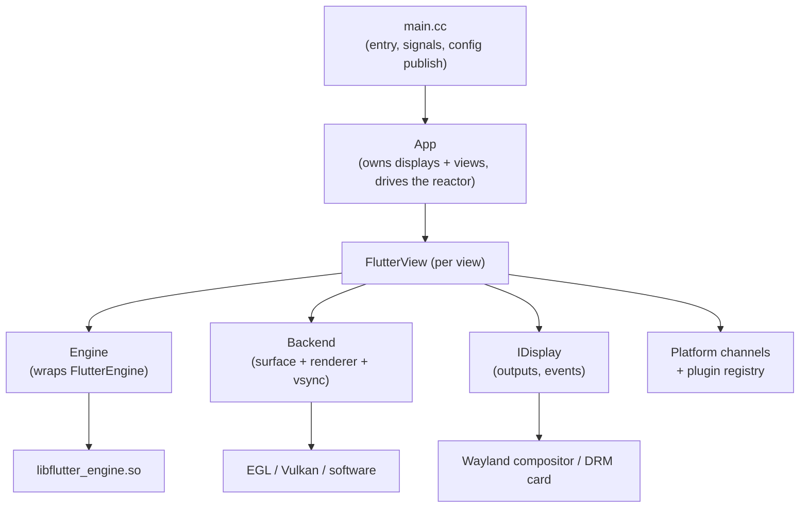

# `ivi-homescreen` Architecture Document

> `ivi-homescreen` is a Flutter embedder (a native "shell" host for the Flutter
> engine) targeting Embedded Linux systems. It loads a Flutter application
> bundle, runs the Flutter engine against a chosen rendering/presentation
> backend (Wayland, DRM/KMS, or software), and bridges the engine to the host's
> displays, input devices, platform channels, and native plugins.

This document describes the *structure* of the code base: the major
subsystems, how they fit together, and where each concern lives on disk. It is
derived from the in-tree code comments and the source itself. For *usage*
(build flags, `config.toml` keys, CLI options), see the
[README](../../README.md); this document intentionally does not repeat the
generated configuration/CLI reference tables.

## Table of Contents

1. [Overview](#1-overview)
2. [Repository Layout](#2-repository-layout)
3. [Core Subsystems](#3-core-subsystems)
   - 3.1. [Process Lifecycle and Startup (`main.cc`)](#31-process-lifecycle-and-startup-maincc)
   - 3.2. [The `App` and the Shared Reactor](#32-the-app-and-the-shared-reactor)
   - 3.3. [The `Engine` Wrapper](#33-the-engine-wrapper)
   - 3.4. [Views (`FlutterView`)](#34-views-flutterview)
   - 3.5. [Configuration](#35-configuration)
   - 3.6. [Task Runner and Threading Model](#36-task-runner-and-threading-model)
4. [Backends (Rendering & Presentation)](#4-backends-rendering--presentation)
   - 4.1. [Wayland-EGL](#41-wayland-egl)
   - 4.2. [Wayland-Vulkan](#42-wayland-vulkan)
   - 4.3. [DRM/KMS-EGL](#43-drmkms-egl)
   - 4.4. [DRM/KMS-Vulkan](#44-drmkms-vulkan)
   - 4.5. [Software](#45-software)
5. [Displays and I/O](#5-displays-and-io)
   - 5.1. [Wayland Integration and Compositor-Protocol Shells](#51-wayland-integration-and-compositor-protocol-shells)
   - 5.2. [Input](#52-input)
   - 5.3. [Vsync and Frame Profiling](#53-vsync-and-frame-profiling)
6. [Platform Channels & Embedder API](#6-platform-channels--embedder-api)
   - 6.1. [Compositor Mode and Platform Views](#61-compositor-mode-and-platform-views)
7. [Additional Features](#7-additional-features)
   - 7.1. [Watchdog](#71-watchdog)
   - 7.2. [Crash Handler](#72-crash-handler)
   - 7.3. [Accessibility](#73-accessibility)
   - 7.4. [Logging and Tracing](#74-logging-and-tracing)
8. [Plugins](#8-plugins)
   - 8.1. [Out-of-tree Plugins](#81-out-of-tree-plugins)
   - 8.2. [The `ihs_shared` Library (Plugin C ABI)](#82-the-ihs_shared-library-plugin-c-abi)
9. [Build System](#9-build-system)

---

## 1. Overview

`ivi-homescreen` embeds the Flutter engine (`libflutter_engine.so`) into a
native C++ host process. The same source runs unchanged on desktop Linux
(Ubuntu 18+, Fedora 33+) and on embedded Yocto images. Its distinguishing
characteristics are:

- **Multiple presentation backends compiled into one binary.** Wayland (EGL or
  Vulkan), DRM/KMS direct-to-display (EGL or Vulkan), a CPU software renderer,
  and leased-DRM variants can all be compiled in together. Exactly one backend
  is *selected at runtime* — process-wide via `--backend`, or per view via
  `[view.backend]` — rather than being fixed at compile time.
- **Multiple views across multiple displays from a single process.** One view
  per application bundle / output, each pinned to a physical connector, laid out
  in a shared pointer coordinate space.
- **A native plugin surface.** A desktop-style plugin registry, a texture
  registry, and a platform-view framework let native code (camera, video, 3D,
  web view, etc.) interoperate with Flutter-rendered content.

The layering, from the outside in:

## 2. Repository Layout

| Path | Contents |
|---|---|
| `shell/` | The embedder itself — all C++ host code (see below). |
| `shell/backend/` | Rendering/presentation backends and the backend registry. |
| `shell/display/` | Display abstraction, DRM/software displays, output management. |
| `shell/view/` | Per-view object, compositor surfaces, layer sequencing. |
| `shell/input/` | Seat, keyboard (xkb), key repeat, DRM/libinput input. |
| `shell/wayland/` | Wayland client (`display`, `window`) and compositor-protocol shells. |
| `shell/configuration/` | `config.toml` / CLI parsing and per-view config layering. |
| `shell/platform/homescreen/` | Flutter embedder client API and platform-channel handlers. |
| `shell/vsync/` | Backend-spanning vsync baton machinery. |
| `shell/profiling/` | Frame profiling, motion-to-photon / present-to-vsync latency. |
| `shell/accessibility/` | Semantics tree and translation to platform accessibility. |
| `shell/logging/` | spdlog-based logger and DLT bridge. |
| `shared/src/` | `ihs_shared` — the C-ABI shared library for out-of-tree FFI plugins. |
| `test/`, `unit-test/`, `integration-test/` | Test harnesses and golden baselines. |
| `scripts/` | Build helpers, config-reference generation, integration test drivers. |

## 3. Core Subsystems

The always-present host machinery: startup, the object graph
(`App` → `FlutterView` → `Engine`), configuration, and the threading model.
The rendering backends (§4) and the platform-facing surface (§6) sit on top of
these.

### 3.1. Process Lifecycle and Startup (`main.cc`)

[`shell/main.cc`](../../shell/main.cc) is the entry point. Its responsibilities,
in order:

1. **Signal handlers.** `SIGINT`/`SIGTERM`/`SIGHUP` are installed with an
   async-signal-safe handler that only flips the global `running` flag and
   writes to a waker eventfd (`MainLoopWaker::SignalWake()`). It deliberately
   does *not* call `exit()` — clean teardown must run on the main thread so the
   DRM backend restores the saved CRTC and the seat restores the VT keyboard
   mode. See [`shutdown_flag.h`](../../shell/shutdown_flag.h) and
   [`main_loop_waker.h`](../../shell/main_loop_waker.h).
2. **Configuration parse.** Command line and `config.toml` files are parsed into
   a vector of `Configuration::Config` (one per view). See §3.5.
3. **Config publish for plugins.** `PublishIhsConfig()` flattens the resolved
   configuration into the `ihs_shared` config store so FFI plugins can read it.
4. **Backend registration and selection.** `RegisterCompiledBackends()`
   populates the process-wide `BackendRegistry`; the active backend key is
   resolved once (env-aware default: a live Wayland session → `wayland-egl`,
   else `drm-kms-egl`). See §4.
5. **Optional subsystems.** The crash handler (§7.2) and watchdog (§7.1) are
   started when compiled in.
6. **`App` construction and `App::Run()`.** Control passes to the main loop
   (§3.2) until `running` is cleared, then destructors unwind cleanly.

### 3.2. The `App` and the Shared Reactor

[`shell/app.{h,cc}`](../../shell/app.h) — `App` is the top-level owner. Given
the parsed configs it:

- **Builds displays.** `BuildDisplays()` creates one `IDisplay` per distinct
  device-context; a homogeneous config set collapses to a single shared display.
  Each view runs on the display for its `(backend, device)`.
- **Builds views.** One `FlutterView` per config (§3.4).
- **Drives a single shared asio reactor.** `Run()` runs one `asio::io_context`
  (the "primary" reactor) on the main thread for *every* backend:
  - Wayland connections register their `{wl-fd, repeat-fd}` onto it so all
    connections stay single-threaded with no per-connection strand.
  - DRM/software displays self-drive their own threads; the reactor runs the
    refresh-rate plugin pump (only while a view needs it, per
    `FlutterView::NeedsPeriodicPump()`) and the shutdown/wake eventfd.
  - An `executor_work_guard` keeps `run()` alive across idle gaps.

`Loop()` is a single-iteration variant retained for tests and diagnostics; it is
not the production loop.

### 3.3. The `Engine` Wrapper

[`shell/engine.{h,cc}`](../../shell/engine.h) — `Engine` wraps a running Flutter
engine instance (`FlutterEngine` via the embedder API). One engine drives one or
more views:

- Constructed with the owning `FlutterView`, an index, engine/Dart-VM command
  line args, the bundle path, accessibility feature flags, and the
  `merge_render_platform` option.
- `Run()` starts the engine against a `FlutterDesktopEngineState`.
- `SetWindowSize()` / pixel-ratio setters push geometry into the engine.
- **Multi-view support.** `AddView()` / `RemoveView()` attach/detach additional
  views (unique, non-zero `view_id`; `0` is the implicit view) so one engine can
  drive several outputs. These are asynchronous (engine reports completion via
  an internal callback) and gracefully error out on engine libraries that
  predate the multi-view API.

### 3.4. Views (`FlutterView`)

[`shell/view/flutter_view.{h,cc}`](../../shell/view/flutter_view.h) — a
`FlutterView` is the unit that ties one Flutter surface to one presentation
target. Each view owns (or references):

- its `Configuration::Config`, index, and `IDisplay`;
- a polymorphic `std::shared_ptr<Backend>` built by `Backend::Create()` (§4);
- an optional `WaylandWindow` (null on DRM/software backends — callers
  null-check `GetWindow()`);
- the platform-channel handlers and, when enabled, the accessibility tree and
  compositor surfaces.

Key responsibilities:

- `Initialize()` wires the backend, engine, and channels.
- `RunTasks()` pumps view/engine tasks.
- `NeedsPeriodicPump()` reports whether the view has work that must be serviced
  at frame cadence (true when compositor-surface plugins are active), which the
  `App` reactor uses to decide whether it may idle.
- `UpdateDisplayMetadata()` re-sends display metrics to the engine when the
  surface scale changes.

Supporting files in `shell/view/`:

- [`present_layer_sequencer.{h,cc}`](../../shell/view/present_layer_sequencer.h)
  — translates the engine's ordered `FlutterLayer**` array into Wayland
  subsurface Z-order operations (`place_above`/`place_below`) without
  destroying/recreating subsurfaces between frames.
- [`compositor_surface.{h,cc}`](../../shell/view/compositor_surface.cc),
  `compositor_surface_interface.h`, `compositor_surface_api.h` — the
  platform-view surface plumbing (§6.1).
- `mutation_stack.h` — accumulates platform-view mutations (clip/transform).

### 3.5. Configuration

[`shell/configuration/configuration.{h,cc}`](../../shell/configuration/configuration.h)
parses `config.toml` (via `tomlplusplus`, exceptions disabled) and the CLI into
a `Configuration::Config` per view. The struct groups process-level fields
(`app_id`, cursor, `wayland_event_mask`, `debug_backend`) and a nested per-view
block (geometry, engine/Dart args, shell type, backend type and DRM/lease knobs,
output binding).

Parameter loading is layered, resolved per view, later layers overriding
earlier ones key-by-key (only `[view.args]` and unmatched CLI options are
additive):

1. built-in defaults,
2. the bundle's own `<bundle>/config.toml`,
3. the `--config` master file's matching `[[view]]` entry (when given),
4. command-line flags (applied process-wide).

All DRM/lease knobs are stored as strings so `Configuration` stays decoupled
from the DRM headers; the backends parse them into their own enums, treating
anything unrecognized as `auto` with a warning. The full key/type/default
reference in the README is generated from this parser by
[`scripts/gen_config_reference.py`](../../scripts/gen_config_reference.py), so it
cannot drift. Runnable per-scenario examples live in
[`docs/config-examples/`](../config-examples/README.md).

### 3.6. Task Runner and Threading Model

[`shell/task_runner.{h,cc}`](../../shell/task_runner.h) — `TaskRunner` backs the
Flutter platform task runner. It owns a single worker thread driving an
`asio::io_context` (with a strand), and exposes `QueueFlutterTask()`,
`QueuePlatformMessage()`, and `QueueUpdateLocales()`. Because the same thread
drives the context, async completion handlers armed against it run on the
`FlutterEngineRun` thread — important for callbacks (e.g. vsync marshaling) that
must run there.

Threading summary:

- **Main thread** runs the shared reactor (§3.2) and Wayland event dispatch.
- **Platform task runner thread** (`TaskRunner`) runs Flutter platform tasks.
- **Raster thread** runs the engine rasterizer; `merge_render_platform` can
  merge it onto the platform thread for single-thread FFI aliasing.
- **DRM/software displays** self-drive their own present threads.

## 4. Backends (Rendering & Presentation)

[`shell/backend/backend.h`](../../shell/backend/backend.h) — `Backend` is the
**unified display-target interface**. One backend instance owns surface
lifecycle, the Flutter renderer/compositor config, and vsync for a single
presentation target. Instances are isolated so heterogeneous backends can run
concurrently.

> Note the naming distinction: a `Backend` (rendering target) is *not* the same
> as a Wayland compositor-protocol *shell* (§5.1, the `--shell` option). The
> concrete backend classes are `WaylandEglBackend`, `WaylandVulkanBackend`,
> `DrmBackend`, `SoftwareBackend`, etc.

**The registry and factory.**

- [`backend_registry.{h,cc}`](../../shell/backend/backend_registry.h) — a
  process-wide table of compiled-in backends. Each `BackendDescriptor` carries a
  registry `key` plus two cohesive factory callables: `make_display` (builds the
  `IDisplay`) and `make_backend` (builds the `Backend` for that display), and an
  optional `list_modes` hook for `--drm-list-modes`. `BackendRegistry` is a
  Meyers singleton; the active descriptor is resolved once at startup and
  read-only thereafter (no locking).
- [`register_backends.{h,cc}`](../../shell/backend/register_backends.cc) —
  `RegisterCompiledBackends()` registers every backend the build enabled.
- `Backend::Create()` (in the shell factory) is the single per-view factory: it
  selects the concrete implementation from the compiled-in set plus the view's
  config, constructs an isolated instance, and performs backend-specific
  post-creation wiring (e.g. DRM cursor/viewport). It fail-fasts on hard
  init failure.

**Plugin GPU sharing.** `backend.h` defines `BackendEglContext` and
`BackendVulkanContext` — handle sets (all `void*` to keep the public header free
of hard EGL/Vulkan includes) that let a plugin create its own EGL context
sharing GL objects with the raster context, or render into a `VkImage` on the
*same* device Flutter renders with (so a platform view's output is a first-class
GPU resource the compositor can import without a cross-API copy).

Each backend lives in its own directory under
[`shell/backend/`](../../shell/backend/) and (except the always-simple software
and leased-DRM/HUD helpers) ships a README with the details that are not obvious
from the source — link targets below rather than transcribed here. Supporting
pieces shared across backends: `gl_process_resolver.{h,cc}` (GL/EGL entry-point
resolution), `backing_store_pool.h` (backing-store reuse), and
[`wayland_leased_drm/`](../../shell/backend/wayland_leased_drm/README.md) (own a
connector leased from a compositor via `drm-lease-v1`) and `hud/` (optional debug
HUD overlay).

### 4.1. Wayland-EGL

EGL + GL ES presenter on a Wayland compositor (pairs `wl_egl_window` with the
optional GL compositor for platform views). The compositor owns the scanout
schedule, so vsync is driven via `wp_presentation_feedback`. Details:
[`shell/backend/wayland_egl/README.md`](../../shell/backend/wayland_egl/README.md).

### 4.2. Wayland-Vulkan

Vulkan presenter on a Wayland compositor (Mesa's `VK_KHR_wayland_surface` WSI
plus the optional Vulkan compositor). Architecturally the same vsync baton dance
as Wayland-EGL, with a present-mode lever and profiler on top. Details:
[`shell/backend/wayland_vulkan/README.md`](../../shell/backend/wayland_vulkan/README.md).

### 4.3. DRM/KMS-EGL

Direct DRM/KMS + GBM + EGL/GLES2 on a bare TTY with no compositor: talks to the
kernel mode-setting driver via `drm-cxx`, opens the DRM device through libseat,
and scans out via the atomic plane allocator or a legacy page-flip fallback.
Details:
[`shell/backend/drm_kms_egl/README.md`](../../shell/backend/drm_kms_egl/README.md).

### 4.4. DRM/KMS-Vulkan

Drives the Flutter Vulkan renderer and presents on hardware KMS planes via
zero-copy dma-buf import. Shares the session/modeset/seat/input stack with
DRM/KMS-EGL; only the renderer and present path differ. Requires
`-DBUILD_COMPOSITOR=ON`. Details:
[`shell/backend/drm_kms_vulkan/README.md`](../../shell/backend/drm_kms_vulkan/README.md).

### 4.5. Software

CPU renderer wiring `FlutterRendererType.kSoftware` to a pluggable
`ISurfaceSink` — no GPU, no Wayland, no Mesa (useful for CI and headless golden
capture). Details:
[`shell/backend/software/README.md`](../../shell/backend/software/README.md).

## 5. Displays and I/O

[`shell/display/idisplay.h`](../../shell/display/idisplay.h) — `IDisplay` is the
event/output abstraction a view runs against: `StartEvents()`/`StopEvents()`/
`PollEvents()`, refresh-rate and buffer-scale queries, cursor activation, and an
optional `IOutputProvider` describing the physical outputs (the `wl_registry` on
Wayland, the card fd on DRM).

Concrete displays and helpers:

- [`drm_display.{h,cc}`](../../shell/display/drm_display.h) — the DRM/KMS display.
- [`software_display.{h,cc}`](../../shell/display/software_display.cc) — the
  software display.
- [`drm_device_resolver.{h,cc}`](../../shell/display/drm_device_resolver.h) —
  rank-picks a DRM device/connector.
- [`drm_mode_list.{h,cc}`](../../shell/display/drm_mode_list.h) — enumerates
  scanout modes (`--drm-list-modes`).
- [`output.{h,cc}`](../../shell/display/output.h),
  [`output_manager.{h,cc}`](../../shell/display/output_manager.h),
  `output_provider.h`, `drm_output_provider.{h,cc}` — the output model.
  `OutputManager::ResolveForView()` binds each view to a physical output *the
  same way for every backend*: it reads the display's `IOutputProvider`, applies
  the `[view.output]` match, and returns the connector / `wl_output` name the
  backend should scan out to. A Wayland compositor connection and a DRM card are
  both treated as "one master domain, N named outputs."
- `scale_policy.h` — buffer-scale policy; `icursor_shape_sink.h` — cursor sink.

### 5.1. Wayland Integration and Compositor-Protocol Shells

[`shell/wayland/`](../../shell/wayland/) holds the Wayland *client* code used by
the Wayland backends:

- [`display.{h,cc}`](../../shell/wayland/display.h) — the `wl_display`
  connection, registry, and global binding.
- [`window.{h,cc}`](../../shell/wayland/window.h) — a top-level `WaylandWindow`
  (owns a `ShellSurface`, applies surface scale, forwards configure events).
- [`input_timestamps.{h,cc}`](../../shell/wayland/input_timestamps.cc) — the
  input-timestamps protocol.
- `protocols/` — generated protocol bindings.

### 9.1 Compositor-protocol shells

[`shell/wayland/shell/`](../../shell/wayland/shell/) selects *how* a surface is
given a role on the compositor (the `--shell` option: `auto|xdg|agl|ivi|simple`).
[`wayland_shell.h`](../../shell/wayland/shell/wayland_shell.h) defines a
`SurfaceRole` enum and a `WindowConfig` with normalized `on_configure`/`on_close`
callbacks, keeping the shell layer independent of `window.h` (avoiding an include
cycle). Each `ShellSurface` installs its protocol's listener internally and
forwards normalized `SurfaceConfigure` events:

- `xdg_shell.{h,cc}` — standard desktop XDG shell.
- `agl_shell.{h,cc}` — AGL compositor roles (`BG`/`PANEL_*`/`NORMAL`).
- `ivi_shell.{h,cc}` — ivi-shell with numeric surface IDs.
- `simple_shell.{h,cc}` — minimal fallback.
- `shells.cc` — shell selection/registration.

### 5.2. Input

[`shell/input/`](../../shell/input/):

- [`iseat.h`](../../shell/input/iseat.h) — the seat abstraction.
- [`drm_seat.{h,cc}`](../../shell/input/drm_seat.h) — libinput/libseat-backed
  seat for the DRM path, including VT keyboard-mode handling.
- [`xkb_keyboard.{h,cc}`](../../shell/input/xkb_keyboard.h) — xkbcommon keymap
  handling.
- [`key_repeater.{h,cc}`](../../shell/input/key_repeater.h) — software key
  repeat driven by the repeat-fd on the reactor.
- [`wake_event_fd.{h,cc}`](../../shell/input/wake_event_fd.cc) — the eventfd used
  to wake the loop.
- `cursor_position_sink.h`, `key_mapping.h` — pointer position sink and keycode
  mapping.

Pointer routing across multiple displays uses a combined coordinate space so a
single cursor follows the pointer between outputs; per-device pointer transforms
(rotation/flip) are configurable for the DRM path.

### 5.3. Vsync and Frame Profiling

[`shell/vsync/ivsync_provider.h`](../../shell/vsync/ivsync_provider.h) —
`IVsyncProvider` is the **backend-spanning vsync baton machinery** shared by
every presentation source (Wayland `wp_presentation`, DRM page-flip/vblank,
software page-flip). The engine hands the embedder an opaque `baton` and expects
exactly one `FlutterEngineOnVsync(baton)` back, marshaled onto the platform task
runner. The park/drain/marshal dance is identical across backends; subclasses
supply only `IsSourcePending()`, `PeriodNs()`, and the source event that calls
`DeliverVsync()`. It handles cold-start safety (a baton parked before the runner
is wired is left parked and drained once the runner arrives).
`wayland_vsync_provider.{h,cc}` is the Wayland implementation.

[`shell/profiling/`](../../shell/profiling/) — `frame_profile.{h,cc}`,
`motion_to_photon.{h,cc}`, and `pv_latency.h` capture frame timing and
present-to-vsync / motion-to-photon latency.

## 6. Platform Channels & Embedder API

[`shell/platform/homescreen/`](../../shell/platform/homescreen/) implements the
Flutter *embedder client API* (the `FlutterDesktop*` surface) plus the standard
platform-channel handlers:

- `flutter_desktop.cc` and the `flutter_desktop_*` headers — engine/view/messenger
  state, texture registrar, plugin registrar.
- `platform_handler.{h,cc}` — the `flutter/platform` channel (system UI, clipboard,
  app-switcher description, etc.).
- `text_input_plugin.{h,cc}` — text input.
- `key_event_handler.{h,cc}`, `keyboard_hook_handler.h`, `key_mapping.{h,cc}` —
  key event routing.
- `mouse_cursor_handler.{h,cc}` — cursor.
- `logging_handler.{h,cc}` — the logging channel.
- `watchdog_plugin.{h,cc}` — the watchdog channel (§7.1).
- `platform_views/` — the platform-view framework (§6.1).
- `client_wrapper/` — the standard Flutter C++ client-wrapper library.
- `public/` — public embedder headers.

The plugin registry is desktop-style and Pigeon-compatible; a texture registry
supports first-party camera/video plugins.

### 6.1. Compositor Mode and Platform Views

Platform views let a plugin-owned native surface be interleaved *between*
Flutter-rendered layers. This has two cooperating parts:

- **Compositor mode (`BUILD_COMPOSITOR=ON`).** The EGL and Vulkan backends wire
  the engine's `FlutterCompositor` backing-store API. A plugin implements
  `ICompositorSurface`
  ([`shell/view/compositor_surface_interface.h`](../../shell/view/compositor_surface_interface.h))
  and registers it with `FlutterView` on the platform-view "create" message
  (`RegisterCompositorSurface`), receiving `OnPresent` on the rasterizer thread.
  The `PresentLayerSequencer` (§3.4) reconciles subsurface Z-order before
  present. With `BUILD_COMPOSITOR_DMABUF_EXPORT=ON` the Vulkan backend exports
  each backing store's memory as a DMA-BUF fd for zero-copy import.
- **Platform-view framework** in
  [`shell/platform/homescreen/platform_views/`](../../shell/platform/homescreen/platform_views/).
  `platform_views_handler.{h,cc}` handles the `flutter/platform_views` channel
  (create/dispose/resize/touch), backed by `platform_view_registry`,
  `platform_view_host`, touch routing (`platform_view_touch`), and DMA-BUF/Vulkan
  import helpers (`dmabuf_vulkan_import`, `egl_dmabuf_import`). The handler's
  design (`AndroidView` compatibility, texture vs. subsurface backing) is
  documented in
  [`platform_views/README.md`](../../shell/platform/homescreen/platform_views/README.md).

Without compositor mode the engine runs single-surface and platform views fall
back to full-screen overlays; existing `wl_subsurface`-based plugins keep working.

## 7. Additional Features

Optional, individually build-gated subsystems.

### 7.1. Watchdog

[`shell/watchdog.{h,cc}`](../../shell/watchdog.h) (built with `BUILD_WATCHDOG=ON`)
monitors the main thread and the Flutter render thread for hangs. If a monitored
source fails to check in within the timeout (default 5 s), the process `abort()`s
to produce a core dump — or, with `BUILD_SYSTEMD_WATCHDOG=ON`, integrates with
systemd via `sd_notify` (`READY=1`, `WATCHDOG=1`, `STOPPING=1`).

Sources are named integer IDs (`WatchdogSource`): `0` = main thread, `1` =
render thread, `3`–`255` available for Dart-side registration. Dart apps use the
`watchdog` platform channel
([`platform/homescreen/watchdog_plugin.{h,cc}`](../../shell/platform/homescreen/watchdog_plugin.cc));
`get_callbacks` returns native `start`/`pet`/`stop` function pointers for
zero-overhead FFI petting on hot paths. Timeout and source names come from the
optional `[watchdog]` config table.

### 7.2. Crash Handler

[`shell/crash_handler.{h,cc}`](../../shell/crash_handler.h) (built with
`BUILD_CRASH_HANDLER=ON`) provides Sentry-native crash handling: it uploads a
minidump for triage. It is configured via the `SENTRY_DSN` environment variable
and the `[sentry]` config table (`release`, `env`, `tags`, `attachments`).

### 7.3. Accessibility

[`shell/accessibility/`](../../shell/accessibility/) (built with
`BUILD_ACCESSIBILITY`) maintains the semantics tree the engine produces:

- `accessibility_tree.{h,cc}` — the semantics node tree per view.
- `semantics_translator.{h,cc}` — translates engine semantics updates into the
  tree. Accessibility feature flags are set per view (`accessibility_features`
  bitmask / `-a`).

### 7.4. Logging and Tracing

[`shell/logging/`](../../shell/logging/) wraps `spdlog` (`logger.hpp`,
`logging.h`). Level is controlled by `SPDLOG_LEVEL` (default `info`). With
`ENABLE_DLT=ON` a DLT bridge routes logs to the DLT daemon for automotive
diagnostics. The logging bridge, together with tracing and the ring registry,
lives in exactly one place at runtime — the `ihs_shared` `.so` (§8.2) — so the
process never ends up with two copies of that state.

## 8. Plugins

Plugins extend the embedder with native capability (camera, video, 3D, web
view, secure storage, …) and interoperate with Flutter content through the
platform-channel registry (§6), the texture registry, and the platform-view
framework (§6.1). There are two flavours.

### 8.1. Out-of-tree Plugins

The first-party plugin set lives in a separate repository,
[`toyota-connected/ivi-homescreen-plugins`](https://github.com/toyota-connected/ivi-homescreen-plugins),
not in this tree. They are pulled into the build either by cloning that repo
into the ivi-homescreen root or by pointing `-DPLUGIN_DIR=<path>` at it, and each
plugin is enabled by its own `BUILD_PLUGIN_*` CMake option (see the
[README](../../README.md) for the full list). Plugins are Pigeon/CPP-compatible
and model themselves after the desktop plugin registry. `DISABLE_PLUGINS=ON`
turns the whole set off.

### 8.2. The `ihs_shared` Library (Plugin C ABI)

[`shared/`](../../shared/) builds `ihs_shared`, a C-ABI shared library that
fronts logging, tracing, platform-view surface negotiation, and configuration
read-back for out-of-tree Dart FFI plugins. Its public headers live in
[`shared/include/ihs/`](../../shared/include/ihs/) (`config.h`, `ihs.h`,
`logging.h`, `platform_view.h`, `platform_view_host.h`, `trace.h`, `format.h`,
`ihs_version.h`); the boundary contract is documented in
[`docs/PLUGIN_ABI.md`](../PLUGIN_ABI.md).

It is intentionally shared-only: a static copy in both the shell and a plugin
would give the process two copies of the logging bridge, ring registry, and
trace sink table. It can also be built standalone (for the CI ABI gate and
consumer smoke tests) without the rest of the tree. `main.cc` publishes the
resolved configuration into it (`PublishIhsConfig`) so plugins read the same
config the shell resolved; keys are flattened names, so extending the set needs
no ABI change.

## 9. Build System

The build is CMake-driven from the top-level
[`CMakeLists.txt`](../../CMakeLists.txt), with modules under
[`cmake/`](../../cmake/) (compiler setup, DRM/KMS detection, Wayland protocol
codegen, packaging, options, docs). Key structural points:

- **Backends are additive, not mutually exclusive.** Every `BUILD_BACKEND_*`
  option may be `ON` together and all selected backends link into one binary;
  the active one is chosen at runtime via the backend registry (§4). At least
  one backend must be enabled or configuration fails. Each backend contributes
  its own renderer config (`Backend::GetRenderConfig` → `kOpenGL`/`kVulkan`/
  `kSoftware`) and loop mode.
- **Feature gating via CMake options.** Compositor mode, DMA-BUF export, crash
  handler, watchdog (+ systemd), accessibility, DLT, LTO, sanitizers, docs, unit
  tests, and each individual plugin are all CMake toggles. See the README for the
  full option list.
- **Compositor-protocol shells** are gated separately (`ENABLE_XDG_CLIENT`,
  `ENABLE_AGL_SHELL_CLIENT`, `ENABLE_IVI_SHELL_CLIENT`, `ENABLE_DRM_LEASE_CLIENT`).
- **Plugins** are out-of-tree (§8.1), referenced by cloning into the repo root
  or via `-DPLUGIN_DIR`.
- **`shared/`** builds independently as `ihs_shared` (§8.2).
- **Sanitizers** (`SANITIZE_ADDRESS`/`MEMORY`/`THREAD`/`UNDEFINED`) are wired
  through `third_party/sanitizers-cmake`.

The generated CLI and configuration reference tables in the README are produced
by [`scripts/gen_config_reference.py`](../../scripts/gen_config_reference.py) from
the binary's `--help` and the parser, and must not be hand-edited.