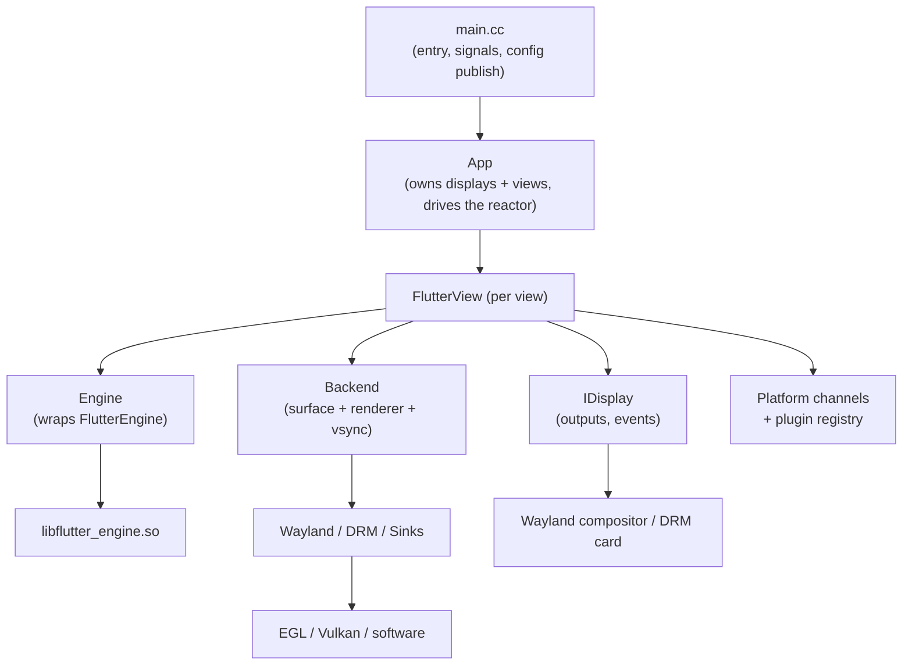

# `ivi-homescreen` Architecture Document

> `ivi-homescreen` is a Flutter embedder (a native "shell" host for the Flutter
> engine) targeting Embedded Linux systems. It loads a Flutter application
> bundle, runs the Flutter engine against a chosen rendering/presentation
> backend (Wayland, DRM/KMS, headless, or software), and bridges the engine to the host's
> displays, input devices, platform channels, and native plugins.

This document describes the *structure* of the code base: the major
subsystems, how they fit together, and where each concern lives on disk. It is
derived from the in-tree code comments and the source itself. For *usage*
(build flags, `config.toml` keys, CLI options), see the
[configuration README](../../shell/configuration/README.md); this document intentionally does not repeat the generated configuration/CLI reference tables.

## Table of Contents

Section order follows the [Repository Layout](#2-repository-layout): the files
directly under `shell/` are covered by [Core Subsystems](#3-core-subsystems);
every other module (each `shell/` subdirectory, plus `shared/`, `test/`, and
`scripts/`) gets its own section or a mention within one.

1. [Overview](#1-overview)
2. [Repository Layout](#2-repository-layout)
3. [Core Subsystems](#3-core-subsystems) — loose files under `shell/`
   - 3.1. [Process Lifecycle and Startup (`main.cc`)](#31-process-lifecycle-and-startup-maincc)
   - 3.2. [The `App` and the Shared Reactor](#32-the-app-and-the-shared-reactor-apphcc)
   - 3.3. [The `Engine` Wrapper](#33-the-engine-wrapper-enginehcc)
   - 3.4. [Task Runner and Threading Model](#34-task-runner-and-threading-model-task_runnerhcc)
4. [Features](#4-features)
    - 4.1. [Configuration](#41-configuration) — `shell/configuration/`
    - 4.2. [Views](#42-views) — `shell/view/`
    - 4.3. [Backends (Rendering & Presentation)](#43-backends-rendering--presentation) — `shell/backend/`
    - 4.4. [Displays and I/O](#44-displays-and-io)
        - 4.4.1. [Displays and Output Management](#441-displays-and-output-management) — `shell/display/`
        - 4.4.2. [Wayland Integration and Compositor-Protocol Shells](#442-wayland-integration-and-compositor-protocol-shells) — `shell/wayland/`
        - 4.4.3. [Input](#443-input) — `shell/input/`
        - 4.4.4. [Vsync](#444-vsync) — `shell/vsync/`
        - 4.4.5. [Frame Profiling](#445-frame-profiling) — `shell/profiling/`
5. [Platform Channels & Embedder API](#5-platform-channels--embedder-api) — `shell/platform/homescreen/`
   - 5.1. [Compositor Mode and Platform Views](#51-compositor-mode-and-platform-views)
6. [Optional Features](#6-optional-features)
   - 6.1. [Watchdog](#61-watchdog) — `shell/watchdog/`
   - 6.2. [Crash Handler](#62-crash-handler) — `shell/crash_handler/`
   - 6.3. [Accessibility](#63-accessibility) — `shell/accessibility/`
      - 6.3.1. [AccessKit](#631-accesskit)
      - 6.3.2. [MCP Surface](#632-mcp-surface)
   - 6.4. [Logging and Tracing](#64-logging-and-tracing) — `shell/logging/`
   - 6.5. [OSGi Multi-Bundle Framework](#65-osgi-multi-bundle-framework) — `shell/osgi/`
7. [Plugins](#7-plugins)
    - 7.1. [Out-of-tree Plugins](#71-out-of-tree-plugins)
    - 7.2. [The `ihs_shared` Library (Plugin C ABI)](#72-the-ihs_shared-library-plugin-c-abi) — `shared/`
    - 7.3. [Location Service](#73-location-service) — `shared/src/location/`
8. [Testing](#8-testing) — `test/`
9. [Build System](#9-build-system) — `scripts/`, `cmake/`
   - 9.1. [Sanitizer Support](#91-sanitizer-support)

---

## 1. Overview

`ivi-homescreen` embeds the Flutter engine (`libflutter_engine.so`) into a
native C++ host process. The same source runs unchanged on desktop Linux
(Ubuntu 20.04+, Fedora 42+) and on embedded Yocto images. Its distinguishing
characteristics are:

- **Multiple presentation backends compiled into one binary.** Wayland (EGL or
  Vulkan), DRM/KMS direct-to-display (EGL or Vulkan), headless (EGL or Vulkan,
  no display), a CPU software renderer, and leased-DRM variants can all be
  compiled in together. Exactly one backend
  is *selected at runtime* — process-wide via `--backend`, or per view via
  `[view.backend]` — rather than being fixed at compile time.
- **Multiple views across multiple displays from a single process.** One view
  per application bundle / output, each pinned to a physical connector, laid out
  in a shared pointer coordinate space.
- **A native plugin surface.** A desktop-style plugin registry, a texture
  registry, and a platform-view framework let native code (camera, video, 3D,
  web view, etc.) interoperate with Flutter-rendered content.

The layering, from the outside in:

## 2. Repository Layout

| Path | Contents |
|---|---|
| `shell/` | Core subsystems (see below). |
| `shell/accessibility/` | Per-view semantics tree, semantics action encoding, AccessKit consumer. |
| `shell/backend/` | Backend registry, factory and base classes. |
| `shell/backend/wayland_egl/` | Wayland-EGL backend. |
| `shell/backend/wayland_vulkan/` | Wayland-Vulkan backend. |
| `shell/backend/wayland_leased_drm/` | drm-lease-v1 client. |
| `shell/backend/drm_kms_egl/` | DRM/KMS-EGL backend. |
| `shell/backend/drm_kms_vulkan/` | DRM/KMS-Vulkan backend. |
| `shell/backend/headless_egl/` | Headless EGL backend (no display; NV12 dma-buf out). |
| `shell/backend/headless_vulkan/` | Headless Vulkan backend (no display; dma-buf export). |
| `shell/backend/software/` | Software-renderer backend. |
| `shell/backend/hud/` | Optional debug HUD overlay. |
| `shell/configuration/` | `config.toml` / CLI parsing and per-view config layering. |
| `shell/crash_handler/` | Sentry crash handler. |
| `shell/display/` | Display abstraction, DRM/software displays, output management. |
| `shell/input/` | Seat, keyboard (xkb), key repeat, DRM/libinput input. |
| `shell/logging/` | Process-wide default context for shell log lines. |
| `shell/osgi/` | OSGi multi-bundle framework. |
| `shell/platform/homescreen/` | Flutter embedder client API and platform-channel handlers. |
| `shell/profiling/` | Frame profiling, motion-to-photon / present-to-vsync latency. |
| `shell/view/` | Per-view object, compositor surfaces, layer sequencing. |
| `shell/vsync/` | Backend-spanning vsync baton machinery. |
| `shell/watchdog/` | Main and render thread hang watchdog. |
| `shell/wayland/` | Wayland client (`display`, `window`) and compositor-protocol shells. |
| `shell/wayland/protocols/` | Vendored Wayland protocol XML; the rest comes from the system `wayland-protocols` package. |
| `shared/src/` | `ihs_shared` — the C-ABI shared library for out-of-tree FFI plugins. |
| `shared/src/location/` | Location service (§7.3). |
| `packages/` | Dart packages (`ihs_mcp_app_tools`). |
| `examples/` | Example applications (`cockpit_demo`). |
| `docs/` | Plugin ABI, platform-view negotiation and MCP docs; Sphinx sources. |
| `test/` | Test harnesses and golden baselines. |
| `scripts/` | Build helpers, config-reference generation, integration test drivers. |
| `cmake/` | CMake modules (§9). |

## 3. Core Subsystems

<!-- loose files directly under `shell/` -->

The always-present host machinery: startup, the object graph
(`App` → `FlutterView` → `Engine`), configuration, and the threading model.
The rendering backends (§4.3) and the platform-facing surface (§5) sit on top of
these.

### 3.1. Process Lifecycle and Startup (`main.cc`)

[`shell/main.cc`](../../shell/main.cc) is the entry point. Its responsibilities,
in order:

1. **Signal handlers.** `SIGINT`/`SIGTERM`/`SIGHUP` are installed with an
   async-signal-safe handler that only flips the global `running` flag and
   writes to a waker eventfd (`MainLoopWaker::SignalWake()`). It deliberately
   does *not* call `exit()` — clean teardown must run on the main thread so the
   DRM backend restores the saved CRTC and the seat restores the VT keyboard
   mode. See [`shutdown_flag.h`](../../shell/shutdown_flag.h) and
   [`main_loop_waker.h`](../../shell/main_loop_waker.h).
2. **Configuration parse.** Command line and `config.toml` files are parsed into
   a vector of `Configuration::Config` (one per view). See §4.1.
3. **Config publish for plugins.** `PublishIhsConfig()` flattens the resolved
   configuration into the `ihs_shared` config store so FFI plugins can read it.
4. **Backend registration and selection.** `RegisterCompiledBackends()`
   populates the process-wide `BackendRegistry`; the active backend key is
   resolved once (env-aware default: a live Wayland session → `wayland-egl`,
   else `drm-kms-egl`). See §4.3.
5. **Optional subsystems.** The crash handler (§6.2) and watchdog (§6.1) are
   started when compiled in.
6. **`App` construction and `App::Run()`.** Control passes to the main loop
   (§3.2) until `running` is cleared, then destructors unwind cleanly.

### 3.2. The `App` and the Shared Reactor (`app.{h,cc}`)

[`shell/app.{h,cc}`](../../shell/app.h) — `App` is the top-level owner. Given
the parsed configs it:

- **Builds displays.** `BuildDisplays()` creates one `IDisplay` per distinct
  device-context; a homogeneous config set collapses to a single shared display.
  Each view runs on the display for its `(backend, device)`.
- **Builds views.** One `FlutterView` per config (§3.4).
- **Drives a single shared asio reactor.** `Run()` runs one `asio::io_context`
  (the "primary" reactor) on the main thread for *every* backend:
  - Wayland connections register their `{wl-fd, repeat-fd}` onto it so all
    connections stay single-threaded with no per-connection strand.
  - DRM/software displays self-drive their own threads; the reactor runs the
    refresh-rate plugin pump (only while a view needs it, per
    `FlutterView::NeedsPeriodicPump()`) and the shutdown/wake eventfd.
  - An `executor_work_guard` keeps `run()` alive across idle gaps.

`Loop()` is a single-iteration variant retained for tests and diagnostics; it is
not the production loop.

### 3.3. The `Engine` Wrapper (`engine.{h,cc}`)

[`shell/engine.{h,cc}`](../../shell/engine.h) — `Engine` wraps a running Flutter
engine instance (`FlutterEngine` via the embedder API). One engine drives one or
more views:

- Constructed with the owning `FlutterView`, an index, engine/Dart-VM command
  line args, the bundle path, accessibility feature flags, and the
  `merge_render_platform` option.
- `Run()` starts the engine against a `FlutterDesktopEngineState`.
- `SetWindowSize()` / pixel-ratio setters push geometry into the engine.
- **Multi-view support.** `AddView()` / `RemoveView()` attach/detach additional
  views (unique, non-zero `view_id`; `0` is the implicit view) so one engine can
  drive several outputs. These are asynchronous (engine reports completion via
  an internal callback) and gracefully error out on engine libraries that
  predate the multi-view API.

### 3.4. Task Runner and Threading Model (`task_runner.{h,cc}`)

[`shell/task_runner.{h,cc}`](../../shell/task_runner.h) — `TaskRunner` backs the
Flutter platform task runner. It owns a single worker thread driving an
`asio::io_context` (with a strand), and exposes `QueueFlutterTask()`,
`QueuePlatformMessage()`, and `QueueUpdateLocales()`. Because the same thread
drives the context, async completion handlers armed against it run on the
`FlutterEngineRun` thread — important for callbacks (e.g. vsync marshaling) that
must run there.

Threading summary:

- **Main thread** runs the shared reactor (§3.2) and Wayland event dispatch.
- **Platform task runner thread** (`TaskRunner`) runs Flutter platform tasks.
- **Raster thread** runs the engine rasterizer; `merge_render_platform` can
  merge it onto the platform thread for single-thread FFI aliasing.
- **DRM/software displays** self-drive their own present threads.

Other loose files under `shell/` covered by this section:
`main_loop_waker.{h,cc}` and `shutdown_flag.h` (§3.1),
`stats.{h,cc}` and `timer.{h,cc}` (profiling helpers, §4.4.5),
`libflutter_engine.{h,cc}` and `shared_library.h` (engine `.so` loader, §3.3),
`cursor_kind.h`, `hexdump.h`, `handler_priority_queue.h`, and `utils.h`.

## 4. Features

<!-- dedicated code units with their own separate documentation -->
<!-- for each feature only a brief description (focusing on why & how) and a link to the relevant README.md should be included. Don't go into specifying the files of the code unit, the API, etc. - delegate implementation details to the relevant READMEs -->

The subsystems that build on the core machinery to present a Flutter application:
per-view configuration, the view object, the rendering backends, and the
displays / I/O they scan out to. Each has its own README; the summaries below
say only *why* the feature exists and *how* it fits in.

Implementation details, configuration options, and subsystem-specific usage
belong in the linked README files. This document is the system-level map of how
those components work together.

### 4.1. Configuration

Turns the command line and one or more `config.toml` files into the per-view
configuration every other subsystem reads, so there is a single, predictable
place where CLI flags, bundle TOML, a master `--config` file, environment
variables, and built-in defaults are layered into a final answer.

Details: [`shell/configuration/README.md`](../../shell/configuration/README.md).

### 4.2. Views

A view is the unit that ties one Flutter surface to one presentation target, so
a single process can drive several independent views (one per bundle / output).
It owns the view's configuration, its backend (§4.3), and the platform-channel
handlers (§5); `App` builds one per config (§3.2) and `Engine` (§3.3) drives it.

Details: [`shell/view/README.md`](../../shell/view/README.md).

### 4.3. Backends (Rendering & Presentation)

A backend is the unified display-target interface: one instance owns surface
lifecycle, the Flutter renderer/compositor config, and vsync for a single
target. Backends are isolated so heterogeneous targets can run concurrently, and
the active one is chosen at runtime from the compiled-in set — which is what lets
Wayland, DRM/KMS, headless and software support all ship in one binary (§9).

**Backends:**
- [wayland_egl](../../shell/backend/wayland_egl/README.md)
- [wayland_vulkan](../../shell/backend/wayland_vulkan/README.md)
- [wayland_leased_drm](../../shell/backend/wayland_leased_drm/README.md)
- [drm_kms_egl](../../shell/backend/drm_kms_egl/README.md)
- [drm_kms_vulkan](../../shell/backend/drm_kms_vulkan/README.md)
- [headless_egl](../../shell/backend/headless_egl/README.md)
- [headless_vulkan](../../shell/backend/headless_vulkan/README.md)
- [software](../../shell/backend/software/README.md)

Also, a [HUD overlay](../../shell/backend/hud/README.md) backend is available for debugging and profiling.

### 4.4. Displays and I/O

#### 4.4.1. Displays and Output Management

Abstracts the event/output source a view runs against (a Wayland compositor
connection or a DRM card) so every backend binds a view to a physical output the
same way — "one master domain, N named outputs" — which is what makes uniform
multi-display layout possible across backends.

Details: [`shell/display/README.md`](../../shell/display/README.md).

#### 4.4.2. Wayland Integration and Compositor-Protocol Shells

The Wayland client code the Wayland backends use to connect, create a surface,
and have the compositor assign it a role. The role is selected by the `--shell`
option (`auto|xdg|agl|ivi|simple`) so the same binary runs under a desktop
compositor, an AGL/ivi automotive compositor, or a minimal one. Vendored
protocol XML lives in [`shell/wayland/protocols/`](../../shell/wayland/protocols/);
the rest comes from the system `wayland-protocols` package, and
`wayland-cxx-scanner` generates the C++ bindings into the build tree (§9).

Code: [`shell/wayland/`](../../shell/wayland/) (client) and
[`shell/wayland/shell/`](../../shell/wayland/shell/) (compositor-protocol shells);
no README yet.

#### 4.4.3. Input

Consumes host input (`libinput` on DRM, Wayland seats otherwise), including seat
discovery and keyboard repeat, and forwards it to the engine as Flutter events —
the single place raw device input is turned into Flutter input.

Details: [`shell/input/README.md`](../../shell/input/README.md).

#### 4.4.4. Vsync

The backend-spanning vsync baton machinery shared by every presentation source,
so the engine's frame pacing is driven the same way whether frames are presented
by a Wayland compositor, a DRM page-flip, or the software path.

Details: [`shell/vsync/README.md`](../../shell/vsync/README.md).

#### 4.4.5. Frame Profiling

Captures frame timing and present-to-vsync / motion-to-photon latency, to make
the embedder's presentation performance measurable on real hardware.

Details: [`shell/profiling/README.md`](../../shell/profiling/README.md).

## 5. Platform Channels & Embedder API

[`shell/platform/homescreen/`](../../shell/platform/homescreen/) implements the
Flutter *embedder client API* (the `FlutterDesktop*` surface) plus the standard
platform-channel handlers. The plugin registry is desktop-style and Pigeon-compatible; a texture registry supports first-party camera/video plugins.

### 5.1. Compositor Mode and Platform Views

Platform views let a plugin-owned native surface be interleaved *between*
Flutter-rendered layers. Without compositor mode the engine runs single-surface and platform views fall
back to full-screen overlays; existing `wl_subsurface`-based plugins keep working.

Included via `BUILD_COMPOSITOR=ON` CMake option. (default: `OFF`)

Details:
- Compositor: [`shell/view/README.md`](../../shell/view/README.md)
- Platform views: [`shell/platform/homescreen/platform_views/README.md`](../../shell/platform/homescreen/platform_views/README.md)
- Surface kinds and renegotiation: [`docs/PLATFORM_VIEW_NEGOTIATION.md`](../PLATFORM_VIEW_NEGOTIATION.md)

## 6. Optional Features

Below you will find optional, individually build-gated subsystems:

### 6.1. Watchdog

[`shell/watchdog/`](../../shell/watchdog/watchdog.h) monitors the main thread and the Flutter render thread for hangs. If a monitored
source fails to check in within the timeout (default 5 s), the process `abort()`s
to produce a core dump — or, with `BUILD_SYSTEMD_WATCHDOG=ON`, integrates with
systemd via `sd_notify` (`READY=1`, `WATCHDOG=1`, `STOPPING=1`).

Sources are named integer IDs (`WatchdogSource`): `0` = main thread, `1` =
render thread, `3`–`255` available for Dart-side registration. Dart apps use the
`watchdog` platform channel
([`platform/homescreen/watchdog_plugin.{h,cc}`](../../shell/platform/homescreen/watchdog_plugin.cc));
`get_callbacks` returns native `start`/`pet`/`stop` function pointers for
zero-overhead FFI petting on hot paths. Timeout and source names come from the
optional `[watchdog]` config table.

Included via `BUILD_WATCHDOG=ON` CMake option. (default: `OFF`)

Details: [`shell/watchdog/README.md`](../../shell/watchdog/README.md).

### 6.2. Crash Handler

A `sentry-native` integration optionally available for crash reporting: [`shell/crash_handler/crash_handler.{h,cc}`](../../shell/crash_handler/crash_handler.h)

It uploads a crash report for triage.

Included via `BUILD_CRASH_HANDLER=ON` CMake option. (default: `OFF`)

Details: [`shell/crash_handler/README.md`](../../shell/crash_handler/README.md).

### 6.3. Accessibility

The accessibility subsystem translates the Flutter semantics tree
(`FlutterEngineUpdateSemantics`) into an in-process accessibility tree per view
and publishes it through the semantics hub in `ihs_shared` (`ihs_semantics.h`).
The hub feeds the two consumers below.

Included via `BUILD_ACCESSIBILITY=ON` CMake option. (default: `OFF`)

Code: [`shell/accessibility/`](../../shell/accessibility/); no README yet.

#### 6.3.1. AccessKit

Exposes every application's semantics to screen readers over AT-SPI, through
AccessKit's Unix adapter. The build does not fetch the AccessKit C bindings;
point CMake at an unpacked `accesskit-c` release.

Included via `BUILD_ACCESSKIT=ON` CMake option, which requires
`BUILD_ACCESSIBILITY=ON`. (default: `OFF`)

#### 6.3.2. MCP Surface

Lets an external agent (an LLM, a test harness) read the semantics tree of every
running application and act on it over the Model Context Protocol: generic verbs
over the tree (`ui_query`, `ui_tap`, `ui_set_text`, `ui_scroll_to`, `ui_tap_at`,
…) plus typed tools an application declares from Dart
([`ihs_mcp_app_tools`](../../packages/ihs_mcp_app_tools/README.md)). The server
lives in `ihs_shared` and listens on a Unix domain socket only, checked with
`SO_PEERCRED`.

Off unless enabled twice: `BUILD_MCP=ON` at build time, which requires
`BUILD_ACCESSIBILITY=ON` (default: `OFF`), and `global.enable_mcp` at runtime.

Details: [`docs/mcp-security.md`](../mcp-security.md),
[`docs/mcp-remote-access.md`](../mcp-remote-access.md). Example:
[`examples/cockpit_demo/`](../../examples/cockpit_demo/README.md).

### 6.4. Logging and Tracing

[`shell/logging`](../../shell/logging/README.md) sets the process-wide default context
for shell log lines. The logging bridge, tracing, DLT support and the ring registry live in
exactly one place at runtime — the `ihs_shared` `.so` (§7.2) — so the process
never ends up with two copies of that state.

Details: [`shell/logging/README.md`](../../shell/logging/README.md).

### 6.5. OSGi Multi-Bundle Framework

Runs several Flutter bundles in one process as independently managed bundles,
with an OSGi lifecycle, a shared service registry and a Dart-side framework
isolate. A startup orchestrator brings bundles up as views in priority order,
critical bundles first; a bundle reports itself ready by completing the
`dev.osgi/bridge` handshake. Bundles are declared in the `[osgi]` /
`[[osgi.bundles]]` config tables. Requires the dynamically linked Dart API
(`dart_api_dl`). With `ENABLE_OSGI=OFF` no OSGi code is compiled.

Included via `ENABLE_OSGI=ON` CMake option. (default: `OFF`)

Code: [`shell/osgi/`](../../shell/osgi/); no README yet.

## 7. Plugins

Plugins extend the embedder with native capability (camera, video, 3D, web
view, secure storage, …) and interoperate with Flutter content through the
platform-channel registry (§5), the texture registry, and the platform-view
framework (§5.1).

### 7.1. Out-of-tree Plugins

The first-party plugin set lives in a separate repository,
[`toyota-connected/ivi-homescreen-plugins`](https://github.com/toyota-connected/ivi-homescreen-plugins),
not in this tree. Plugins are pulled into the build by cloning that repo into the
ivi-homescreen root or by pointing `-DPLUGINS_DIR=<path>` at it, and each is
enabled by its own `BUILD_PLUGIN_*` CMake option (`DISABLE_PLUGINS=ON` turns the
whole set off). They are Pigeon/CPP-compatible and model themselves after the
desktop plugin registry (§5).

### 7.2. The `ihs_shared` Library (Plugin C ABI)

[`shared/`](../../shared/) builds `ihs_shared`, a C-ABI shared library that
fronts logging, tracing, platform-view surface negotiation, configuration
read-back, the semantics hub, the MCP provider registry and the location service
(§7.3) for out-of-tree Dart FFI plugins.

Installed headers, from [`shared/include/ihs/`](../../shared/include/ihs/):
`ihs.h`, `ihs_version.h`, `config.h`, `format.h`, `logging.h`, `trace.h`,
`platform_view.h`, `location.h`, `vk_export.h`, and the generated
`ihs_export.h`; plus `ihs_semantics.h` with `BUILD_ACCESSIBILITY`, and
`ihs_mcp_provider.h` / `ihs_mcp_app_tools.h` with `BUILD_MCP`. The rest of that
directory is shell-only and not installed: `platform_view_host.h`,
`ihs_semantics_host.h`, `ihs_mcp_registry.h`, `ihs_mcp_transport.h`,
`ihs_mcp_semantics.h`, `flutter_desktop_bridge.h`.

The boundary contract is documented in [`docs/PLUGIN_ABI.md`](../PLUGIN_ABI.md).

Details: [`shared/README.md`](../../shared/README.md).

### 7.3. Location Service

`ihs_location_*` in `ihs_shared`: one position service that any consumer polls
or subscribes to, instead of each plugin re-implementing acquisition. Built-in
sources are gpsd, geoclue (sd-bus loaded from `libsystemd` at runtime), gpsd
with geoclue fallback, or a replayed gpsd capture. A consumer can also register
its own measurement source — a CAN speed or gyro yaw rate — and bind it through
`ihs_location_start_options()`, alone or fused with a built-in source. Fixes
are reported as received or fused through a constant-velocity (`kalman.cv`) or
CTRV (`kalman.ctrv`) Kalman filter. Always compiled in.

Details: [`shared/src/location/README.md`](../../shared/src/location/README.md).

## 8. Testing

[`test/`](../../test/) holds the unit tests, integration harnesses, and golden
baselines (per-scenario shell scripts drive the integration cases; the golden
images live under `test/baselines/`). Unit tests build with `BUILD_UNIT_TESTS=ON` and `COVERAGE=ON`
and run via `ctest`.

`UNIT_TEST_SAVE_GOLDENS=ON` regenerates the goldens.

Coverage-guided fuzz targets for the surfaces that parse external input build
with `BUILD_FUZZERS=ON` (clang only); see
[`test/fuzz/README.md`](../../test/fuzz/README.md).

## 9. Build System

<!-- read sources: **/CMakeLists.txt, cmake/**/* -->

The build is CMake-driven from the top-level
[`CMakeLists.txt`](../../CMakeLists.txt), with modules under
[`cmake/`](../../cmake/) (compiler setup, DRM/KMS detection, Wayland protocol
codegen, packaging, options, docs). Key structural points:

- **Backends are additive, not mutually exclusive.** Every `BUILD_BACKEND_*`
  option may be `ON` together and all selected backends link into one binary;
  the active one is chosen at runtime via the backend registry (§4.3). At least
  one backend must be enabled or configuration fails. Each backend contributes
  its own renderer config (`Backend::GetRenderConfig` → `kOpenGL`/`kVulkan`/
  `kSoftware`) and loop mode.
- **Feature gating via CMake options.** Compositor mode, DMA-BUF export, crash
  handler, watchdog (+ systemd), accessibility, AccessKit, MCP, OSGi, debug HUD,
  DLT, LTO, sanitizers, fuzzers, docs, unit tests, and each individual plugin
  are all CMake toggles. See the README for the
  full option list.
- **Compositor-protocol shells** are gated separately (`ENABLE_XDG_CLIENT`,
  `ENABLE_AGL_SHELL_CLIENT`, `ENABLE_IVI_SHELL_CLIENT`, `ENABLE_SIMPLE_SHELL_CLIENT`).
- **Plugins** are out-of-tree (§7.1), referenced by cloning into the repo root
  or via `-DPLUGINS_DIR`.
- **`shared/`** builds independently as `ihs_shared` (§7.2).
- **Sanitizers** (`SANITIZE_ADDRESS`/`MEMORY`/`THREAD`/`UNDEFINED`) are wired
  through `third_party/sanitizers-cmake`.

The generated CLI and configuration reference tables in the README are produced
by [`scripts/gen_config_reference.py`](../../scripts/gen_config_reference.py) from
the binary's `--help` and the parser, and must not be hand-edited.

### 9.1. Sanitizer support

You can enable the sanitizers with `SANITIZE_ADDRESS`, `SANITIZE_MEMORY`, `SANITIZE_THREAD` or `SANITIZE_UNDEFINED` options in
your CMake configuration. You can do this by passing e.g. `-DSANITIZE_ADDRESS=ON` on your command line.

If sanitizers are supported by your compiler, the specified targets will be built with sanitizer support. If your
compiler has no sanitizing capabilities you'll get a warning but CMake will continue processing and sanitizing will
simply just be ignored.