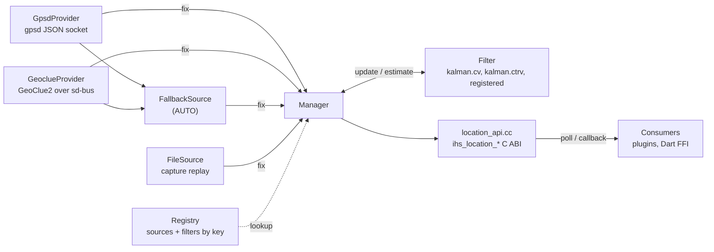

# location/

`ihs_location`: the shared location service in `ihs_shared`. It gives every
consumer — a map's position puck, a compass widget, a navigation plugin, Dart
via FFI — one place to poll or subscribe for the device's position, so
acquisition lives once in `libihs_shared.so` instead of being re-implemented per
plugin.

Fixes come from gpsd, geoclue, or a replayed gpsd capture. They are reported as
received, or fused through a Kalman filter that smooths noise, predicts a fresh
position between fixes when polled at UI rate, and coasts through short
outages. The service is always compiled into `ihs_shared`, with no build option
and no link-time dependency beyond `libdl`.

The public C ABI is [`shared/include/ihs/location.h`](../../include/ihs/location.h).
The header is the normative reference for each call's contract.

---

## Features

| Capability | Status | Toggle / scope |
|---|---|---|
| gpsd source: JSON socket, `?WATCH`, reconnects when gpsd drops | Built-in | `IHS_LOCATION_GPSD` |
| geoclue source: GeoClue2 over D-Bus, sd-bus `dlopen`ed from `libsystemd.so.0` | Built-in | `IHS_LOCATION_GEOCLUE` |
| gpsd primary, geoclue fallback | Built-in | `IHS_LOCATION_AUTO` |
| Replay of a captured gpsd stream (`gpspipe -w`): realtime, fast, loop | Built-in | `IHS_LOCATION_FILE` |
| Constant-velocity Kalman filter | Built-in | Filter key `kalman.cv` |
| Constant-turn-rate-and-velocity (CTRV) extended Kalman filter | Built-in | Filter key `kalman.ctrv` |
| Fix time on `CLOCK_MONOTONIC` and 1-sigma accuracy | Built-in | `ihs_location_latest2` |
| Polling: latest fix, generation counter | Built-in | `ihs_location_latest`, `_latest2`, `_generation` |
| Push callback on each fix | Built-in | `ihs_location_set_callback` |
| Caller-registered filters | Built-in | `ihs_location_register_filter` |
| Caller-registered measurement sources | Partial | `ihs_location_register_source`; not yet bound by a start call (see [Known limitations](#known-limitations)) |

---

## Architecture



`ihs_location_start_filtered()` builds one event source for the requested
`IhsLocationSource`, plus a `Manager`, and ties them together: the source's
worker thread pushes each fix to the Manager at its wake point (a socket read, a
D-Bus signal, the next line of a capture). Nothing polls.

Without a filter, the Manager stores each fix whole and atomically
(`PublishFix`), so a consumer never sees a half-updated position. With a
filter, each fix becomes one position measurement (`SubmitPositionFix`) routed
to the filter's `update()`, and every read asks the filter to `estimate()` the
state at the time of the read. `ihs_location_start()` is the unfiltered case.

Consumers poll (`latest2`, with `generation` to notice a new fix) or subscribe
(`set_callback`). Subscribe first, then read the current fix: that order cannot
miss an update.

### Module responsibilities

- **`location_api.cc`** — the C ABI. Builds the source and Manager for a start
  call, parses the `config` strings, makes the built-in filters available on
  demand, and keeps every exception from crossing the boundary.
- **`manager.{hpp,cc}`** — composes a service from a source and an optional
  filter. Passthrough without a filter; `update()` / `estimate()` with one. A
  missing or failing filter degrades to passthrough.
- **`registry.{hpp,cc}`** — the process-wide, mutex-guarded key → ops table
  behind `ihs_location_register_source` / `_filter`, the same shape as
  `ihs_pv`'s factory registry.
- **`gpsd_provider.{hpp,cc}`** — the gpsd client, and `ParseTpv`, the TPV
  report parser (fix, plus `epx`/`epy`/`eph`/`eps` accuracy).
- **`geoclue_provider.{hpp,cc}`** — the GeoClue2 client: creates a client, sets
  `DesktopId` and street-level accuracy, subscribes to `LocationUpdated`.
- **`sd_bus_dynamic.{hpp,cc}`** — loads the slice of sd-bus geoclue needs from
  `libsystemd.so.0` at first use, the way the [DLT sink](../../README.md#dlt-sink)
  loads `libdlt`.
- **`fallback_source.{hpp,cc}`** — the `AUTO` combiner. Forwards gpsd fixes, and
  forwards a geoclue fix only when gpsd has been silent for more than 5 s,
  judged by timestamp when that geoclue fix arrives, with no timer.
- **`file_source.{hpp,cc}`** — capture replay. Stamps fixes from a monotonic
  timeline synthesized from the recorded `time` deltas, so a filter sees the
  true `dt` at any replay speed.
- **`kalman_cv.{hpp,cc}`**, **`kalman_ctrv.{hpp,cc}`** — the built-in filters,
  below.
- **`location.hpp`** — internal `Position`, `ILocationProvider`, `IEventSource`,
  and the monotonic clock.

### Filters

| Key | Model and state | Corrects from | `filter_config` |
|---|---|---|---|
| `kalman.cv` | Constant velocity, `[e, n, v_e, v_n]`; linear | GNSS position | `q=<value>` process-noise density; default `1.0` |
| `kalman.ctrv` | Constant turn rate and velocity EKF, `[e, n, ψ, v, ω]`; follows an arc, so a turning vehicle does not lag the corner | GNSS position; ground speed and yaw rate from a source that provides them | `qa=<σ>` acceleration, m/s², default `2.0`; `qw=<σ>` yaw acceleration, rad/s², default `0.15` |

Both run in a local east/north tangent plane in meters, anchored at the first
fix and re-anchored past 10 km, on fixed-size matrix code with no Eigen. Both
share the same robustness rules:

- a chi-square gate rejects an outlier, and a persistent run of rejections
  resets the filter to the raw fix
- `dt` comes from `CLOCK_MONOTONIC`, so a wall-clock or GPS-time step cannot
  corrupt the state; out-of-order measurements are dropped
- `estimate(t)` predicts forward to the read time, and the reported sigma grows
  while coasting

### File map

```
shared/include/ihs/location.h      public C ABI
shared/src/location/
├── location_api.cc                C ABI → source + Manager
├── location.hpp                   Position, ILocationProvider, IEventSource
├── manager.{hpp,cc}               source + filter composition
├── registry.{hpp,cc}              key → source / filter ops
├── gpsd_provider.{hpp,cc}         gpsd client, ParseTpv
├── geoclue_provider.{hpp,cc}      GeoClue2 client
├── sd_bus_dynamic.{hpp,cc}        runtime sd-bus loader
├── fallback_source.{hpp,cc}       AUTO: gpsd primary, geoclue fallback
├── file_source.{hpp,cc}           capture replay
├── kalman_cv.{hpp,cc}             kalman.cv
└── kalman_ctrv.{hpp,cc}           kalman.ctrv
shared/tests/location/             unit tests, synthetic-track harness
shared/tests/consumer/consumer.c   installed-ABI smoke test (strict C11)
```

### Threading model

- Each source runs its own worker thread (gpsd socket, geoclue bus, file
  replay). `AUTO` runs both the gpsd and the geoclue worker.
- One Manager mutex serializes measurement intake, the filter instance (filters
  are not thread-safe), and the stored fix. `latest`, `latest2` and
  `generation` may be called from any thread while the service runs.
- The callback runs on an acquisition thread, not the caller's, and not always
  the same one (`AUTO` forwards from either worker). It is invoked outside the
  Manager lock, so it may call `latest2`. It must not call `ihs_location_stop()`.
- Start and stop are lifecycle calls on the owning thread. `ihs_location_stop()`
  joins the workers and is the only point after which no callback fires;
  clearing the callback is not a synchronization point.

---

## Build steps

Always compiled into `ihs_shared`; there is no CMake option. Link-time
dependency: `libdl` only.

### Dependencies

Runtime, all optional:

- a gpsd daemon, for `GPSD` and `AUTO`
- GeoClue2 and `libsystemd.so.0`, for `GEOCLUE` and `AUTO`; without them geoclue
  reports no fix and gpsd is unaffected

### Configure + build

The location tests compile the internal sources directly, so they need no
install prefix, gpsd or geoclue:

```bash
cmake -S shared/tests/location -B lbuild -G Ninja
cmake --build lbuild
ctest --test-dir lbuild --output-on-failure
```

Nine tests: `parse_tpv`, `registry`, `fallback_source`, `manager`, `filter`,
`kalman_cv`, `kalman_ctrv`, `file_source`, and `wire` (end to end over the C
ABI, replaying a capture). The installed-ABI smoke test is
[`shared/tests/consumer`](../../tests/consumer/consumer.c). Both run in the
[`ihs-shared`](../../../.github/workflows/ihs-shared.yml) CI workflow.

---

## Running

```c
#include <ihs/location.h>

/* Runs on an acquisition thread: copy what you keep, hand work off. */
static void on_fix(void* user_data, const IhsPosition* pos) { /* ... */ }

IhsLocationService* loc =
    ihs_location_start_filtered(IHS_LOCATION_AUTO, NULL, "kalman.cv", NULL);
ihs_location_set_callback(loc, on_fix, NULL); /* subscribe first */

IhsPosition pos;
if (ihs_location_latest2(loc, &pos, sizeof(pos))) {
  /* current fix, including t_monotonic_ns and sigma_* */
}

ihs_location_stop(loc); /* joins the workers; no callback after this */
```

A start call returns a handle even when there is no fix yet or gpsd is not
running; the service reports no fix until one arrives. It returns NULL only when
the source cannot start at all, e.g. a missing capture file.

Use `ihs_location_latest2` with `sizeof(IhsPosition)` for the timestamp and
accuracy. `ihs_location_latest` fills only the original six fields, for callers
built against an older header.

### Sources and `config`

| `IhsLocationSource` | Acquires from | `config` |
|---|---|---|
| `IHS_LOCATION_GPSD` | gpsd | Numeric IPv4 `host:port` (host names are not resolved); default `127.0.0.1:2947` |
| `IHS_LOCATION_GEOCLUE` | GeoClue2 | D-Bus address, or `user` for the session bus; default the system bus |
| `IHS_LOCATION_AUTO` | gpsd; geoclue after 5 s of gpsd silence | Ignored |
| `IHS_LOCATION_FILE` | A captured gpsd JSON stream | `<path>[?<flags>]`; flags `fast`, `realtime` (default), `loop`, separated by `,` or `&` |

Examples: `drive.jsonl`, `drive.jsonl?fast`, `drive.jsonl?loop,fast`.

### Custom filters

Register an `IhsLocationFilterOps` under a key with
`ihs_location_register_filter()`, then pass that key to
`ihs_location_start_filtered()`. `create`, `update` and `estimate` are
required; `destroy` is optional. Registering an existing key, `kalman.cv`
included, replaces it. Ops structs are copied bounded by `struct_size`, so a
caller built against an older header is never over-read.

---

## Diagnostics/Debug

- **No hardware:** record a drive once with `gpspipe -w > drive.jsonl`, then
  start `IHS_LOCATION_FILE` with `"drive.jsonl?loop"`. The replay runs at the
  recorded cadence and drives a filter exactly like a live gpsd.
- **No fix from gpsd:** `gpspipe -w` against the same `host:port` shows whether
  gpsd is producing TPV reports with `mode` 2 or 3. The service reconnects on
  its own if gpsd starts later.
- **No fix from geoclue:** check that `libsystemd.so.0` is present and that
  geoclue's configuration allows the `DesktopId` `ihs-location`. geoclue fixes often
  report `speed_mps` < 0 (unknown).
- **Filter seems inactive:** an unknown filter key, or a filter whose `create`
  fails, degrades to passthrough without an error. A non-NULL handle does not
  prove the filter is running.
- **Accuracy:** `sigma_e_m` / `sigma_n_m` come from gpsd `epx`/`epy` (or `eph`)
  and geoclue `Accuracy`. With a filter they are the filter's own estimate,
  which grows while coasting.

---

## Benchmarks

### Methodology

`shared/tests/location/track_gen` builds a deterministic ground-truth track
(straight, constant turn, stationary), adds seeded Gaussian noise (splitmix64
and Box-Muller, identical on libstdc++ and libc++), and feeds the fixes through
the filter. Error is RMSE against ground truth, in meters, at 8 m 1-sigma
position noise. Each test uses its own track and seed, so compare within a row.

### Results summary

| Test | Scenario | Result |
|---|---|---|
| `filter_test` (through the Manager) | Straight | raw 11.5 m, `kalman.cv` 7.0 m |
| `filter_test` | Stationary | raw 11.2 m, `kalman.cv` 6.2 m |
| `filter_test` | 10 s outage | passthrough gap error 34.5 m, `kalman.cv` 14.1 m |
| `kalman_cv_test` | Straight | raw 12.2 m, `kalman.cv` 6.2 m; speed 12.6 m/s (truth 12.0) |
| `kalman_cv_test` | 500 m outlier spike | estimate moved 0.00 m (gated) |
| `kalman_ctrv_test` | Turn | `kalman.ctrv` 5.0 m, `kalman.cv` 11.7 m |
| `kalman_ctrv_test` | Straight | `kalman.ctrv` 7.6 m |

---

## Known limitations

- A source registered with `ihs_location_register_source()` is never bound: the
  start calls build the Manager from the built-in sources only. Registered
  filters do work.
- With the built-in sources a filter sees GNSS position only. `kalman.ctrv`'s
  speed and yaw-rate updates need a CAN or gyro source, which needs the item
  above; today only the unit tests exercise them.
- An unknown filter key, or a failing `create`, degrades to passthrough without
  an error.
- gpsd `config` takes a numeric IPv4 address; host names are not resolved.
- geoclue needs `libsystemd.so.0` at runtime and the `DesktopId` `ihs-location` to be
  allowed; geoclue-only fixes usually carry no speed.
- `AUTO` notices gpsd going silent only when the next geoclue fix arrives; if
  both go quiet, the last fix stands.
- Not in the `IhsApi` table (`ihs_get_api`); plugins call the exported
  `ihs_location_*` symbols directly.
- The registry has no unregister, so a registered source or filter must outlive
  every service that uses it.
- Nothing in the shell starts the service or reads location config; each
  consumer calls `ihs_location_start*` itself.

---

## References

- [`shared/include/ihs/location.h`](../../include/ihs/location.h) — the C ABI
- [`shared/README.md`](../../README.md) — the `ihs_shared` library
- [`docs/PLUGIN_ABI.md`](../../../docs/PLUGIN_ABI.md) — the plugin boundary contract
- [gpsd JSON protocol](https://gpsd.io/gpsd_json.html)
- [gpspipe](https://gpsd.io/gpspipe.html)
- [GeoClue](https://gitlab.freedesktop.org/geoclue/geoclue/-/wikis/home)
