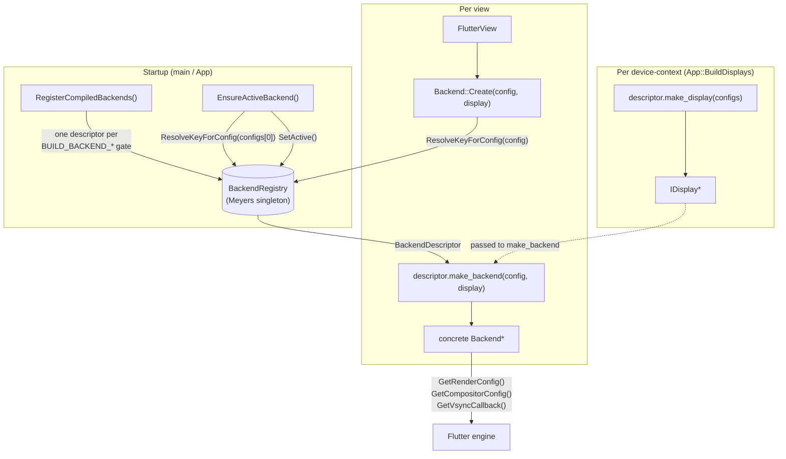

# Backend abstraction

The display-target layer of the embedder. A `Backend` owns everything that is
specific to *how* one Flutter view reaches the screen — surface lifecycle, the
`FlutterRendererConfig` / `FlutterCompositor` handed to the engine, and the
per-target vsync source — behind a single abstract interface
([`backend.h`](backend.h)). One process can compile in several concrete
backends; a process-wide [`BackendRegistry`](backend_registry.h) holds
the compiled-in set, and the `Backend::Create` factory builds the right
concrete instance per view at runtime from the resolved config. This folder is
the parent of the per-backend implementation directories, each of which has its
own README.

## Features

| Capability | Status | Toggle / scope |
|---|---|---|
| Abstract `Backend` interface (surface, renderer/compositor config, vsync) | Built-in | Always |
| Runtime backend registry (`BackendRegistry` singleton) | Built-in | Always |
| Per-view factory (`Backend::Create`) | Built-in | Always |
| Compiled-in backend registration (`RegisterCompiledBackends`) | Per backend | `BUILD_BACKEND_*` |
| Env-aware backend resolution (`ResolveKeyForConfig`) | Built-in | Always |
| Multiple backends in one binary, resolved per view | Built-in | Depends on enabled `BUILD_BACKEND_*` |
| EGL share-context export to plugins (`GetEglContext`) | Opt-in per backend | EGL backends only |
| Vulkan handle export to plugins (`GetVulkanContext`) | Opt-in per backend | Vulkan backends only |
| Reusable backing-store pool (`BackingStorePool`) | Built-in header | Used by EGL / Vulkan backends |
| GL/EGL symbol resolver (`GlProcessResolver`) | Built-in | EGL-based backends |
| Motion-to-photon profiler hook (`GetMotionToPhoton`) | Opt-in per backend | DRM/KMS, software, and Wayland backends; `IVI_M2P_PROFILE` |
| Compositor-surface registration (platform views) | Opt-in per backend | `BUILD_COMPOSITOR` |
| Debug HUD config plumbing (`SetHudConfig`) | Opt-in per backend | `BUILD_HUD` |
| `--drm-list-modes` hook per backend | Per backend | DRM + software (DRM sink) backends |

---

## Architecture



A `Backend` is the unified display-target interface. Each concrete
implementation lives in its own subfolder and is compiled behind its own
`BUILD_BACKEND_*` guard, so a build pulls in only the backends it enables.
Because every instance is isolated, heterogeneous backends can run concurrently
(one process, several views, each on the device-context display `App` placed it
on).

- **`backend.h` — the abstract `Backend`.** Declares the virtual surface
  lifecycle (`Resize`, `CreateSurface`, `TextureMakeCurrent`/`ClearCurrent`),
  the engine-facing config accessors (`GetRenderConfig`, `GetCompositorConfig`),
  the optional per-backend `GetVsyncCallback` (returning `nullptr` leaves
  Flutter on its internal wall-clock scheduler), and lifecycle hooks
  (`SetEngineHandle`, `SetPlatformTaskRunner`, `StopVsyncMonitor`,
  `ReleaseRenderSurfaces`). It also declares the static `Backend::Create`
  factory. Two plugin-interop escape hatches are declared here and default to
  "not supported": `GetEglContext` (fills a `BackendEglContext` so a plugin can
  create a share-context) and `GetVulkanContext` (fills a `BackendVulkanContext`
  so a plugin renders a platform view into a `VkImage` on the same device the
  engine uses). Under `BUILD_COMPOSITOR` it adds the compositor-surface
  registration hooks for platform views, and under `BUILD_HUD` the `SetHudConfig`
  plumbing. DRM/KMS and software backends own a `profiling::MotionToPhoton`
  instance on `Backend`; Wayland owns its instance on `Display`. All are gated by
  `IVI_M2P_PROFILE`.
- **`backend_registry.h` / `.cc` — the registry.** `BackendDescriptor` is one
  compiled-in backend's runtime identity: a string `key`, a `make_display`
  callable, a `make_backend` callable (which expects the `IDisplay` its own
  `make_display` produced), and an optional `list_modes` hook.
  `BackendRegistry` is a Meyers singleton holding the descriptor table; it is populated once at startup, one active descriptor is
  resolved before `App` is constructed, and it is read-only thereafter, so no
  locking is required.
- **`register_backends.h` / `.cc` — registration + resolution.** This single
  translation unit gates each backend's `make_display`/`make_backend` body
  behind its own `BUILD_BACKEND_*` guard (the bodies that used to live inline in
  `App::MakeDisplay` and the `Backend::Create` `#if/#elif` chains).
  - `RegisterCompiledBackends()` registers one descriptor per enabled backend,
    including the three leased-DRM tiers (which reuse the direct DRM/software
    factories, changing only where the DRM fd comes from).
  - `EnsureActiveBackend()` makes `App` self-contained: it registers the
    compiled-in backends (if not already), resolves the active key from the
    configs, and calls `SetActive`. Returns `false` when nothing resolves.
  - `ResolveKeyForConfig()` is the per-view selector. An exact registry key
    (from `[view.backend]` / `--backend`) wins; otherwise the sole compiled
    backend; otherwise an environment heuristic — a live Wayland session picks a
    `wayland-*` backend, else KMS-direct (`drm-kms-*` / `software`) — honoring
    the legacy `egl`/`vulkan` renderer hint within the chosen family. The leased
    family is resolved **before** any fallback and never degrades to an unleased
    backend (leasing drives a connector the compositor handed over; falling back
    to an unleased backend would grab a whole card outright — the opposite of
    what was asked).
- **`Backend::Create` — the per-view factory.** Defined in
  [`../view/flutter_view.cc`](../view/flutter_view.cc); it resolves the view's
  key, looks up the descriptor, calls `descriptor->make_backend(config,
  display)`, wires the HUD config under `BUILD_HUD`, and returns the instance
  (`nullptr` on a resolution failure; concrete backends `exit()` on a hard
  init failure).
- **`backing_store_pool.h` — reusable backing-store pool.** A header-only,
  backend-agnostic free-list keyed by `(width, height)` that mirrors the
  engine's backing-store reuse. Any type providing `Width()`/`Height()` works;
  the Wayland-EGL and Wayland-Vulkan backends instantiate it for their FBO /
  texture / Vulkan stores. Thread-safe (`Acquire`/`Release`/`Flush` from any
  thread).
- **`gl_process_resolver.h` / `.cc` — GL/EGL symbol loader.** A process-lifetime
  singleton (`GlProcessResolver::GetInstance()`) wrapping `EglProcessResolver`,
  which `dlopen`s `libGLESv2.so.2` + `libEGL.so.1` and resolves GL entry points
  (falling back to `eglGetProcAddress`). Used by the EGL-based backends
  (`wayland_egl`, `drm_kms_egl`) to feed the engine's GL proc-resolver. Handles
  are intentionally never `dlclose`d.

Distinct from the Wayland *compositor-protocol* shells in
[`../wayland/shell/`](../wayland/shell/) (the `--shell` option): a backend is a
presentation target, a shell is a compositor role.

### File map

```
shell/backend/
├── backend.h              # Abstract Backend interface + BackendEglContext / BackendVulkanContext
├── backend_registry.h     # BackendDescriptor + BackendRegistry (singleton) declarations
├── backend_registry.cc    # Registry storage, Register/Resolve/Keys/SetActive/Active
├── register_backends.h    # RegisterCompiledBackends / EnsureActiveBackend / ResolveKeyForConfig
├── register_backends.cc   # Per-backend make_display / make_backend bodies + registration + resolver
├── backing_store_pool.h   # Header-only reusable backing-store free-list
├── gl_process_resolver.h  # EGL/GLES symbol resolver (singleton) declarations
├── gl_process_resolver.cc # dlopen of libGLESv2 / libEGL, dlsym + eglGetProcAddress fallback
├── drm_kms_egl/           # DRM/KMS + EGL backend            (see drm_kms_egl/README.md)
├── drm_kms_vulkan/        # DRM/KMS + Vulkan backend         (see drm_kms_vulkan/README.md)
├── software/              # CPU (software) backend + sinks   (see software/README.md)
├── headless_egl/          # Headless EGL encoder             (see headless_egl/README.md)
├── headless_vulkan/       # Headless Vulkan encoder + export consumer (see headless_vulkan/README.md)
├── wayland_egl/           # Wayland client + EGL backend     (see wayland_egl/README.md)
├── wayland_vulkan/        # Wayland client + Vulkan backend  (see wayland_vulkan/README.md)
├── wayland_leased_drm/    # drm-lease-v1 client (leased tiers) (see wayland_leased_drm/README.md)
└── hud/                   # Compositor debug HUD overlay      (Dear ImGui)
```

Related, outside this folder:

```
shell/view/flutter_view.cc          # Definition of Backend::Create (the per-view factory)
shell/app.cc                        # BuildDisplays(): EnsureActiveBackend + one display per device-context
shell/main.cc                       # --drm-list-modes dispatch via the active descriptor
shell/display/idisplay.h            # IDisplay seam a backend's make_display produces
shell/configuration/configuration.cc # [view.backend] / --backend parsing (see configuration/README.md)
cmake/options.cmake                 # BUILD_BACKEND_* / BUILD_SOFTWARE_* / BUILD_HUD options
```

### Threading model

The registry is populated and made active during single-threaded startup and is
read-only afterward, so `Resolve`/`Active`/`Keys` need no locking. Concrete
backends drive their own threading (rasterizer, page-flip/event-loop threads);
the `Backend` hooks encode the ordering contract the shell must honor —
`ReleaseRenderSurfaces()` runs *after* the engine threads are joined but *before*
the display members are destroyed, and `StopVsyncMonitor()` runs before the
engine destructs so async work cannot outlive the engine handle. Any backend
wiring `FlutterEngineOnVsync` must marshal it onto the platform task runner
handed to it via `SetPlatformTaskRunner()`. `BackingStorePool` is safe to call
from any thread.

---

## Build steps

Backends are **additive**: each is compiled in behind its own `BUILD_BACKEND_*`
CMake option, and at least one must be enabled for a usable binary. A
single-backend build registers exactly one descriptor;
[`register_backends.cc`](register_backends.cc) and
[`backend_registry.cc`](backend_registry.cc) are always compiled (they are
backend-agnostic).

### Configure + build

```sh
cmake -B build -G Ninja \
  -DBUILD_BACKEND_WAYLAND_EGL=ON \
  -DBUILD_BACKEND_DRM_KMS_EGL=OFF
cmake --build build
```

Options are declared in [`cmake/options.cmake`](../../cmake/options.cmake):

- `BUILD_BACKEND_WAYLAND_EGL` (default **ON**) — Wayland client + EGL/GLES.
- `BUILD_BACKEND_WAYLAND_VULKAN` (default ON only when `BUILD_BACKEND_WAYLAND_EGL` is OFF) — Wayland client + Vulkan.
- `BUILD_BACKEND_DRM_KMS_EGL` (default OFF) — direct KMS scanout + EGL/GLES.
- `BUILD_BACKEND_DRM_KMS_VULKAN` (default OFF) — direct KMS scanout + Vulkan (zero-copy dma-buf).
- `BUILD_BACKEND_SOFTWARE` (default OFF) — CPU rendering; `BUILD_SOFTWARE_SINK_DRM` / `BUILD_SOFTWARE_SINK_FBDEV` / `BUILD_SOFTWARE_INPUT_LIBINPUT` select its scanout sinks and input.
- `BUILD_BACKEND_HEADLESS_EGL` (default OFF) — GPU-EGL encoder (GPU render → NV12 → HW encode; needs EGL/GLES/gbm + `v4l2-webrtc-codec`).
- `BUILD_BACKEND_HEADLESS_VULKAN` (default OFF) — headless Vulkan encoder (no display / scanout).
- `BUILD_BACKEND_WAYLAND_LEASED_DRM` (default OFF) — the `drm-lease-v1` client; combine with one or more renderer stacks to enable the leased tiers.
- `BUILD_COMPOSITOR` (default OFF) — enables the `FlutterCompositor` backing-store API (required for platform-view layers and `BUILD_HUD`).
- `BUILD_HUD` (default ON, forced OFF without `BUILD_COMPOSITOR`) — the Dear ImGui debug overlay.

### Build matrix

| Config | CMake flags | Backend keys registered |
|--------|-------------|-------------------------|
| Wayland EGL (default) | `-DBUILD_BACKEND_WAYLAND_EGL=ON` | `wayland-egl` |
| Wayland Vulkan | `-DBUILD_BACKEND_WAYLAND_EGL=OFF -DBUILD_BACKEND_WAYLAND_VULKAN=ON` | `wayland-vulkan` |
| DRM/KMS EGL | `-DBUILD_BACKEND_DRM_KMS_EGL=ON` | `drm-kms-egl` |
| DRM/KMS Vulkan | `-DBUILD_BACKEND_DRM_KMS_VULKAN=ON` | `drm-kms-vulkan` |
| Software | `-DBUILD_BACKEND_SOFTWARE=ON` | `software` |
| Headless EGL encoder | `-DBUILD_BACKEND_HEADLESS_EGL=ON` | `headless-egl` |
| Headless Vulkan encoder | `-DBUILD_BACKEND_HEADLESS_VULKAN=ON` | `headless-vulkan` |
| Leased DRM (EGL renderer) | `-DBUILD_BACKEND_WAYLAND_LEASED_DRM=ON -DBUILD_BACKEND_DRM_KMS_EGL=ON` | `drm-kms-egl`, `wayland-leased-drm-egl` |
| Leased DRM (Vulkan renderer) | `-DBUILD_BACKEND_WAYLAND_LEASED_DRM=ON -DBUILD_BACKEND_DRM_KMS_VULKAN=ON` | `drm-kms-vulkan`, `wayland-leased-drm-vulkan` |
| Leased DRM (software) | `-DBUILD_BACKEND_WAYLAND_LEASED_DRM=ON -DBUILD_BACKEND_SOFTWARE=ON -DBUILD_SOFTWARE_SINK_DRM=ON` | `software`, `wayland-leased-drm-software` |

Multiple backends may be enabled together; each adds its key, and
`ResolveKeyForConfig` picks between them per view.

---

## Running

The backend is selected at runtime, not at build time (when more than one is
compiled in). Selection precedence, per view:

1. An exact registry key from `[view.backend]` `type` (TOML) or `--backend`
   (CLI) — the primary path.
2. If only one backend is compiled in, that backend (with a warning if a
   different one was explicitly requested).
3. The **leased** family (`wayland-leased-drm[-egl|-vulkan|-software]`) —
   resolved before any fallback; the bare name `wayland-leased-drm` picks the
   first available tier (vulkan → egl → software) and never falls back to an
   unleased backend.
4. Otherwise an environment heuristic: a live Wayland session
   (`WAYLAND_DISPLAY` set **and** the socket exists) selects a `wayland-*`
   backend; otherwise KMS-direct (`drm-kms-*`) then `software`. The legacy
   `egl`/`vulkan` hint chooses the renderer within the selected family.

When the resolved key differs from what was configured (a bare family name, a
legacy hint, or an unset field), the resolution is logged at `info`:
`[backend] resolved '<configured>' -> '<key>'`. A build with no usable backend
aborts at startup.

### CLI Flags

| Flag | What it does |
|------|-------------|
| `--backend <key>` | Select the active backend. The `<key>` is the registry key of a compiled-in backend (see the build matrix above). A bare family name (e.g. `wayland-leased-drm`) picks the first available tier (vulkan → egl → software) and never falls back to an unleased backend. If no backend resolves, the process aborts at startup. |

The `[view.backend]` TOML table mirrors `--backend` (`type = "..."`) and carries
the DRM- and lease-only sub-tables. See
[`../configuration/README.md`](../configuration/README.md) for the full
configuration surface and layering order.

---

## Diagnostics/Debug

- **Confirm the resolved backend.** Startup logs `[backend] resolved
  '<configured>' -> '<key>'` whenever the effective key differs from the
  configured string, and the resolved config (including `Backend:`) is printed
  by the configuration layer. Raise verbosity with `IHS_LOG_LEVEL=debug`.
- **A leased request that "isn't available"** logs an explicit `[backend]`
  error listing the `BUILD_BACKEND_*` flags to rebuild with, rather than
  silently falling back — by design.
- **`--drm-list-modes`** enumerates the active backend's connector modes; a
  backend without a `list_modes` hook (e.g. Wayland) logs
  `the '<key>' backend does not support --drm-list-modes`.
- **Hard init failures fail fast.** A concrete backend that cannot initialize
  logs `[FlutterView] <backend> init failed; aborting` (or the equivalent) and
  `exit()`s rather than letting the engine dereference a null backend.
- **Per-backend debugging** (validation layers, DRM knobs, GL caps, sink
  selection) is covered in each backend subdirectory's README.

---

## References

- [`backend.h`](backend.h) — the abstract `Backend` interface.
- [`backend_registry.h`](backend_registry.h) / [`backend_registry.cc`](backend_registry.cc) — the registry and descriptor.
- [`register_backends.h`](register_backends.h) / [`register_backends.cc`](register_backends.cc) — registration and resolution.
- [`backing_store_pool.h`](backing_store_pool.h) — reusable backing-store pool.
- [`gl_process_resolver.h`](gl_process_resolver.h) / [`gl_process_resolver.cc`](gl_process_resolver.cc) — GL/EGL symbol resolver.
- Per-backend implementations:
  - [`wayland_egl/README.md`](wayland_egl/README.md)
  - [`wayland_vulkan/README.md`](wayland_vulkan/README.md)
  - [`wayland_leased_drm/README.md`](wayland_leased_drm/README.md)
  - [`drm_kms_egl/README.md`](drm_kms_egl/README.md)
  - [`drm_kms_vulkan/README.md`](drm_kms_vulkan/README.md)
  - [`headless_egl/README.md`](headless_egl/README.md)
  - [`headless_vulkan/README.md`](headless_vulkan/README.md)
  - [`software/README.md`](software/README.md)
  - [`hud/`](hud/) — compositor debug HUD (Dear ImGui overlay).
- [`../configuration/README.md`](../configuration/README.md) — `[view.backend]` / `--backend` parsing and layering.
- [`../view/flutter_view.cc`](../view/flutter_view.cc) — `Backend::Create` definition.
- [`../app.cc`](../app.cc) — `EnsureActiveBackend` + per-device-context display creation.
- [`../../cmake/options.cmake`](../../cmake/options.cmake) — `BUILD_BACKEND_*` options.
