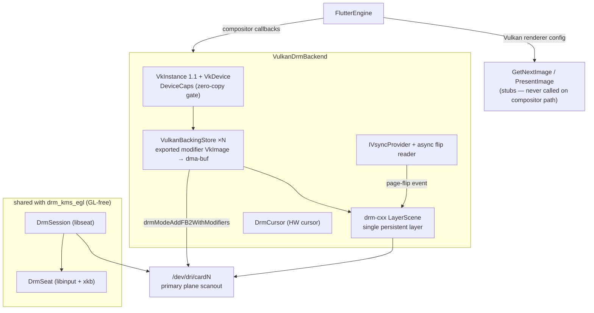

# drm_kms_vulkan backend

Drives the Flutter **Vulkan** renderer and presents the result on hardware
KMS planes via **zero-copy dma-buf import**, using the drm-cxx scene
abstraction. The session / modeset / seat / input stack is shared with the
[drm_kms_egl](../drm_kms_egl/README.md) backend (those translation units sit
below the pixel layer and are GL-free); only the renderer and the present path
differ.

Enable with `-DBUILD_BACKEND_DRM_KMS_VULKAN=ON`. **`-DBUILD_COMPOSITOR=ON` is
required** — the engine only reaches the present path through the Flutter
compositor's `CreateBackingStore` / `PresentLayers` callbacks.

## Features

| Capability | Status | Toggle / scope |
|---|---|---|
| Vulkan render + zero-copy dma-buf KMS scanout | ✓ | `-DBUILD_BACKEND_DRM_KMS_VULKAN=ON` + `-DBUILD_COMPOSITOR=ON` |
| Zero-copy gate (Vulkan 1.1 + dma-buf extension set + openable DRM node) | ✓ | Refuses cleanly at init with a diagnostic if unmet |
| Render-node-aware physical-device selection (vendor/name fallback) | ✓ | Picks the real GPU over a software ICD (llvmpipe) |
| Explicit DRM-format-modifier backing stores, exported as dma-buf | ✓ | `NegotiateModifiers` intersects GPU export ↔ plane `IN_FORMATS` |
| Triple-buffered, vsync-paced present (ring of scanout buffers) | ✓ | `avoid_backing_store_cache` + non-blocking page flips |
| Page-flip-locked Flutter vsync | ✓ | `IVI_DRMVK_VSYNC=0` for wall-clock fallback |
| Scanout rotation (0/90/180/270) | ✓ | `--drm-rotation`; 90/270 use a tiled non-DCC modifier |
| Rotation-aware touch + HW cursor; per-device pointer transform | ✓ | `--input-transform` (shared DRM seat) |
| KMS HW cursor (drm-cxx / xcursor) | ✓ | Requires libxcursor (`HAVE_DRM_CURSOR`); `--disable-cursor` |
| libseat session, with direct-master fallback | ✓ | `LIBSEAT_BACKEND=seatd` forces the fallback |
| wayland-leased-drm: drive an externally-owned DRM fd | ✓ | Second `Create()` overload, lease fd + connector + revocation gate |
| Standalone zero-copy capability probe (`drm_kms_vulkan_probe`) | ✓ | `-DBUILD_DRM_KMS_VULKAN_PROBE=ON` (implied by the backend) |
| Debug HUD (imgui Vulkan) | ✓ | `-DBUILD_HUD=ON`; `IVI_HUD` / `[hud].enable`; explicit-sync path |
| DCC / tiled scanout consumption in the unrotated path | deferred | Advertised in the negotiated set, not yet driving allocation |

---

## Architecture



The backend brings up a Vulkan 1.1 instance and selects a physical device that
can do zero-copy dma-buf scanout, then opens the DRM device, takes master,
discovers the scanout target, and builds the `LayerScene` the present path
commits onto. Each Flutter backing store is an exported modifier `VkImage`
scanned out zero-copy on the primary plane. Session / modeset / seat / input
are reused verbatim from the EGL backend; only the renderer and present path
differ.

**How it works, step by step:**

1. **Device bring-up.** Creates a Vulkan 1.1 instance and selects a physical
   device that can do zero-copy dma-buf scanout: render-node-aware when the
   device exposes a DRM node, vendor/name fallback otherwise (this is what
   picks the real GPU over a software ICD such as llvmpipe). The device is
   gated on **Vulkan 1.1** (the Flutter engine's Skia backend requires a 1.1
   device — a 1.0 device is rejected here so the backend refuses with a clear
   reason instead of the engine fatally aborting), a fixed set of extensions,
   and `timelineSemaphore`; if any are missing the backend refuses cleanly
   rather than handing back a backend that cannot present. Required device
   extensions:
   `VK_KHR_external_memory_fd`, `VK_EXT_external_memory_dma_buf`,
   `VK_EXT_image_drm_format_modifier`, `VK_EXT_queue_family_foreign`,
   `VK_KHR_external_semaphore_fd`, `VK_KHR_external_fence_fd`,
   `VK_KHR_synchronization2`.

2. **Scanout target.** Opens the KMS device read-only, finds a connected
   connector + its CRTC + primary plane, picks a mode (connector-preferred by
   default; see `--drm-mode`), and reads that plane's `IN_FORMATS` modifiers.
   `NegotiateModifiers` intersects the modifiers the GPU can export for the
   color format with those the plane can scan out.

3. **Backing stores.** Each Flutter backing store is a device-local `VkImage`
   allocated with an explicit DRM format modifier (`VK_IMAGE_TILING_DRM_FORMAT_MODIFIER_EXT`)
   and exported as a dma-buf. The image is handed to the engine already in
   `COLOR_ATTACHMENT_OPTIMAL`, which is the layout the Flutter Vulkan renderer
   expects on entry and leaves it in after rendering. `FlutterVulkanImage`
   only carries `{image, format}`, so all backing-store images use the
   vendored Vulkan headers and a single consistent dispatch.

4. **Present.** `avoid_backing_store_cache` is on, so the engine cycles through
   a small **ring of scanout buffers** (rendering into a free buffer while KMS
   scans another). A single persistent drm-cxx `LayerScene` layer presents
   whichever ring slot is ready; the framebuffer is imported once per slot and
   reused. Before each commit a barrier flushes the renderer's color writes
   (`COLOR_ATTACHMENT_OPTIMAL` → `GENERAL`) so the scanout engine sees the
   frame. Commits are **vsync-paced**: the first is a blocking modeset, the
   rest are non-blocking page flips drained against the DRM fd, giving
   tear-free triple-buffered present.

   The Vulkan renderer config also supplies `get_next_image` / `present_image`
   callbacks. They are never invoked on the compositor path, but the embedder
   rejects a Vulkan renderer config that leaves them null, so they are stubs.

### Module responsibilities

- **`VulkanDrmBackend`** ([vulkan_drm_backend.cc](vulkan_drm_backend.cc),
  [vulkan_drm_backend.h](vulkan_drm_backend.h)) — the `Backend` implementation.
  `Create()` runs the Vulkan bring-up (instance → physical device → logical
  device + queues), then `SetupCompositor()` opens the DRM device, takes master,
  discovers the scanout target, and builds the `LayerScene`. Implements the
  Flutter compositor callbacks (`CreateBackingStore` / `CollectBackingStore` /
  `PresentLayers`) and the scanout hand-off barrier. Returns nullptr on failure;
  the caller treats null as a hard init failure and aborts, exactly as
  `drm_kms_egl` does. A second `Create()` overload drives an externally-owned
  DRM fd for wayland-leased-drm (lease fd + connector id + revocation gate),
  leaving the Vulkan side untouched.

- **`drm_kms_vulkan::VulkanBackingStore`**
  ([vulkan_backing_store.cc](vulkan_backing_store.cc),
  [vulkan_backing_store.h](vulkan_backing_store.h)) — a device-local `VkImage`
  allocated with an explicit DRM format modifier and exported as a dma-buf,
  ready for zero-copy KMS scanout. Owns the image, memory, view, and dma-buf fd;
  reads back the chosen modifier and per-plane layout for the framebuffer
  import. Exposes an address-stable `FlutterVulkanImage`.

- **`drm_kms_vulkan::ScanoutTarget`**
  ([drm_scanout_target.cc](drm_scanout_target.cc),
  [drm_scanout_target.h](drm_scanout_target.h)) — discovers the KMS scanout
  target (connected connector + CRTC + mode + primary plane + that plane's
  `IN_FORMATS` modifiers) read-only, without taking DRM master. A second
  overload probes an already-open lease fd, pinned to the leased connector.

- **`drm_kms_vulkan::NegotiateModifiers`**
  ([modifier_format.cc](modifier_format.cc),
  [modifier_format.h](modifier_format.h)) — intersects the modifiers the ICD can
  export for the color format with the plane's `IN_FORMATS`, ordered tiled-first
  with `LINEAR` last. `DescribeModifier` decodes a modifier to a readable label
  (e.g. `AMD(GFX10_RBPLUS 64K_R_X dcc=1 retile)`).

- **`drm_kms_vulkan::DeviceCaps` / `ProbeDeviceCaps`**
  ([device_caps.cc](device_caps.cc), [device_caps.h](device_caps.h)) —
  capability summary filled at bring-up and logged. `ProbeDeviceCaps` is the
  lightweight read-only zero-copy gate used by the probe tool (throwaway
  instance, no logical device). `DrmNodeNumber` resolves a DRM node path's
  (major, minor) to match a physical device's DRM node against the scanout
  device.

- **`drm_kms_vulkan_probe`** ([probe_main.cc](probe_main.cc)) — standalone
  exerciser for the zero-copy gate. Runs the same `ProbeDeviceCaps()` in
  isolation (no libseat / DRM master) and dumps every plane's advertised
  `IN_FORMATS` modifiers, decoded. Exit code mirrors the backend's contract:
  0 = gate passed, 1 = refused.

### File map

- [vulkan_drm_backend.cc](vulkan_drm_backend.cc), [vulkan_drm_backend.h](vulkan_drm_backend.h) — the `VulkanDrmBackend` backend: bring-up, compositor callbacks, present, vsync, HW cursor.
- [vulkan_backing_store.cc](vulkan_backing_store.cc), [vulkan_backing_store.h](vulkan_backing_store.h) — exported modifier `VkImage` → dma-buf backing store.
- [drm_scanout_target.cc](drm_scanout_target.cc), [drm_scanout_target.h](drm_scanout_target.h) — read-only KMS scanout-target discovery (path + lease fd).
- [modifier_format.cc](modifier_format.cc), [modifier_format.h](modifier_format.h) — modifier negotiation + human-readable modifier decode.
- [device_caps.cc](device_caps.cc), [device_caps.h](device_caps.h) — capability struct + zero-copy probe + DRM-node number resolution.
- [probe_main.cc](probe_main.cc) — `drm_kms_vulkan_probe` standalone gate/modifier dump tool.

Shared verbatim from [drm_kms_egl](../drm_kms_egl/README.md) (GL-free, below the
pixel layer): `scene_layer_source_vk.cc`, `drm_session.cc`, `driver_probe.cc`,
`drm_cursor.cc`, plus [shell/display](../../display/README.md)'s
`drm_display.cc` / `drm_output_provider.cc` / `drm_device_resolver.cc` /
`drm_mode_list.cc` and [shell/input](../../input/README.md)'s `drm_seat.cc`.

### Threading model

- **Main thread**: argv parse, backend `Create()`, engine bring-up.
- **Flutter rasterizer thread**: the compositor callbacks
  (`CreateBackingStoreImpl` / `PresentLayersImpl`) and every KMS commit. Slot
  state stays raster-thread-local.
- **Async flip-reader thread**: arms `drmHandleEvent` for the next page-flip
  event and, on completion (`OnFlipEvent`), returns the vsync baton with the
  kernel scanout time; touches no slot state.
- **DrmSession / DrmSeat dispatch threads**: reused from `drm_kms_egl` — libseat
  session events + udev hotplug, and libinput + xkb input.

The HW cursor is created against the compositor's DRM device and destroyed
before it, so it never outlives that device.

---

## Build steps

### Dependencies

Same DRM / GBM / seat / input stack as `drm_kms_egl`; on Ubuntu 24.04 /
Debian 13 / Fedora 41+:

```bash
sudo apt-get install -y \
  ninja-build cmake pkg-config \
  libdrm-dev libgbm-dev libinput-dev libudev-dev \
  libxkbcommon-dev libxcursor-dev libseat-dev
```

There is **no build-time Vulkan SDK / `libvulkan` dependency**: only the
vendored `third_party/Vulkan-Headers` are needed at build time. The Vulkan
loader and an ICD are resolved at runtime via the dynamic loader (see Running).

### Configure + build

```bash
cmake -GNinja -B cmake-build-debug-clang \
  -DCMAKE_BUILD_TYPE=Debug \
  -DBUILD_BACKEND_DRM_KMS_VULKAN=ON \
  -DBUILD_COMPOSITOR=ON

ninja -C cmake-build-debug-clang
```

`BUILD_BACKEND_DRM_KMS_VULKAN` can be enabled alongside other backends and
selected per view through the backend registry. `BUILD_COMPOSITOR=ON` is
**required** because presentation is reachable only through compositor callbacks.

### Build matrix

| Config | CMake flags | Present path compiled in |
|--------|-------------|--------------------------|
| Backend | `-DBUILD_BACKEND_DRM_KMS_VULKAN=ON -DBUILD_COMPOSITOR=ON` | Full Vulkan zero-copy scanout backend (+ `drm_kms_vulkan_probe`) |
| Probe only | `-DBUILD_DRM_KMS_VULKAN_PROBE=ON` | Just the standalone `drm_kms_vulkan_probe`, cross-buildable alongside any backend |

- **`BUILD_BACKEND_DRM_KMS_VULKAN`** — build the backend; implies the probe tool.
- **`BUILD_DRM_KMS_VULKAN_PROBE`** — build only the probe (device_caps + modifier_format have no shell/EGL/Wayland/DRM-master deps).
- **`BUILD_VULKAN_VALIDATION`** — vendor the Khronos validation layer so `-d` guarantees validation even on images with no system layer registry (off by default).
- **`BUILD_COMPOSITOR_DMABUF_EXPORT`** — export backing-store memory as a dma-buf fd for zero-copy plugins (requires `VK_KHR_external_memory_fd`; falls back silently).
- **`BUILD_HUD`** — compile the imgui Vulkan debug HUD (requires `BUILD_COMPOSITOR`).

### Optional features detected at configure time

- **libxcursor** missing → `HAVE_DRM_CURSOR` undefined, `drm_cursor.cc` not
  compiled, no HW cursor at runtime (logged at `message(STATUS …)`, build
  continues).

---

## Running

The backend needs **DRM master** on the scanout device.

- `--drm-device <node>` — the KMS device with the connectors (the display
  controller, e.g. `card1` for vc4 on a Pi, not the render-only `v3d` node).
- `--drm-mode <W>x<H>[@<R>]` — select the scanout mode (`R` = integer refresh
  Hz; omitted = any). Unset uses the connector's preferred mode.

Session / DRM master:

- With a libseat seat (logind) the backend uses it automatically
  (`[DrmDisplay] libseat session active`).
- Without a usable seat (e.g. a plain SSH login or a console login with no
  logind seat), libseat's in-process builtin backend cannot grab the VT. Force
  the legacy direct-master path by setting **`LIBSEAT_BACKEND=seatd`** with no
  seatd daemon running: libseat fails to open the seat, `DrmSession::Open()`
  returns null, and the backend falls back to a direct `/dev/dri` open +
  `drmSetMaster`. Run from an active VT or as root.

Example (Pi, forcing the fallback and a specific mode):

```sh
LIBSEAT_BACKEND=seatd LD_LIBRARY_PATH=<bundle>/lib \
    homescreen --drm-device /dev/dri/card1 --drm-mode 1920x1080@60 -b <bundle>
```

The Vulkan loader and an ICD must be present at runtime (`libvulkan1` +
`mesa-vulkan-drivers` for V3DV on the Pi; the headers are vendored, so the
loader is dlopen'd, never linked).

### CLI Flags

| Flag | What it does |
|------|-------------|
| `--drm-device <node>` | KMS device with the connectors (display controller node) |
| `--drm-mode <W>x<H>[@<R>]` | Select the scanout mode (`R` = integer refresh Hz); unset = connector preferred |
| `--drm-rotation <0\|90\|180\|270>` | Rotate the scanout (see Rotation) |
| `--drm-list-modes` | Report each connector's modes and which planes can rotate, then exit |
| `--input-transform "<name-substring>=<0\|90\|180\|270>[,flip-x][,flip-y]"` | Per-device pointer transform, matched on the libinput device-name substring (repeatable; first match wins) |
| `--disable-cursor` | Disable the KMS HW cursor |

### Env vars

| Env | Default | Effect |
|------|---------|--------|
| `IVI_DRMVK_VSYNC` | (on) | `0` disables page-flip-locked vsync (falls back to the engine's wall-clock scheduler) |
| `IVI_DRMVK_PROFILE` | (off) | Enables per-frame cadence profiling (also enabled by the `IVI_PROFILE` umbrella) |
| `IVI_DRMVK_NO_EXPLICIT_SYNC` | (off) | Set to force the CPU-fence fallback instead of the explicit-sync (`IN_FENCE_FD`) scanout hand-off |
| `IVI_HUD` | (off) | Enable the debug HUD (also honored via `[hud].enable`); `BUILD_HUD` builds only |
| `LIBSEAT_BACKEND` | — | `seatd` (with no seatd daemon running) forces the direct-master fallback path |

---

## Hardware support

Zero-copy scanout requires a buffer that **both** the render GPU and the
display controller can use directly. What matters is whether the **display**
can address the render GPU's exported (MMU-mapped, possibly scattered) buffer —
either because it is the same device, or because the display has its own
address translation.

All rows below were validated on real hardware. The `Works` rows were confirmed
with a live run; the `Fails` / `Refuses` rows with `drm_kms_vulkan_probe` and/or
a live run. The negotiated set is logged decoded (e.g. `AMD(GFX10_RBPLUS
64K_R_X dcc=1 retile)`) — but note this lists what the plane *can* scan out, not
what is used: the backing stores are allocated **LINEAR** by default (a tiled,
non-DCC modifier only for a 90/270 rotation, which amdgpu requires; see
"Rotation" above). So DCC is advertised but not yet consumed — making it real is
a follow-on once the negotiated modifier drives allocation in the unrotated path.

| Platform | Render → display | Result |
| --- | --- | --- |
| amdgpu — desktop / iGPU (RADV) | one device, unified memory + IOMMU | **Works** — validated, tear-free; scans out LINEAR (DCC advertised, not yet used) |
| Steam Deck "Galileo" (Van Gogh, RADV) | RDNA2 APU, unified memory + IOMMU | **Works** — validated **end-to-end** (interactive, LINEAR zero-copy, triple-buffered, 1000+ frames). **Rotation** validated at `--drm-rotation 270` (upright landscape, tiled non-DCC scanout) with touchscreen, HW cursor, and trackpad input remapped (see "Rotation" / "Input on a rotated display") |
| Raspberry Pi 5 | `v3d` (V3D 7.x) → `vc4-drm`, display can address V3D buffers | **Works** — validated, tear-free at 3840×2160; scans out `BROADCOM(VC4_T_TILED)` |
| Raspberry Pi 4 | `v3d` (V3D 4.2) → `vc4-drm`, **no display IOMMU** | **Fails** — `AddFB` EINVAL (see below) |
| Arduino Uno Q | Adreno 702 via **virtio-gpu / gfxstream** (virtualized) → `msm_dpu` | **Fails** — virtgpu fails resource allocation under DRM master; Vulkan falls back to llvmpipe (see below) |
| NanoPC-T6 (rk3588) | Mali-G610 (blob, Vulkan 1.3) → `rockchip-drm` (vop2) | **Refuses** — vop2 planes want AFBC (on their Cluster/overlay planes); the Mali-blob Vulkan exports only `LINEAR`, so no common modifier |
| BeaglePlay (AM625) | PowerVR AXE-1-16M (Mesa `pvr`, Vulkan 1.2) → `tidss` display | **Refuses** — Mesa `pvr` does not implement `VK_EXT_image_drm_format_modifier` (nor `synchronization2`), so there is no modifier image to export for scanout |

### Unified-memory GPUs (render device == scanout device)

On GPUs where one device both renders and scans out (e.g. **amdgpu**), the
exported modifier image is directly scannable. This is the simplest path.

### Split render/display SoCs

These have a separate render GPU and display controller (e.g. the Pi's `v3d` +
`vc4-drm`). The render GPU has its own MMU and backs `VkImage` allocations with
ordinary **shmem (scattered) pages**. Whether that buffer can be scanned out
depends on the **display** side:

- **Pi 5 (works).** The VideoCore VII display path can address the
  V3D-allocated buffer, so importing the V3D-exported dma-buf as a `vc4`
  framebuffer succeeds and it presents at 4K.
- **Pi 4 (fails).** The `vc4` display HVS has **no IOMMU**; it DMAs the
  framebuffer by physical address and can only scan **physically contiguous
  (CMA)** memory. Registering the scattered V3D buffer as a `vc4` framebuffer
  (`drmModeAddFB2WithModifiers`) returns **EINVAL**. This is independent of
  resolution (confirmed at 3840×2160 and 1920×1080) and of the format/modifier
  (`vc4` advertises `LINEAR` `XRGB8888` and it is negotiated correctly) — the
  buffer's physical layout simply is not scannable.
- **NanoPC-T6 / rk3588 (refuses).** A second failure mode, independent of
  contiguity: the `rockchip-drm` vop2 display *has* an IOMMU, but its planes
  want a tiled/compressed **AFBC** modifier and reject the `LINEAR` import at
  any resolution. The render GPU (Mali-G610 blob) and the source only offer
  `LINEAR`, so there is no common scanout modifier. The display advertising an
  IOMMU is necessary but not sufficient — it must also accept a modifier the
  render GPU can export. The backend refuses cleanly here.
- **BeaglePlay / AM625 (refuses).** A third, earlier failure mode: the render
  GPU's Vulkan driver doesn't implement the modifier extension *at all*. The
  PowerVR AXE-1-16M runs the upstream Mesa `pvr` driver — a real hardware
  Vulkan 1.2 device that *does* expose `external_memory_dma_buf`,
  `queue_family_foreign`, `external_memory_fd` and `timeline_semaphore` — but it
  does **not** implement `VK_EXT_image_drm_format_modifier` (nor
  `synchronization2`). With no modifier extension there is no explicit-modifier
  export image to allocate, so nothing can be negotiated against the `tidss`
  display's `IN_FORMATS` and the gate refuses before rendering. This is a
  driver-maturity gap (Mesa `pvr` is brand new), not a hardware limit. Confirmed
  on-target with `drm_kms_vulkan_probe`: `ZERO-COPY GATE: REFUSE … PowerVR
  A-Series AXE-1-16M missing VK_EXT_image_drm_format_modifier`. The GL backend
  (`drm_kms_egl`) renders fine on this board.

**On the Pi 4, the `cma=` boot setting does not fix this.** CMA *size* governs
how much contiguous memory `vc4` can allocate for its **own** buffers; it has no
effect on where V3D allocates a `VkImage`. V3D never uses CMA (it has an MMU),
so its buffers are non-contiguous regardless of CMA capacity — the mismatch is
the allocation **source/layout**, not the CMA **size**.

Making the export-based path work on a no-display-IOMMU SoC like the Pi 4 would
require inverting the buffer ownership: allocate the scanout buffer from a
**contiguous source** the display can scan (a GBM BO with `GBM_BO_USE_SCANOUT`,
or the kernel CMA dma-buf heap `/dev/dma_heap/linux,cma`) and **import** it into
the Vulkan driver via `VK_EXT_external_memory_dma_buf`, rendering into the
imported buffer. That is an import-based allocator, not implemented here and not
a boot-config change. For such SoCs the GL backend (`drm_kms_egl`, which uses
GBM scanout buffers) is the working path today.

### Vulkan version and virtualized GPUs

Independent of scanout, the device must expose **Vulkan 1.1** (the engine's
Skia backend requires it); stacks that expose only 1.0 are rejected at the gate.

A **virtualized GPU** is a subtler case: it can pass a read-only capability
check yet fail in the live backend. The confirmed example is the **Arduino
Uno Q**, whose Adreno 702 is presented through **virtio-gpu / gfxstream** (the
board runs Linux over a Qualcomm hypervisor). A read-only probe may enumerate a
capable Turnip device and pass the gate — but once the backend takes **DRM
master** and the guest tries to allocate GPU resources, virtgpu fails
(`DRM_IOCTL_VIRTGPU_… Bad file descriptor`, `Failed to create virtgpu
AddressSpaceStream`) and the Vulkan loader falls back to **llvmpipe** (software),
which the gate then rejects. The scanout side is otherwise fine — the `msm_dpu`
display has an SMMU and advertises `LINEAR` — but the virtualized render path
cannot produce a real scanout buffer under master. Lesson: the read-only gate
is necessary, not sufficient, on virtualized GPUs — the live master-holding run
is the decisive test.

## Rotation

`--drm-rotation <0|90|180|270>` rotates the scanout. The CRTC keeps its native
mode; for 90/270 the **render extent** (Flutter viewport + backing stores) is
swapped, the buffer is scanned out through the plane's `rotation` property, and
`drm_kms_vulkan_probe` / `--drm-list-modes` report which planes can rotate.

A 90/270 rotation needs a **tiled, non-DCC** scanout buffer — amdgpu rejects
both LINEAR and DCC under rotation — so the backend allocates a tiled non-DCC
modifier (filtered from the negotiated set) for those angles, while 0/180 stay
LINEAR. If no tiled modifier is available the rotated commit will not succeed
and the backend says so.

### Input on a rotated display

Touch and the HW cursor track the rotation automatically: the touchscreen
position is scaled and inverse-rotated into the render viewport, and the cursor
sprite + position are rotated to match (amdgpu's cursor plane is rotate-0 only,
so the sprite is pre-rotated in software).

Relative pointers are **not** rotated by default — an external mouse is
user-relative, so its motion already matches the screen. A pointer bolted to a
rotated chassis (a built-in trackpad) can be corrected per device with a
repeatable flag, matched on the libinput device-name substring (first match
wins; unmatched devices pass through):

    --input-transform "<device-name-substring>=<0|90|180|270>[,flip-x][,flip-y]"

This is handled in the shared DRM seat, so it applies to both DRM backends.

**Steam Deck** (validated at `--drm-rotation 270`): touchscreen, HW cursor, and
the right trackpad all work. The right trackpad (a relative pointer) needs **no**
transform (`=0`) — its sensor is aligned to the landscape chassis. The left
trackpad is scroll / d-pad emulation in the controller's lizard mode (it folds
into the keyboard/scroll path, not a second pointer), so it is not separately
addressable through libinput; per-pad control would need the Steam Input /
hidraw protocol instead.

## Cross-compiling for the Raspberry Pi

emb cross-compiles the backend for aarch64 from the project's `.emb/`
(drm-kms-vulkan is the rpi5 backend set):

```sh
emb cross . --target rpi5-trixie --build --backend drm-kms-vulkan
```

It reuses the `drm-kms-egl` sysroot/toolchain (same DRM/GBM/seat deps; the
Vulkan entry points are dlopen'd, so no link-time `libvulkan`). A JIT (debug)
bundle works for testing: `flutter build bundle --debug` produces an
architecture-independent `kernel_blob.bin` that runs on the target's matching
debug engine.

---

## Diagnostics/Debug

- **Zero-copy gate.** The backend runs `ProbeDeviceCaps()` at `Create()`; on
  refusal it logs the cause and returns nullptr (FlutterView then exits with
  `EXIT_FAILURE`). To observe the gate without bringing up libseat / DRM master,
  run the standalone probe:

  ```sh
  drm_kms_vulkan_probe [/dev/dri/cardN]     # default /dev/dri/card0
  ```

  Exit code 0 = gate passed, 1 = refused. The probe also dumps every plane's
  advertised `IN_FORMATS` modifiers, decoded and labeled by plane type (PRIMARY
  / OVERLAY / CURSOR), so you can see whether the display can scan out a
  tiled/compressed layout (AMD DCC, ARM AFBC, Broadcom UIF) and on which plane.
  It is read-only (no DRM master), so it is safe to run alongside a live
  compositor. Force a refuse for testing with a software ICD:
  `VK_ICD_FILENAMES=<lavapipe icd.json> drm_kms_vulkan_probe`, or point it at a
  non-existent node.

- **Negotiated modifiers.** The backend logs the negotiated modifier set decoded
  by `DescribeModifier` (e.g. `AMD(GFX10_RBPLUS 64K_R_X dcc=1 retile)`).

- **`--drm-list-modes`.** Reports every connector's modes and which planes can
  rotate, then exits — no engine bring-up, no TTY required.

- **Cadence profiling.** `IVI_DRMVK_PROFILE` (or the `IVI_PROFILE` umbrella)
  enables per-frame cadence profiling, written from the rasterizer thread.

- **Validation layers.** Build with `-DBUILD_VULKAN_VALIDATION=ON` and run with
  `-d` to guarantee the Khronos validation layer even on images with no system
  layer registry.

- **Debug HUD.** With `-DBUILD_HUD=ON`, set `IVI_HUD` (or `[hud].enable`) to draw
  the imgui Vulkan HUD; it is recorded into the scanout-barrier command buffer
  (explicit-sync path only) so the scanout fence covers it.

---

## References

- [drm_kms_egl backend](../drm_kms_egl/README.md) — the shared session / modeset / seat / input stack and the GL present path.
- [shell/backend overview](../README.md) — the backend registry and `Backend` interface.
- [shell/display](../../display/README.md) — `DrmDisplay` and DRM mode-list support.
- [shell/input](../../input/README.md) — the shared `DrmSeat` (libinput + xkb, input transforms).
- [shell/backend/hud](../hud/README.md) — the debug HUD.
- [Vulkan `VK_EXT_image_drm_format_modifier`](https://registry.khronos.org/vulkan/specs/1.3-extensions/man/html/VK_EXT_image_drm_format_modifier.html) — the explicit-modifier image extension the zero-copy gate requires.
- [Linux DRM format modifiers](https://www.kernel.org/doc/html/latest/gpu/drm-kms.html) — KMS plane `IN_FORMATS` and framebuffer modifier import.
