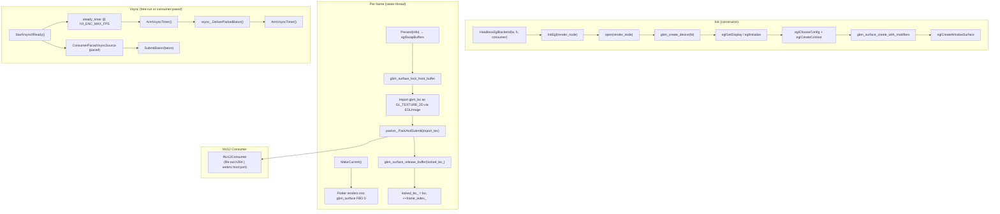

# headless_egl backend

An EGL-only rendering backend that runs with **no display, no Wayland, and no
scanout**. The Flutter engine renders on the GPU (OpenGL ES 3) into a real EGL
window surface backed by a `gbm_surface`; on `eglSwapBuffers` the presented
buffer is imported as a GL texture and packed RGBA→NV12 on the GPU, then handed
to an `INv12Consumer` (file encoder or WebRTC) via dma-buf. It is the
zero-copy counterpart of the software backend's CPU `EncoderSink`: the GPU
both rasterizes and colour-converts, and no CPU touches the pixels.

## Features

| Capability | Status | Toggle / scope |
|---|---|---|
| OpenGL ES 3 render target (gbm_surface + EGL window surface) | Built-in | Always |
| GPU RGBA→NV12 color conversion (Nv12GlPacker) | Built-in | Always |
| Zero-copy dma-buf export to encoder/bridge | Built-in | Always |
| Synthetic vsync pacing (free-run, no display) | Built-in | `IVI_ENC_MAX_FPS` (default 30 fps; `≤0` disables) |
| Consumer-paced vsync with ring backpressure | Opt-in | `IVI_HEADLESS_PACED=1` |
| Free-run (ceiling-only) vsync mode | Opt-in | `IVI_HEADLESS_FREERUN=1` |
| Per-frame vsync baton delivery | Built-in | Always |
| Pointer injection through engine input path | Built-in | Always |
| EGL context export to plugins (`GetEglContext`) | Built-in | Always once device is created |
| No display surface; `CreateSurface` / `Resize` are stubs | Built-in | Always |

---

## Architecture

`HeadlessEglBackend` derives from the abstract [`Backend`](../backend.h)
interface. It opens a DRM render node, creates a GBM device, initializes an
EGL display with OpenGL ES 3, and allocates a double-buffered `gbm_surface`
for the engine to render into. On each present the just-presented buffer is
imported as a GL texture and passed to the `Nv12GlPacker`, which GPU-converts
it to NV12 and submits the result to the `INv12Consumer`.



### Module responsibilities

- **EGL device bring-up.** `InitEgl` → opens the DRM render node, creates a GBM
  device, resolves `eglGetPlatformDisplayEXT` for `EGL_PLATFORM_GBM_KHR`,
  initializes EGL, selects an OPAQUE XRGB8888 config (no alpha), creates a
  GL ES 3 context and a shared resource context, allocates a double-buffered
  `gbm_surface` with a `DRM_FORMAT_MOD_LINEAR` modifier (untiled so it
  imports as a plain `GL_TEXTURE_2D`), and wraps it in an EGL window surface.
- **Render target ring.** The `gbm_surface` is the engine's swap chain — two
  buffers the driver manages on `eglSwapBuffers`. The just-presented buffer
  is locked and imported each frame; the previously locked buffer is released.
- **NV12 packing.** `InitRenderTarget` sets up a single reusable import texture
  and initializes the `Nv12GlPacker`. `Present` imports the linear `gbm_bo` as
  an `EGLImage` via `EGL_EXT_image_dma_buf_import`, binds it to the import
  texture, and calls `packer_.PackAndSubmit` which GPU-converts RGBA→NV12 and
  hands the result to the consumer.
- **Vsync.** `StartVsyncIfReady` creates a free-running `steady_timer` paced
  at `IVI_ENC_MAX_FPS` (default 30 fps). `IVI_HEADLESS_PACED=1` replaces the
  timer with a `ConsumerPacedVsyncSource` whose credit budget is the packer's
  ring depth, so the engine renders at the consumer's real rate and stalls
  cleanly when the encoder backs up. `IVI_HEADLESS_FREERUN=1` starts the paced
  source in ceiling-only (detached) mode. `IVI_HEADLESS_VSYNC=0` (or a
  non-positive fps) disables synthetic vsync entirely and leaves Flutter on
  its internal wall-clock scheduler.
- **Consumer.** The `INv12Consumer` is supplied at construction. The sink is
  selected by `IVI_ENC_SINK` (default `file:out.h264`); `file:<path>` writes
  an H.264 file, `webrtc:<host>:<port>` streams via WebRTC.

### File map

| Path | Responsibility |
|------|----------------|
| [headless_egl.h](headless_egl.h) / [headless_egl.cc](headless_egl.cc) | `HeadlessEglBackend` — EGL/GBM bring-up, swap-chain present, NV12 pack integration, synthetic vsync, consumer wiring |

### Threading model

Three threads are involved:

- **Raster thread** — drives `MakeCurrent` / `Present` (the Flutter renderer's
  present callbacks). All GL/EGL operations (buffer import, NV12 packing,
  consumer submission) run here.
- **Platform task runner** — the vsync `Trampoline` and timer handlers run on
  it via `asio::post` onto its strand; `InjectPointer` marshals input events
  onto it before calling `FlutterEngineSendPointerEvent`.
- **Consumer thread** — `INv12Consumer` owns its own encoding/streaming thread;
  it receives NV12 frames from the packer without blocking the raster thread.

`std::atomic` flags (`vsync_running_`) coordinate state between threads.

---

## Build steps

### Dependencies

- GBM (`libgbm`) — provided by the system Mesa
- EGL / GLES 3 — provided by the system Mesa
- `Nv12GlPacker` and `INv12Consumer` — compiled from `backend/software/`

### Configure + build

```sh
cmake -B build -G Ninja -DBUILD_BACKEND_HEADLESS_EGL=ON
ninja -C build
```

### Build matrix

| Config | CMake flags | Output |
|--------|-------------|--------|
| Headless EGL | `-DBUILD_BACKEND_HEADLESS_EGL=ON` | `headless_egl.cc` |

### Optional features detected at configure time

None — this backend has no configure-time feature detection. GBM/EGL/GL
extensions are probed at runtime in `InitEgl` and `Present`; any shortfall
results in a log warning and a failed present (not a hard abort).

---

## Running

There is no display. The backend boots and paces at `IVI_ENC_MAX_FPS` frames
per second; `IVI_HEADLESS_VSYNC=0` disables synthetic vsync and leaves Flutter
on its wall-clock scheduler.

### CLI Flags

| Flag | What it does |
|------|-------------|

### Env vars

| Env | Default | Effect |
|------|---------|--------|
| `IVI_HEADLESS_VSYNC` | (not set) | Any non-zero value enables synthetic vsync pacing. `0` or unset with `IVI_ENC_MAX_FPS≤0` disables pacing and leaves Flutter on wall-clock. |
| `IVI_ENC_MAX_FPS` | `30` | Encode rate in fps; used as the synthetic vsync rate and as the packer's rate ceiling. `≤0` disables pacing. |
| `IVI_HEADLESS_PACED` | `0` | Any non-zero value enables consumer-paced vsync: the packer's ring depth is the credit budget and `IVI_ENC_MAX_FPS` is the rate ceiling. The engine renders at the consumer's real rate and stalls when the encoder backs up. |
| `IVI_HEADLESS_FREERUN` | `0` | Any non-zero value starts the paced vsync source in ceiling-only (detached) mode. |
| `IVI_ENC_RENDER_NODE` | `/dev/dri/renderD128` | DRM render node to open for GBM. |
| `IVI_ENC_SINK` | `file:out.h264` | Consumer spec: `file:<path>` (H.264 file) or `webrtc:<host>:<port>` (WebRTC stream). |

---

## Diagnostics/Debug

- **Logs go to stderr.** Look for `[HeadlessEgl]` prefixes.
- **Confirm EGL bring-up.** Startup logs `[HeadlessEgl] EGL {major}.{minor} ready
  on {render_node} (XRGB8888)`.
- **Confirm render target.** First `MakeCurrent` logs
  `[HeadlessEgl] render target ready {W}x{H}`.
- **Confirm vsync mode.** `StartVsyncIfReady` logs either
  `[HeadlessEgl] synthetic vsync at {N} fps` (timer mode) or nothing (paced
  or disabled).
- **Confirm present.** Each `Present` that reaches `eglSwapBuffers` and the
  packer logs nothing on success; failures log `[HeadlessEgl] eglSwapBuffers
  failed` or `[HeadlessEgl] import eglCreateImageKHR failed`.
- **`--drm-list-modes`** is not supported; the backend logs
  `the 'headless_egl' backend does not support --drm-list-modes`.

---

## Known limitations / follow-ups

1. **Geometry changes are ignored** — `Resize()` logs a warning and keeps the
   initial extent. A mid-run resize would require tearing down and recreating
   the swap chain, EGL contexts, import texture, and packer.
2. **No platform-view composition** — `GetCompositorConfig` returns a
   single-surface compositor; platform-view layers are not supported in a
   headless context.
3. **Fixed encode resolution** — the backend is constructed with an initial
   width and height and ignores Flutter view resize requests. The consumer
   sees a fixed-resolution stream.
4. **H.264 file output only for file sink** — the `file:` consumer writes raw
   H.264 frames (NAL units) to disk; playback requires a container (e.g.
   MP4) or a player that accepts raw H.264.
5. **No WebRTC validation in-tree** — the `webrtc:` consumer is implemented
   but not exercised by any integration test; the socket framing and
   signalling are a follow-up.
6. **GBM linear modifier requirement** — the swap chain forces
   `DRM_FORMAT_MOD_LINEAR` so the presented buffers import cleanly as
   `GL_TEXTURE_2D`. A driver that rejects the forced modifier falls back to
   a plain `gbm_surface_create` which may hand back tiled buffers; these
   may mis-import as dashed or blocky garbage.

---

## References

- [Backend interface](../backend.h) — display-target abstraction
- [Backend overview README](../README.md)
- [headless_vulkan backend README](../headless_vulkan/README.md) — the Vulkan sibling with the same no-display architecture
- [Nv12GlPacker](../../backend/software/nv12_gl_packer.h) — GPU RGBA→NV12 packer
- [INv12Consumer](../../backend/software/nv12_consumer.h) — encoder/bridge consumer interface
- [drm_kms_egl backend README](../drm_kms_egl/README.md) — EGL/KMS sibling with real scanout
- `EGL_EXT_image_dma_buf_import` — dma-buf import extension
- GBM (`libgbm`) — Generic Buffer Management for DRM render nodes
