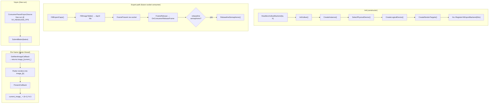

# headless_vulkan backend

A Vulkan-only rendering backend that runs with **no display, no Wayland, and no
scanout**. It boots the Flutter Vulkan renderer against a minimal Vulkan device
(instance + one graphics queue) and feeds it a 3-slot ring of `VkImage` render
targets; frames are composited and then go nowhere. It is the foundation for a
future dma-buf-export + external-semaphore-synchronized socket path that a
downstream bridge plugin (e.g. CARLA/Unreal) will consume.

## Features

| Capability | Status | Toggle / scope |
|---|---|---|
| Vulkan render target ring (3 × `VK_FORMAT_R8G8B8A8_UNORM`) | Built-in | Always |
| Synthetic vsync pacing (free-run, no display) | Built-in | `IVI_HEADLESS_FPS` (default 30 fps; `≤0` disables) |
| External-memory export: opaque-fd pool | Opt-in | `IVI_VK_EXPORT_MODE=opaque` |
| External-memory export: dma-buf pool with DRM modifiers | Opt-in | `IVI_VK_EXPORT_MODE=dmabuf` |
| Per-frame cross-process GPU sync (render_done / consumer_done as OPAQUE_FD semaphores) | Opt-in | Auto when export is active; `IVI_VK_EXPORT_LOOPBACK=1` enables in-process self-consumer |
| Loopback stand-in consumer for same-process validation | Opt-in | `IVI_VK_EXPORT_LOOPBACK=1` |
| In-process C ABI (`ihs_vk_export_get_api`) for bridge plugins | Built-in | Always |
| Pointer injection through engine input path | Built-in | Always |
| Vulkan device UUID pinning | Opt-in | `IVI_VK_DEVICE_UUID` (hex, no separators) |
| Vulkan context export to plugins (`GetVulkanContext`) | Built-in | Always once device is created |
| Consumer-driven pool resize (rebuild + generation bump) | Built-in | Always (triggers on `RebuildExportPool` call) |
| No display surface; `CreateSurface` / `Resize` are stubs | Built-in | Always |

---

## Architecture

`HeadlessVulkanBackend` derives from the abstract [`Backend`](../backend.h)
interface. It creates a Vulkan instance, selects the first non-CPU physical
device that supports Vulkan 1.1, opens one graphics queue, and allocates a
ring of 3 `VkImage` + dedicated `VkDeviceMemory` render targets. The engine
composites into these images via the Vulkan render config callbacks; the images
are never presented anywhere.



### Module responsibilities

- **Vulkan device bring-up.** `InitVulkan` → `CreateInstance` → `SelectPhysicalDevice`
  → `CreateLogicalDevice`. `SelectPhysicalDevice` skips CPU/software renderers
  (`llvmpipe`, `lavapipe`, `SwiftShader`) and optionally pins to a specific
  GPU via `IVI_VK_DEVICE_UUID`. The device UUID is retained for the future
  export handshake.
- **Render target ring.** `CreateRenderTargets` allocates 3 `VkImage` +
  dedicated `VkDeviceMemory` slots (`VK_IMAGE_TILING_OPTIMAL`,
  `VK_FORMAT_R8G8B8A8_UNORM`). This is the **plain pool**. When
  `IVI_VK_EXPORT_MODE` is set, a **exportable pool** is attempted first
  (`CreateExportablePool`): opaque-fd or dma-buf allocation with DRM modifier
  tiling, using `VK_KHR_external_memory[_fd]` / `VK_EXT_external_memory_dma_buf`
  / `VK_EXT_image_drm_format_modifier` extensions. On any failure the plain
  pool is used as fallback, so the backend always boots and paces.
- **Per-frame sync.** When the exportable pool is active, a pair of
  OPAQUE_FD-exportable binary semaphores per image (`render_done_[i]` /
  `consumer_done_[i]`) is created, their fds exported, and each
  `consumer_done_[i]` pre-signaled so the first `GetNextImage` wait passes.
  `RebaselineSemaphores` recreates the semaphores from scratch between consumer
  sessions (binary semaphores cannot be reset in place). `IVI_VK_EXPORT_LOOPBACK=1`
  enables an in-process self-consumer that stands in for the future socket
  consumer.
- **Vsync.** `StartVsyncIfReady` creates a `ConsumerPacedVsyncSource` run in
  **free-run mode** (ceiling-only pacing; no consumer). `IVI_HEADLESS_FPS=0`
  disables synthetic vsync entirely and leaves Flutter on its internal
  wall-clock scheduler.
- **Export ABI.** `vk_export_api.cc` exposes `ihs_vk_export_get_api` (the
  `IhsVkExportApiV1` table) so a bridge plugin can query the pool caps, receive
  per-present frame notifications, inject pointer input, and drive pool resizes.
  The test consumer in `export_consumer/` validates the full wire protocol
  (hello → caps → image table → frame present/release loop → resize) over a
  Unix SEQPACKET socket.

### File map

| Path | Responsibility |
|------|----------------|
| [headless_vulkan.h](headless_vulkan.h) / [headless_vulkan.cc](headless_vulkan.cc) | `HeadlessVulkanBackend` — Vulkan device bring-up, render-target ring, export pool, per-frame sync semaphores, synthetic vsync, export ABI stubs |
| [vk_export_api.h](vk_export_api.h) / [vk_export_api.cc](vk_export_api.cc) | Exported `ihs_vk_export_get_api` C ABI (delegates to the active backend instance) |
| [export_consumer/export_consumer_main.cc](export_consumer/export_consumer_main.cc) | Standalone same-device test consumer — connects to the bridge socket, imports the pool, validates zero-copy content correctness, drives vsync pacing |
| [export_consumer/vk_consumer.h](export_consumer/vk_consumer.h) / [vk_consumer.cc](export_consumer/vk_consumer.cc) | Vulkan import of the exported pool + per-frame render_done wait / consumer_done signal |
| [export_consumer/wire_client.h](export_consumer/wire_client.h) / [wire_client.cc](export_consumer/wire_client.cc) | Unix SEQPACKET framing send/receive for the wire protocol |
| [export_consumer/wire_protocol.h](export_consumer/wire_protocol.h) | Wire protocol v1: `Hello`, `Caps`, `ImageTable`, `FramePresent`, `FrameRelease`, `InputPointer`, `Resize`, `Bye` messages + SCM_RIGHTS fd ordering |

### Threading model

Three threads are involved:

- **Raster thread** — drives `GetNextImageCallback` and `PresentCallback` (the Flutter renderer's present callbacks). All Vulkan queue operations (semaphore signal/wait, image layout queries, pool rebuild via `PerformResize`) run here. Frame-present listener callbacks also fire here.
- **Bridge IO thread** — calls the exported C ABI functions (`FillImageTable`, `FillExportCaps`, `SetExportFrameListener`, `SetExportPaceSource`, `RebuildExportPool`, `InjectPointer`). Mutexes guard shared state:
  - `export_fd_mutex_` — serializes `FillImageTable`'s fd reads against `RebaselineSemaphores`' rewrites
  - `resize_mutex_` / `resize_cv_` — `RebuildExportPool` blocks on the raster thread's `PerformResize`
  - `frame_listener_mutex_` — `SetExportFrameListener` vs. `PresentCallback` on different threads
- **Platform task runner** — the `VsyncTrampoline` runs on it; `InjectPointer` marshals input events onto it before calling `FlutterEngineSendPointerEvent`.

`std::atomic` flags (`resize_pending_`, `sync_rebaseline_pending_`, `vsync_running_`, `export_consumer_active_`) coordinate state between threads without holding the mutexes for long.

---

## Build steps

### Dependencies

No external Vulkan loader library is linked — `vulkan.hpp` dlopens `libvulkan`
at runtime and uses its own dynamic dispatch loader. The only build-time
requirement is the vendored Vulkan headers in `third_party/Vulkan-Headers/`.

### Configure + build

```sh
cmake -B build -G Ninja -DBUILD_BACKEND_HEADLESS_VULKAN=ON
ninja -C build
```

### Build matrix

| Config | CMake flags | Output |
|--------|-------------|--------|
| Headless Vulkan (base) | `-DBUILD_BACKEND_HEADLESS_VULKAN=ON` | `headless_vulkan.cc`, `vk_export_api.cc` |
| + test consumer | always compiled in | adds `export_consumer_main.cc`, `vk_consumer.cc`, `wire_client.cc` |

### Optional features detected at configure time

None — this backend has no configure-time feature detection. The Vulkan device
extensions and export capabilities are probed at runtime in `CreateRenderTargets`
and `CreateExportSemaphores`; any shortfall falls back to the non-exportable
plain pool without affecting bring-up.

---

## Running

There is no display. The backend always boots and paces at `IVI_HEADLESS_FPS`
frames per second; `IVI_HEADLESS_FPS=0` disables synthetic vsync.


### CLI Flags

| Flag | What it does |
|------|-------------|

### Env vars

| Env | Default | Effect |
|------|---------|--------|
| `IVI_HEADLESS_FPS` | `30` | Synthetic vsync rate in fps. `≤0` disables the pacer and leaves Flutter on its wall-clock scheduler. |
| `IVI_VK_DEVICE_UUID` | (none) | 16 hex bytes ( separators optional) — pins the physical device by its `deviceUUID` rather than taking the first non-CPU Vulkan 1.1 device. |
| `IVI_VK_EXPORT_MODE` | (none) | `opaque` — allocate the pool with `VK_KHR_external_memory` + export OPAQUE_FD handles. `dmabuf` — allocate with DRM modifier tiling and export dma-buf handles. Unset means no export; the plain (non-exportable) pool is used. |
| `IVI_VK_EXPORT_LOOPBACK` | `0` | Any non-zero value enables the in-process self-consumer: after each present, the backend waits `render_done[i]` and signals `consumer_done[i]` on the same queue, validating the semaphore round-trip without a real socket. |

---

## Diagnostics/Debug

- **Logs go to stderr.** Look for `[HeadlessVulkan]` prefixes.
- **Confirm device selection.** Startup logs `[HeadlessVulkan] selected device
  '<name>'`. Use `IVI_VK_DEVICE_UUID` to pin to a specific GPU.
- **Confirm export mode.** When `IVI_VK_EXPORT_MODE` is set, logs show
  `[HeadlessVulkan] export pool active: mode={dmabuf|opaque} images=3 WxH`.
  If the device lacks the required extensions or export capability, it logs a
  warning and falls back to the non-exportable pool — it never hard-fails
  bring-up.
- **Confirm semaphore state.** When loopback or a consumer is attached,
  `[HeadlessVulkan] image N sync semaphores: render_done_fd=N consumer_done_fd=N`
  is logged per slot.
- **Per-frame frame-present notification.** `SetExportFrameListener` fires the
  registered callback on the raster thread after each present, with the slot
  index and frame sequence.
- **Pool rebuild.** `RebuildExportPool(w, h)` (called from the bridge IO thread)
  triggers a raster-thread pool rebuild at the next `GetNextImage` boundary,
  bumps `generation_`, and logs `[HeadlessVulkan] pool rebuilt WxH -> WxH
  (generation N)`. A timeout (2 s) is applied so a stalled raster does not
  hang the bridge.
- **`--drm-list-modes`** is not supported; the backend logs
  `the 'headless_vulkan' backend does not support --drm-list-modes`.

---

## Wire protocol (export consumer)

The `export_consumer/` directory contains a standalone test consumer that
exercises the full wire protocol v1 over a Unix SEQPACKET socket (default:
`$XDG_RUNTIME_DIR/ihs-vk-export.sock`, else `/tmp/ihs-vk-export.sock`).

### Message flow

```
Consumer                           Bridge (HeadlessVulkanBackend)
    |                                        |
    | -------- Hello (deviceUUID) ---------> |
    | <------- Caps ------------------------ |
    | <------- ImageTable (+ fds) -----------|
    |                                        |
    | (per frame)                           |
    | <------- FramePresent (slot, seq) ----|
    | -------- FrameRelease (slot) -------->|
    |                                        |
    | (optional resize)                      |
    | -------- Resize (WxH) --------------> |
    | <------- ImageTable (+ fds) -----------|
    |                                        |
    | -------- Bye ------------------------>|
```

### Env vars (consumer)

| Env | Default | Effect |
|------|---------|--------|
| `IHS_VK_CONSUMER_SOCKET` | `$XDG_RUNTIME_DIR/ihs-vk-export.sock` | Unix SEQPACKET socket path |
| `IHS_VK_CONSUMER_FRAMES` | `120` | Stop after this many frames |
| `IHS_VK_CONSUMER_RESIZE` | (none) | Send one `Resize` after a few frames (e.g. `800x600`) to exercise pool rebuild |

---

## Known limitations / follow-ups

1. **No in-tree socket bridge yet** — frames are discarded unless export is
   enabled and a bridge consumes the C ABI. The export machinery and standalone
   socket consumer are in-tree, but a downstream bridge plugin must expose the
   backend's C ABI over the Unix SEQPACKET socket.
2. **Geometry changes are ignored** — `Resize()` logs a warning and keeps the
   initial pool extent. The pool can only be rebuilt at a new size via
   `RebuildExportPool` (consumer-driven), not by a Flutter view resize.
3. **Single GPU only** — `SelectPhysicalDevice` picks one non-CPU Vulkan 1.1
   device; multi-GPU systems require `IVI_VK_DEVICE_UUID` to pin to the
   correct GPU. There is no GPU-failover logic.
4. **Binary semaphores only** — the per-frame sync semaphores are binary
   (not timeline). If a consumer stalls, the backend will wait indefinitely
   on `vkQueueWaitIdle` during `RebaselineSemaphores`. Timeline semaphores
   are a future improvement.
5. **No platform-view composition** — `BUILD_COMPOSITOR` has no effect on this
   backend; there is no `FlutterCompositor` backing-store API integration.
   Platform-view layers are not supported in a headless context.
6. **Loopback consumer is single-threaded** — the in-process self-consumer
   (`IVI_VK_EXPORT_LOOPBACK=1`) performs no actual content validation; it
   only exercises the semaphore round-trip. Full zero-copy correctness
   validation requires the real socket consumer.

---

## References

- [Backend interface](../backend.h) — display-target abstraction
- [Backend overview README](../README.md)
- [headless_egl backend README](../headless_egl/README.md) — the EGL sibling with the same no-display architecture
- [wayland_vulkan backend README](../wayland_vulkan/README.md) — Vulkan/WSI comparison baseline
- [drm_kms_vulkan backend README](../drm_kms_vulkan/README.md) — Vulkan zero-copy KMS sibling
- [ihs/vk_export.h](../../../shared/include/ihs/vk_export.h) — exported C ABI header
- `VK_KHR_external_memory`, `VK_KHR_external_memory_fd` — opaque-fd export extensions
- `VK_EXT_external_memory_dma_buf`, `VK_EXT_image_drm_format_modifier` — dma-buf export extensions
- `VK_KHR_external_semaphore`, `VK_KHR_external_semaphore_fd` — semaphore export extensions
- `vulkan.hpp` dynamic dispatch — runtime Vulkan loader (dlopen libvulkan)
