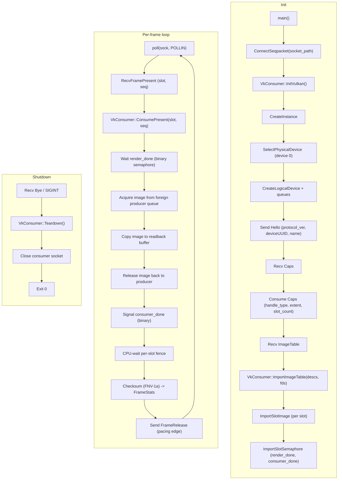

# export_consumer

A standalone same-device test consumer for the `ihs-vk-export` path. It connects
to the bridge's Unix SEQPACKET socket, imports the headless-vulkan backend's
exported Vulkan image pool (dma-buf or opaque-fd memory plus binary
render_done/consumer_done semaphores), and for each presented frame waits
render_done, copies the image out to a host buffer and checksums it (proving
zero-copy content correctness), then signals consumer_done and sends a
FrameRelease pacing edge back to the backend. It is the consumer half of the
export path described in [vk_export_api.h](../vk_export_api.h).

## Features

| Capability | Status | Toggle / scope |
|---|---|---|
| Same-device OPAQUE_FD import | Built-in | When bridge offers `kHandleOpaqueFd` |
| Same-device dma-buf import (with DRM modifier) | Built-in | When bridge offers `kHandleDmaBuf` |
| Import-symmetric to `HeadlessVulkanBackend` export | Built-in | Always |
| Per-frame GPU-wait render_done, copy-out, checksum (FNV-1a), signal consumer_done | Built-in | Always |
| CPU-side pacing via FrameRelease (drives consumer-paced vsync) | Built-in | Always |
| Optional resize exercise (`IHS_VK_CONSUMER_RESIZE`) | Opt-in | `IHS_VK_CONSUMER_RESIZE="WxH"` |
| Frame budget limiter (`IHS_VK_CONSUMER_FRAMES`) | Opt-in | Default 120 frames |
| Clean teardown on SIGINT or bridge Bye | Built-in | Always |

---

## Architecture

The consumer is a self-contained binary that talks to the bridge over the wire
protocol defined in [wire_protocol.h](wire_protocol.h). It follows the same
device as the backend (physical device 0), sends a `Hello` with its own
`deviceUUID`, receives `Caps` and an `ImageTable`, imports every pool image and
both semaphores per slot, and then enters a `poll` loop waiting for `FramePresent`
messages from the bridge.



### Module responsibilities

- **`wire_protocol.h`** — the shared wire protocol contract: message types,
  payload structs, handle-type bits, and capability flags. Every struct is
  padding-free and guarded with a `static_assert` on size.
- **`wire_client.h` / `wire_client.cc`** — minimal SEQPACKET framing: connect,
  send framed messages (with optional SCM_RIGHTS fds), and receive one
  datagram. The consumer only needs Hello, FrameRelease, Bye, and
  Resize as outgoing, and Caps, ImageTable, FramePresent, Bye as incoming.
- **`vk_consumer.h` / `vk_consumer.cc`** — the Vulkan import engine: creates a
  dynamic-dispatch instance on physical device 0, imports the image table
  (opaque-fd or dma-buf), and per frame submits a copy-out command buffer that
  waits render_done, copies the image to host memory, checksums it with FNV-1a,
  and signals consumer_done.
- **`export_consumer_main.cc`** — the entry point: resolves socket path and
  frame budget from env, performs the handshake (Hello → Caps → ImageTable),
  enters the per-frame poll loop, and exercises an optional resize request.

### File map

| Path | Responsibility |
|------|----------------|
| [wire_protocol.h](wire_protocol.h) | Shared wire protocol: message types, payload structs, handle-type bits, capability flags |
| [wire_client.h](wire_client.h) / [wire_client.cc](wire_client.cc) | SEQPACKET framing: connect, send, receive, SCM_RIGHTS fd handling |
| [vk_consumer.h](vk_consumer.h) / [vk_consumer.cc](vk_consumer.cc) | Vulkan import engine: instance/device creation, image table import, per-frame copy-out and checksum |
| [export_consumer_main.cc](export_consumer_main.cc) | Entry point: handshake, poll loop, env-driven configuration, teardown |

### Threading model

The consumer is **single-threaded**. All Vulkan operations (import, present
consume, copy-out, fence wait) run on the main thread. The `poll` loop blocks
on the socket until the bridge sends a `FramePresent`.

---

## Build steps

### Dependencies

- Vulkan 1.1 runtime (dynamic loader + driver; no link-time libvulkan)
- vendored `vulkan.hpp` (from the shell's third_party) — used for dynamic
  dispatch via `VULKAN_HPP_DISPATCH_LOADER_DYNAMIC 1`

### Configure + build

```sh
cmake -B build -G Ninja
ninja -C build ihs-vk-export-consumer
```

### Build matrix

| Config | CMake flags | Output |
|--------|-------------|--------|
| Export consumer (default) | (none) | `ihs-vk-export-consumer` binary |

### Optional features detected at configure time

None — this binary has no configure-time feature detection. Vulkan extensions
are probed at runtime during `VkConsumer::InitVulkan`.

---

## Running

The consumer must be run **after** the compositor (bridge) is already listening
on the SEQPACKET socket. It connects, imports, consumes frames, then exits
cleanly when the frame budget is reached or on SIGINT.

```sh
./build/shell/backend/headless_vulkan/export_consumer/ihs-vk-export-consumer
```

### CLI Flags

None — configuration is entirely environment-driven.

### Env vars

| Env | Default | Effect |
|------|---------|--------|
| `IHS_VK_CONSUMER_SOCKET` | `$XDG_RUNTIME_DIR/ihs-vk-export.sock` (fallback `/tmp/ihs-vk-export.sock`) | Unix SEQPACKET socket path to connect to the bridge. |
| `IHS_VK_CONSUMER_FRAMES` | `120` | Stop after consuming this many frames. |
| `IHS_VK_CONSUMER_RESIZE` | (unset) | `"WxH"` — after a few frames, send one `Resize` message to exercise the backend's pool rebuild. |

---

## Diagnostics/Debug

- **Logs go to stderr.** Look for `[ihs-vk-consumer]` prefixes.
- **Handshake success.** `Hello -> Caps -> ImageTable` logs the bridge's
  `deviceUUID` match and the imported handle type (dma-buf or opaque-fd).
- **Per-frame stats.** Every consumed frame logs the slot index, frame
  sequence, FNV-1a CRC, and two sampled pixels (`px_first` and `px_center`) so
  you can confirm content changes frame to frame.
- **Exit code.** `0` on a clean run (frame budget or SIGINT); non-zero on any
  protocol, import, or Vulkan error.

---

## Known limitations / follow-ups

1. **Physical device 0 only** — the consumer always selects `physical_device[0]`.
   A multi-GPU system must ensure the backend and consumer land on the same GPU
   (the `deviceUUID` handshake catches a mismatch, but the consumer does not
   search).
2. **Binary semaphores only** — the consumer uses binary semaphore waits and
   signals. The bridge can offer timeline semaphores (`kCapsTimelineSemaphores`),
   but the consumer does not exploit them yet.
3. **No pointer/key injection** — `kInputPointer` and `kInputKey` messages are
   defined in the wire protocol but not yet implemented in the consumer.