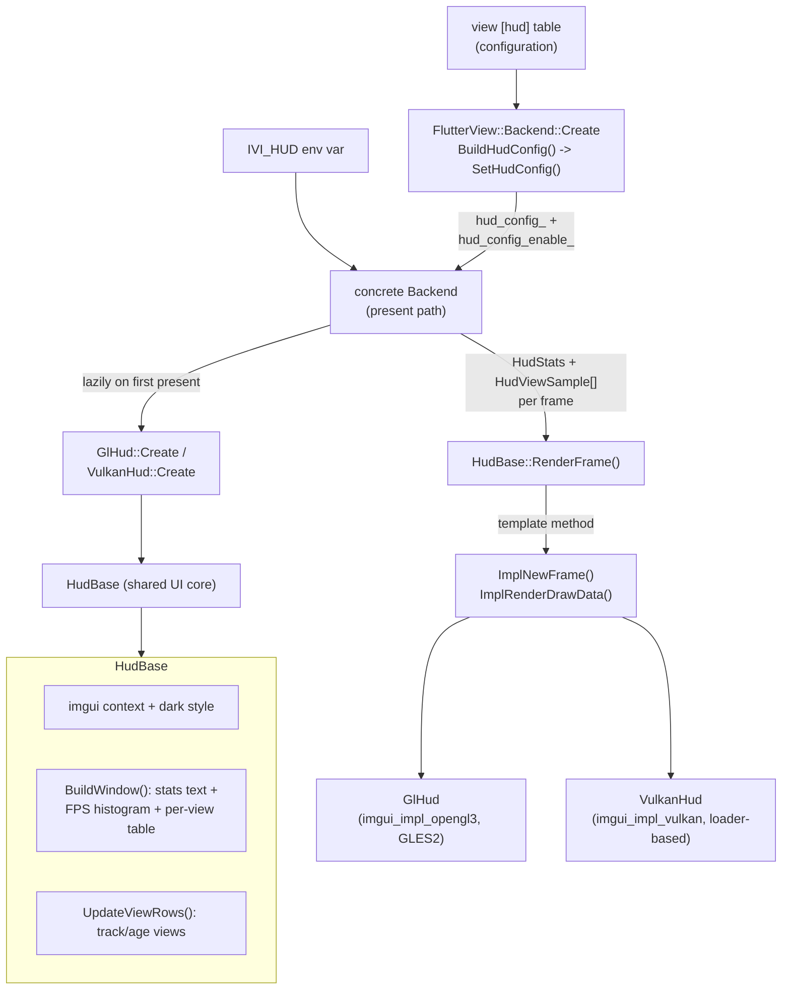

# Debug HUD overlay

An optional, non-interactive [Dear ImGui](https://github.com/ocornut/imgui)
overlay that a compositor backend draws over the composited frame to surface
live present statistics — FPS against the display refresh, average/worst frame
interval, stall count, dma-buf/explicit-sync state — and a per-platform-view
table (size, present count, and whether each view took the zero-copy dma-buf
path). It exists purely as a compositor debugging aid: it steals no input, has
no title bar or hot key, and is enabled from the view's `[hud]` config table or
the `IVI_HUD` environment variable. Rendering is split into a shared,
backend-neutral UI core (`HudBase`) and two thin render backends (`GlHud` for
the OpenGL-ES/EGL paths, `VulkanHud` for the Vulkan paths), so a given binary
only pulls in the imgui render backend for the renderers it was built with.

## Features

| Capability | Status | Toggle / scope |
|---|---|---|
| Frame stats (FPS / avg / worst / stalls) | Built-in | With HUD active |
| FPS histogram with green/red refresh threshold | Built-in | With HUD active |
| Per-view table (id, size, presents, idle frames, path) | Built-in | With HUD active |
| View appear/dispose flash + age-out | Built-in | With HUD active |
| dma-buf present / explicit-sync indicators | Built-in | Reported per backend |
| OpenGL-ES render backend (`GlHud`) | Built-in | `BUILD_BACKEND_WAYLAND_EGL` / `BUILD_BACKEND_DRM_KMS_EGL` |
| Vulkan render backend (`VulkanHud`) | Built-in | `BUILD_BACKEND_WAYLAND_VULKAN` / `BUILD_BACKEND_DRM_KMS_VULKAN` |
| Offscreen texture render (DRM plane compositor) | Built-in | `GlHud::RenderOffscreen`, drm-kms-egl |
| Corner / margin / font / colors / opacity | Built-in | `[hud]` config table |
| Enable from config or env | Built-in | `[hud] enable` / `IVI_HUD` |

---

## Architecture



The HUD is a small class hierarchy rooted at the backend-neutral interface
[`IHud`](ihud.h) (just `IsOpen()` / `SetOpen()`). [`HudBase`](hud_base.h) owns
everything renderer-independent: the imgui context and style, the frame-time
history ring, the green/red FPS histogram, the per-view row tracking, and the
overlay window layout. Concrete backends supply only two hooks — an imgui
new-frame call and a draw-data submission — through `HudBase::RenderFrame`,
which is a template method: it sets the display size and delta time, updates the
view rows, calls `ImplNewFrame()`, builds the window, then calls
`ImplRenderDrawData()` with the recorded draw list (skipping submission entirely
when the draw data is empty).

- **`IHud`** — the tiny virtual surface a backend holds a HUD through, plus the
  plain-old-data structs it feeds each frame: `HudStats` (FPS, avg/worst frame
  interval, target refresh, stalls, dma-buf/explicit-sync flags), `HudViewSample`
  (one composited platform view: id, size, dma-buf path), and `HudConfig`
  (corner, margin, font scale, background alpha, RGBA text color).
- **`HudBase`** — shared implementation. `InitContext()` creates the imgui
  context with `IniFilename`/`LogFilename` disabled (a compositor must not write
  `imgui.ini`). `BuildWindow()` positions a decoration-free, input-less window in
  the configured corner and draws the stats, histogram, and view table.
  `UpdateViewRows()` keeps a `ViewRow` per Flutter platform-view id, flashing
  green just after a view appears and red while it is dying, and dropping rows a
  short grace period after a view stops being composited.
- **`GlHud`** — OpenGL-ES render backend over `imgui_impl_opengl3` (GLSL ES
  `#version 100`). `Render()` draws over the default framebuffer (FBO 0) just
  before the backend's buffer swap; `RenderOffscreen()` renders into an owned,
  reused transparent RGBA texture and returns its GL name, for the DRM plane
  compositor that composites the HUD onto a KMS-inverted scanout buffer with the
  same y-flip it applies to app layers.
- **`VulkanHud`** — Vulkan render backend over `imgui_impl_vulkan`. It is built
  `IMGUI_IMPL_VULKAN_NO_PROTOTYPES`, so it resolves every Vulkan entry point
  through the shell's interposed `vkGetInstanceProcAddr` — the same
  queue-serialising loader the rest of the compositor uses — rather than linking
  libvulkan. Its render pass loads (preserves) the composited image in `GENERAL`
  layout and records the overlay into the caller's command buffer and target
  image view; framebuffers are cached per image view and dropped on swapchain
  resize (`DropFramebuffers()`).

Each backend creates its HUD lazily on the first present once it has determined
the HUD is enabled, feeds it a rolling window of present intervals as `HudStats`,
and builds the `HudViewSample` list from that frame's `FlutterLayer`
platform-view layers.

### File map

| Path | Purpose |
|------|---------|
| [ihud.h](ihud.h) | `IHud` interface + `HudStats` / `HudViewSample` / `HudConfig` structs |
| [hud_base.h](hud_base.h) | `HudBase` shared UI core (declaration) |
| [hud_base.cc](hud_base.cc) | imgui context, window layout, FPS histogram, per-view tracking |
| [gl_hud.h](gl_hud.h) | `GlHud` OpenGL-ES render backend (declaration) |
| [gl_hud.cc](gl_hud.cc) | `imgui_impl_opengl3` init, default-FBO + offscreen render |
| [vulkan_hud.h](vulkan_hud.h) | `VulkanHud` Vulkan render backend (declaration) |
| [vulkan_hud.cc](vulkan_hud.cc) | render pass / descriptor pool, loader wiring, command recording |

### Threading model

Input-facing HUD methods (`SetOpen`, config) are set once on the platform thread
before the first present; `RenderFrame` and all GPU work run on the
raster/present thread with the backend's GL context current (`GlHud`) or inside
the caller's command buffer under the shared Vulkan queue lock (`VulkanHud`).
The concrete backend is responsible for not racing the two; in practice the HUD
is configured before presenting begins and thereafter only touched from the
present path. Teardown must run while the device / GL context is still valid: a
backend resets its HUD (with the context current) so `imgui_impl_*_Shutdown`
lands on a live device, and only then does `~HudBase` destroy the imgui context.

---

## Build steps

### Dependencies

- **Dear ImGui** — vendored at [`third_party/imgui`](../../../third_party/imgui)
  (1.92.8); no system package required. The core (`imgui.cpp`, `imgui_draw.cpp`,
  `imgui_tables.cpp`, `imgui_widgets.cpp`) is always built when the HUD is on;
  the `imgui_impl_vulkan` and/or `imgui_impl_opengl3` render backends are
  compiled only for the enabled renderers.
- No extra runtime libraries: the Vulkan backend resolves through the shell's
  interposed loader, and the GL backend uses imgui's bundled GL loader.

### Configure + build

The HUD is gated by the `BUILD_HUD` CMake option (default `ON`), defined in
[cmake/options.cmake](../../../cmake/options.cmake) and emitted as
`BUILD_HUD` in the generated config header. It additionally **requires
`BUILD_COMPOSITOR`**: if `BUILD_HUD` is on but the compositor is off, configure
disables the HUD and prints a status line. The HUD sources are only added to the
shell target when a compatible backend is also enabled (see
[shell/CMakeLists.txt](../../CMakeLists.txt)).

```sh
cmake -B build -G Ninja \
    -DBUILD_COMPOSITOR=ON \
    -DBUILD_HUD=ON \
    -DBUILD_BACKEND_WAYLAND_EGL=ON
cmake --build build
```

To drop the vendored imgui and HUD code entirely (size-constrained builds):

```sh
cmake -B build -G Ninja -DBUILD_HUD=OFF
```

### Build matrix

| Config | CMake flags | Present path compiled in |
|--------|-------------|--------------------------|
| GL HUD | `BUILD_HUD=ON BUILD_COMPOSITOR=ON` + `BUILD_BACKEND_WAYLAND_EGL` or `BUILD_BACKEND_DRM_KMS_EGL` | `hud_base.cc` + `gl_hud.cc` |
| Vulkan HUD | `BUILD_HUD=ON BUILD_COMPOSITOR=ON` + `BUILD_BACKEND_WAYLAND_VULKAN` or `BUILD_BACKEND_DRM_KMS_VULKAN` | `hud_base.cc` + `vulkan_hud.cc` |
| Both | any GL **and** any Vulkan backend enabled | `hud_base.cc` + `gl_hud.cc` + `vulkan_hud.cc` |
| Off | `BUILD_HUD=OFF`, or `BUILD_COMPOSITOR=OFF`, or no compatible backend | none (imgui not linked) |

- `BUILD_HUD` — master switch for the overlay + vendored imgui.
- `BUILD_COMPOSITOR` — hard prerequisite; the HUD draws in the compositor
  present path, so it is force-disabled without it.
- `BUILD_BACKEND_*` — select which render backend translation units compile,
  matching the imgui impl sources added in
  [third_party/imgui/CMakeLists.txt](../../../third_party/imgui/CMakeLists.txt).

---

## Running

The HUD is off by default. It is summoned open when the resolved view config
sets `[hud] enable = true` **or** the `IVI_HUD` environment variable is present;
either source turns it on (they are OR-ed in the backend). It is a
non-interactive overlay — no hot key, no pointer capture, no title bar — so once
enabled it simply appears in the configured corner and updates every present.
The window is created lazily on the first present after enablement; if the imgui
render backend fails to initialise, the backend logs a warning
(`HUD unavailable (...)`) and never retries.

Enable via config:

```toml
[hud]
enable = true
corner = "top-right"
```

Enable via environment (any backend):

```sh
IVI_HUD=1 ./homescreen -b /path/to/bundle
```

On startup a backend logs `debug HUD enabled` once the overlay is created.

### Env vars

| Env | Default | Effect |
|------|---------|--------|
| `IVI_HUD` | unset | If set (any value), enables the HUD regardless of the `[hud] enable` config value. |

### `[hud]` config table

Appearance and layout only (enablement aside); parsed by the
[configuration](../../configuration/README.md) layer into `Config::hud` and
translated to `HudConfig` in `FlutterView` (`BuildHudConfig`). Ignored unless
the build has `BUILD_HUD` and the compositor is on.

| Key | Type | Default | Values | Effect |
|-----|------|---------|--------|--------|
| `enable` | bool | `false` | `true` \| `false` | Enable the HUD (`IVI_HUD` also enables it). |
| `corner` | string | `top-left` | `top-left` \| `top-right` \| `bottom-left` \| `bottom-right` | Screen corner the overlay hugs. |
| `margin` | float | `12` | float (px) | Gap from the chosen corner. |
| `font_scale` | float | `1.0` | float | Multiplies the base HUD font size. |
| `bg_alpha` | float | `0.75` | float `[0,1]` | Window background opacity. |
| `text_color` | string | `#FFFFFF` | `#RRGGBB` or `#RRGGBBAA` | HUD text color (malformed values keep opaque white). |

See the generated [config reference](../../../docs/config-examples/reference.toml)
(`[view.hud]`) for the authoritative list.

---

## Diagnostics/Debug

- **HUD does not appear** — confirm the binary was built with `BUILD_HUD=ON`,
  `BUILD_COMPOSITOR=ON`, and a compatible backend; check the startup log for
  `debug HUD enabled` (created) versus `HUD unavailable (...)` (imgui init
  failed). If neither line appears, the enable source was not seen — verify
  `IVI_HUD` is exported or `[hud] enable = true` is in the resolved config.
- **Reading the overlay** — the FPS line shows measured versus target (display
  refresh); histogram bars are green at or above 90% of refresh and red below.
  `stalls` counts presents that blocked on a buffer/flip. The
  `dma-buf present` / `explicit sync` lines reflect the backend's present path.
  The per-view table lists each composited platform view: `id`, `size`,
  cumulative `presents`, idle-frame count (`Δf`), and `path` (`dma-buf`, `WSI`,
  or `disposed`); rows flash green on appearance and red while aging out.
- **`imgui.ini` / logs** — the HUD disables imgui's ini and log files, so it
  never writes state to disk.

---

## References

- [Dear ImGui](https://github.com/ocornut/imgui) — vendored at
  [`third_party/imgui`](../../../third_party/imgui)
- [`shell/configuration/README.md`](../../configuration/README.md) — how the
  `[hud]` table is parsed and layered
- [`docs/config-examples/reference.toml`](../../../docs/config-examples/reference.toml) —
  generated `[view.hud]` config reference
- [`cmake/options.cmake`](../../../cmake/options.cmake) — `BUILD_HUD` /
  `BUILD_COMPOSITOR` options
- [`shell/CMakeLists.txt`](../../CMakeLists.txt) — HUD source gating
