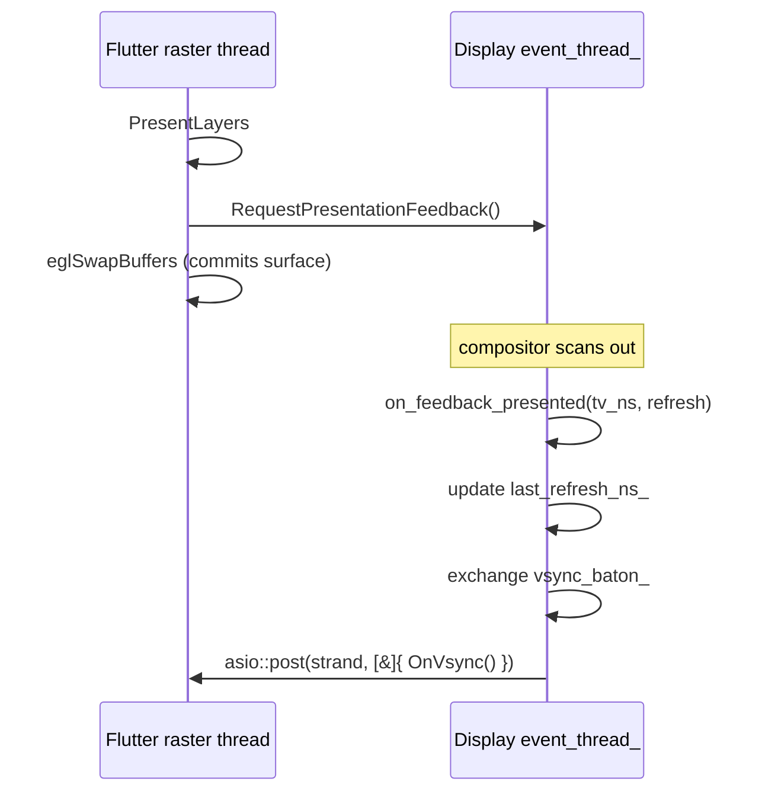

# wayland_egl backend

EGL + GL ES presenter on Wayland. Pairs `wl_egl_window` (Mesa hands us the
buffer pool) with the optional homescreen GL compositor for platform views.
This README covers the parts that aren't obvious from the source — the
compositor-mediated vsync path in particular.

## Features

| Capability | Status | Toggle / scope |
|---|---|---|
| EGL + GL ES presenter on `wl_egl_window` | Built-in | `BUILD_BACKEND_WAYLAND_EGL` |
| Compositor-mediated vsync via `wp_presentation_feedback` | Built-in | `IVI_WL_VSYNC` (default on); needs `wp_presentation` + `CLOCK_MONOTONIC` |
| Wall-clock scheduler fallback | Built-in | Auto when vsync unusable / `IVI_WL_VSYNC=0` |
| Partial repaint (buffer-age + `eglSetDamageRegionKHR` + `eglSwapBuffersWithDamageKHR`) | Built-in (Skia GL only) | Auto-disabled under Impeller (`--enable-impeller`) |
| GL compositor for platform views | Opt-in | `BUILD_COMPOSITOR` |
| Debug HUD (imgui GL) | Opt-in | `BUILD_HUD` + `BUILD_COMPOSITOR`; `IVI_HUD` / `[hud].enable` |
| Per-frame cadence profiling | Opt-in | `IVI_WL_PROFILE` |
| Motion-to-photon profiling | Opt-in | `IVI_M2P_PROFILE` / `IVI_PROFILE` |
| EGL share-context export to plugins (`GetEglContext`) | Built-in | Always |

---

## Architecture

The `WaylandEglBackend` derives from both [Egl](egl.h) (EGL context/surface
lifecycle, damage-extension probing) and the abstract
[Backend](../backend.h) interface (renderer/compositor config + vsync). It
owns a `wl_egl_window` bound to the view's `wl_surface`, and — when
`BUILD_COMPOSITOR` is set — a GL compositor plus backing-store pools for
platform-view layers.

The compositor — not the application — owns the scanout schedule on Wayland.
There is no equivalent of `drmModePageFlip` to wait on. The right hook is the
`wp_presentation_time` extension: every commit you care about, you mint a
`wp_presentation_feedback` object before `wl_surface.commit` and the compositor
sends you back a `presented` event with the realized scanout timestamp. The
`wp_presentation` machinery lives in a Display-owned
[WaylandVsyncProvider](../../vsync/wayland_vsync_provider.h); the backend
forwards to it (gate, baton submit, feedback request, stop).



The baton-return path uses the platform task runner's strand so
`FlutterEngineOnVsync` is always called on the engine's run thread
(Flutter enforces; returns `kInternalInconsistency` otherwise).

`SetVsyncBaton` includes an idle-wake kick: if no feedback is in flight
(very first frame, post-idle wake from input) it drains the baton
inline via `PostOnVsync` so Flutter doesn't sit forever waiting for an
`OnVsync` that would never come from a commit that hasn't happened yet.

### When `vsync_callback` is wired

`WaylandEglBackend::GetVsyncCallback()` returns `&VsyncTrampoline` iff
all three of:

1. The compositor advertised `wp_presentation` (KWin, Mutter, weston, sway,
   kwin all do).
2. The announced `clock_id` is `CLOCK_MONOTONIC` (Flutter's
   `GetCurrentTime()` is also CLOCK_MONOTONIC; mismatched clocks would
   need cross-clock translation that this backend declines to do).
3. `IVI_WL_VSYNC` is not `0`.

Otherwise it returns `nullptr` and the engine falls back to its
internal wall-clock scheduler. The decision is logged once at startup
(`info`-level — "wp_presentation not advertised" / "clock_id != CLOCK_MONOTONIC").

### Module responsibilities

- **Presentation.** `WaylandEglBackend` builds the `FlutterRendererConfig`
  (OpenGL), maps the `wl_egl_window` to an EGL surface, and drives
  `eglSwapBuffers` / the damage swap path from the rasterizer thread.
- **Vsync.** The backend forwards to the Display-owned `WaylandVsyncProvider`:
  `GetVsyncCallback` gates on `vsync_->Usable()`; `VsyncTrampoline` →
  `SetVsyncBaton` → `vsync_->SubmitBaton`; `RequestPresentationFeedback` →
  `vsync_->RequestFeedback`; `StopVsyncMonitor` → `vsync_->Stop`.
- **Partial repaint.** Buffer-age existing-damage tracking
  (`m_existing_damage_map`, `m_damage_history`) feeds
  `eglSetDamageRegionKHR` / `eglSwapBuffersWithDamageKHR` — Skia GL only (see
  [partial_repaint_gate.h](partial_repaint_gate.h)).
- **Compositor (`BUILD_COMPOSITOR`).** `GlCompositor` blits/quad-composites
  backing stores onto the window framebuffer for platform-view layers;
  `GlCaps` probes the runtime GL feature set; `EglFboBackingStore` /
  `EglTextureBackingStore` (pooled via `BackingStorePool`) hold the engine's
  render targets.

### File map

| Path | Responsibility |
|------|----------------|
| [wayland_egl.h](wayland_egl.h) / [wayland_egl.cc](wayland_egl.cc) | `WaylandEglBackend` — surface lifecycle, renderer/compositor config, vsync forwarding, partial repaint, swap profiling |
| [egl.h](egl.h) / [egl.cc](egl.cc) | `Egl` base — EGL display/context/surface, make-current, swap, damage-extension probing (`EGL_KHR_partial_update`, buffer age) |
| [partial_repaint_gate.h](partial_repaint_gate.h) | `EngineSwitchesEnableImpeller()` — pure parse of `--enable-impeller` to gate the partial-repaint path |
| [gl_caps.h](gl_caps.h) / [gl_caps.cc](gl_caps.cc) | `GlCaps` — runtime GL capability probe (`BUILD_COMPOSITOR`) |
| [gl_compositor.h](gl_compositor.h) / [gl_compositor.cc](gl_compositor.cc) | `GlCompositor` — blit / quad-shader layer composition (`BUILD_COMPOSITOR`) |
| [egl_backing_store.h](egl_backing_store.h) / [egl_backing_store.cc](egl_backing_store.cc) | `EglFboBackingStore` / `EglTextureBackingStore` — engine render targets (`BUILD_COMPOSITOR`) |

### Threading model

The `on_feedback_presented` / `discarded` listeners fire on
[Display](../../wayland/display.h)'s `event_thread_`, which is a separate thread
from the platform task runner. That's why the feedback-in-flight state is
guarded by a mutex and `OnVsync` is always posted via the runner's strand
(never inline). `RequestPresentationFeedback` runs on the rasterizer thread
(the `m_wl_surface` handle is `std::atomic` because `CreateSurface` on the
platform thread can otherwise race it during a resize). The `eglSwapBuffers`
self-time profile (`swap_profile_`) is accumulated and flushed entirely on the
rasterizer thread, kept separate from the event-thread cadence profile to avoid
a cross-thread data race.

A future refactor could move `wl_display_dispatch` onto the platform task runner
via an asio `async_wait` on the display fd — at which point the listener would
fire on the runner thread, the mutex could be dropped, and `OnVsync` could be
called inline. That change is out of scope here because it touches all Wayland
event dispatch (input, configure, output).

---

## Build steps

### Configure + build

The backend compiles when `BUILD_BACKEND_WAYLAND_EGL` is enabled. Platform-view
composition (the `GlCompositor` / backing-store sources) additionally requires
`BUILD_COMPOSITOR`.

```sh
cmake -B build -G Ninja -DBUILD_BACKEND_WAYLAND_EGL=ON
ninja -C build
```

### Build matrix

| Config | CMake flags | Present path compiled in |
|--------|-------------|--------------------------|
| Base EGL presenter | `BUILD_BACKEND_WAYLAND_EGL=ON` | `wayland_egl.cc`, `egl.cc`, `gl_process_resolver.cc` |
| + platform-view compositor | `BUILD_BACKEND_WAYLAND_EGL=ON BUILD_COMPOSITOR=ON` | adds `egl_backing_store.cc`, `gl_caps.cc`, `gl_compositor.cc` |
| + debug HUD | `... BUILD_COMPOSITOR=ON BUILD_HUD=ON` | adds the imgui GL HUD (`GlHud`) |

### Toolchain compatibility

`egl.h` explicitly includes `<array>` rather than relying on a transitive
include. This is required on Yocto dunfell (riscv64 / armv7), where older
toolchains do not expose `std::array` transitively through `<vector>` or
`<EGL/egl.h>` and the build otherwise stops with
`implicit instantiation of undefined template 'std::array<…>'`.

---

## Running

Runtime requires a Wayland compositor. For the compositor-mediated vsync path,
the compositor must advertise the `wp_presentation` global with a
`CLOCK_MONOTONIC` clock (KWin, Mutter, weston, sway). When it does not, the
backend logs the reason once and falls back to Flutter's internal wall-clock
scheduler.

Read logs on stderr; the vsync-wiring decision and profiling summaries are
emitted at `info` level.

### Env vars

| Env | Default | Effect |
|------|---------|--------|
| `IVI_WL_VSYNC` | (on) | `0` disables both the `vsync_callback` wiring AND the per-commit `wp_presentation_feedback` requests, falling back to Flutter's internal wall-clock scheduler. Use to bisect pacing regressions or to work around a compositor whose `presented` events are unreliable. The two gates must move together — otherwise feedback objects would accumulate without a baton consumer. |
| `IVI_WL_PROFILE` | (off) | Anything non-empty enables per-frame cadence profiling. Every 60 presented frames, `on_feedback_presented` logs: `profile (n=60): fps=X mean_interval=Yus max_interval=Zus discarded=N refresh=Mus flags=0xF`. Useful to confirm the compositor's presented timestamps line up with its advertised refresh and to spot stalls. |
| `IVI_M2P_PROFILE` | (off) | Anything non-empty enables the **motion-to-photon** (input-to-scanout) profiler. Joins kernel input time from `zwp_input_timestamps_v1` (pointer/touch) with compositor scanout time from `wp_presentation` feedback. Reports two latencies per window: **frame-accurate** — each input is attributed to the frame whose build cutoff (the baton's `frame_start_time`) is at or after it, i.e. the frame that actually rendered it, giving true `present − input`; and **floor** — `present − input` for the first scanout at or after the input, which under-counts by the engine pipeline depth. Every 120 presents logs `[wayland] motion->photon: frame-accurate p50=Xms p99=Yms max=Zms \| floor p50=xms p99=yms \| n=N dropped=D`, plus a session summary (both metrics) at teardown; their difference is the pipeline depth (typically one to two frames). `IVI_PROFILE` enables it too. |

## Architectural notes

**Per-commit object, not a long-lived stream.** Unlike DRM's
`PAGE_FLIP_EVENT` (one fd you read forever), `wp_presentation_feedback`
mints a brand-new object per commit that delivers exactly one of
`presented` / `discarded` and is then destroyed. The lifecycle is owned
by the backend — `feedback_in_flight_` tracks outstanding objects so
`StopVsyncMonitor` can destroy them before the engine teardown.

**`discarded` semantics.** The compositor sends `discarded` when the
frame was superseded (next commit landed first) or the surface was
occluded. The handler treats it as equivalent to `presented` for
baton-return purposes but uses `LibFlutterEngine->GetCurrentTime()` as
the frame_start_time since we have no real timestamp. Discards are
counted in the `IVI_WL_PROFILE` log line — a steady stream of them
indicates the rasterizer is producing frames faster than the
compositor can present them (compositor backpressure).

**Refresh = 0.** Protocol allows the compositor to send `refresh=0`
when it doesn't know the cadence (virtual outputs, mirrored displays
with mismatched modes). The handler preserves the previous value
rather than overwriting `last_refresh_ns_` with garbage that would
skew `frame_target_time`.

**Partial repaint is Skia-only.** The backend's partial-repaint path
(buffer-age existing-damage query → `eglSetDamageRegionKHR` →
`eglSwapBuffersWithDamageKHR`) is correct only under the Skia OpenGL
renderer, which both consumes the existing damage and reports frame /
buffer damage back on present. Under Impeller GLES the engine still
queries existing damage and advertises partial-repaint support, but its
present path reports no damage — feeding it buffer-age-narrowed existing
damage would let it clip rendering against history the presented buffer
never preserved (and it passes a null buffer-damage rect the swap path
must not dereference). When Impeller is the active renderer the backend
reports the whole surface as existing damage and swaps full frames. The
active renderer is inferred from the `--enable-impeller` engine switch
(the shell has no dedicated flag); the parse lives in
`partial_repaint_gate.h`. Finishing Impeller's own present-damage wiring
in the engine is what would let this path light up under Impeller.

### What the compositor is responsible for

Unlike DRM where the application owns the scanout schedule, on Wayland the
compositor decides:

- When the frame actually presents (it may delay, e.g. to align with another
  surface's commit on a transactional compositor like KWin).
- The realized refresh rate (compositor reports it per-frame in
  `wp_presentation_feedback.refresh`; can change mid-session for
  variable-refresh-rate panels).
- Whether the commit is direct-scanned-out or composited (reported via the
  `flags` arg: `WP_PRESENTATION_FEEDBACK_KIND_ZERO_COPY` indicates direct
  scanout).

The client's job is to feed the compositor at the cadence the compositor asks
for, then trust its `presented` events for pacing. That's what this backend
does.

---

## Diagnostics/Debug

- **`IVI_WL_PROFILE=1`** adds a log line every 60 presented frames with
  mean/max interval, discarded count, the compositor-reported refresh, and a
  5-bucket histogram of per-frame intervals against a 60Hz baseline (≤17ms =
  on-vblank, 18-33ms = 1 vblank missed, 34-50ms = 2 vblanks missed, 51-100ms =
  slow, >100ms = idle/pause). On clean shutdown, `StopVsyncMonitor` emits a
  one-line session summary + histogram covering the entire run.
- **`WAYLAND_DEBUG=client`** gives the raw protocol trace — useful to verify
  that exactly one `wp_presentation_feedback` request is minted per commit and
  exactly one `presented` or `discarded` returns per request.
- **Validation:** compare `mean_interval` to compositor-reported `refresh` — if
  they match, the client is keeping cadence; if `mean_interval > refresh`, the
  client is missing vblanks. The histogram makes the *miss distribution* legible
  (occasional double-miss vs. constant single-miss have different root causes).

### Known limitations / follow-ups

1. **SIGTERM shutdown is racy** — `WaylandEglBackend::GetRenderConfig` lambdas
   dereference `state->view_controller->engine` after teardown, producing a
   SIGSEGV ~1.9s after SIGTERM. Reproduces identically with `IVI_WL_VSYNC=0`, so
   the race is pre-existing and unrelated to the wp_presentation vsync work. DRM
   fixed the analogous race in commit `17ade4ef [shutdown] race-free
   engine/view/embedder teardown on SIGTERM`; wayland_egl needs the same
   treatment.
2. **Cross-clock translation not implemented** — when the compositor advertises
   a `clock_id` other than `CLOCK_MONOTONIC`, this backend falls back to the
   wall-clock scheduler. Could be lifted by sampling both clocks once at startup
   and adding the delta to each `presented` timestamp before passing it to
   `OnVsync`. No mainline compositor needs this today.
3. **`wl_display_dispatch` still on its own thread** — see the Threading model
   section above. Moving dispatch to the platform task runner via asio would
   simplify the synchronization model and drop the mutex on the feedback state,
   but it's a fleet-wide change to all Wayland event handling and is deferred to
   a separate change.

---

## Benchmarks

Measured on KWin Wayland (Fedora 43, kernel 6.19, amdgpu Polaris-class),
`feat/drm-kms-egl` branch, running the flutter-wonderous-app bundle.
Compositor is the desktop session's KWin (3440×1440 @ 60Hz primary,
1680×1440 @ 60Hz secondary). Window size 800×600.

### Methodology

`IVI_WL_PROFILE=1` adds a log line every 60 presented frames with
mean/max interval, discarded count, the compositor-reported refresh,
and a 5-bucket histogram of per-frame intervals against a 60Hz
baseline (≤17ms = on-vblank, 18-33ms = 1 vblank missed, 34-50ms = 2
vblanks missed, 51-100ms = slow, >100ms = idle/pause). On clean
shutdown, `StopVsyncMonitor` emits a one-line session summary +
histogram covering the entire run.

`WAYLAND_DEBUG=client` gives the raw protocol trace — useful to verify
that exactly one `wp_presentation_feedback` request is minted per
commit and exactly one `presented` or `discarded` returns per request.

Validation: compare `mean_interval` to compositor-reported `refresh` —
if they match, the client is keeping cadence; if `mean_interval >
refresh`, the client is missing vblanks. The histogram makes the *miss
distribution* legible (occasional double-miss vs. constant single-miss
have different root causes).

### Results summary

Headline result — KWin Wayland @ 60Hz. Aggregate across 23 profile windows
(~23 seconds, 1380 presented frames) on the flutter-wonderous-app bundle,
`IVI_WL_VSYNC=1 IVI_WL_PROFILE=1`:

| Metric | Value |
|---|---:|
| Frames presented | 1380 |
| Compositor-reported refresh | 16.668 ms (60.00 Hz) |
| Weighted mean interval | 17.64 ms (**56.69 Hz**) |
| Worst single interval | 183.4 ms (content-load stall) |
| Discarded by compositor | 0 |
| Feedback flags (OR) | `0x7` = `VSYNC \| HW_CLOCK \| HW_COMPLETION` |

| Bucket | Frames | % |
|---|---:|---:|
| 60Hz on-vblank (≤17 ms) | 1344 | **97.46%** |
| 30Hz (18-33 ms) | 0 | 0.00% |
| 20Hz (34-50 ms) | 28 | 2.03% |
| slow (51-100 ms) | 5 | 0.36% |
| idle (>100 ms) | 2 | 0.15% |

KWin delivered hardware-accurate vblank timestamps for every commit
(`flags=0x7`). Zero compositor-side discards across the whole run.
The 2.5% off-vblank tail is exclusively Flutter raster stalls during
wonderous content-load — note the bimodal miss distribution: misses
*never* land in the 30Hz bucket (single-vblank-late) but always
double-skip into the 20Hz bucket or worse. That's KWin's transactional
commit model: once the deadline is missed, the next entire vblank is
forfeit, not just half of it.

#### Comparison to `drm_kms_egl`

DRM benchmark (from [drm_kms_egl](../drm_kms_egl/README.md)): amdgpu
RDNA/Polaris @ 240Hz, same wonderous bundle, `IVI_DRM_RT=1 IVI_DRM_VSYNC=1`,
64,769-frame sample.

| Metric | DRM @ 240Hz | wayland_egl @ 60Hz |
|---|---:|---:|
| Frame budget (refresh period) | 4.17 ms | 16.67 ms |
| Native cadence hit-rate | **98.0%** (≤6 ms) | **97.5%** (≤17 ms) |
| Mean interval | 4.31 ms | 17.64 ms |
| 1-vblank misses | 1.8% (7-11 ms) | 0.0% (18-33 ms) |
| ≥2-vblank misses | 0.2% (12+ ms) | 2.5% (34+ ms) |
| Discards | n/a (PAGE_FLIP_EVENT can't drop) | 0 (KWin didn't drop any) |
| Sample size | 64,769 | 1,380 |

**Per-vblank hit rate is essentially identical** — both backends keep
~97-98% of frames inside one vblank period. The interesting difference
is the miss profile:

- **DRM** misses mostly land in the next-vblank bucket (120Hz, 7-11ms)
  — the kernel pages out scanout state for one frame and recovers. That
  pattern is consistent with brief Flutter raster spikes (text layout,
  texture upload) costing one extra vblank.
- **Wayland** misses skip the 30Hz bucket entirely. When `KWin` misses
  the deadline, the surface is forfeited until the *next* commit lands
  — which won't happen until Flutter's raster catches up. Result: misses
  cluster at 2+ vblank intervals.

This is a compositor-model difference, not a Wayland-vsync-path bug.
The wp_presentation pacing recovers cleanly: the very next post-miss
interval typically returns to the 60Hz bucket without compensatory
bursting.

The sample-size gap (64K vs 1.4K frames) is unrelated to the vsync
code; the wonderous-app bundle on this host hits a pre-existing Mesa
hash-table crash within ~30s, capping the runtime per smoke. The
240Hz DRM measurement was on different hardware (Jetson Orin) where
the bundle stayed stable for much longer.

#### Differences from `drm_kms_egl` (architecture)

| Aspect | drm_kms_egl | wayland_egl |
|---|---|---|
| Vsync source | drm fd `PAGE_FLIP_EVENT` (long-lived, one fd) | `wp_presentation_feedback` (one fresh object per commit) |
| Timestamp source | kernel `tv_sec/tv_usec` in `drmEventContext::page_flip_handler` (currently discarded — uses wall clock) | Compositor `tv_sec_hi/lo/tv_nano_sec` in `presented` event (used as-is) |
| Refresh source | `mode_.vrefresh` from mode probe | `refresh` arg in each `presented` event (per-frame, refresh-adaptive) |
| OnVsync delivery | Inline from asio handler (platform runner) | `asio::post(strand, …)` from event_thread_ |
| Discards | n/a (kernel never drops a flip silently) | Possible (compositor may supersede or occlude); counted as a frame for baton purposes |
| Direct scanout | REFLECT_Y probe enables it on capable hardware | Compositor decides; client cannot opt in |


---

## Known limitations / follow-ups

1. **SIGTERM shutdown is racy** — `WaylandEglBackend::GetRenderConfig`
   lambdas dereference `state->view_controller->engine` after teardown,
   producing a SIGSEGV ~1.9s after SIGTERM. Reproduces identically with
   `IVI_WL_VSYNC=0`, so the race is pre-existing and unrelated to the
   wp_presentation vsync work. DRM fixed the analogous race in commit
   `17ade4ef [shutdown] race-free engine/view/embedder teardown on
   SIGTERM`; wayland_egl needs the same treatment.
2. **Cross-clock translation not implemented** — when the compositor
   advertises a `clock_id` other than `CLOCK_MONOTONIC`, this backend
   falls back to the wall-clock scheduler. Could be lifted by sampling
   both clocks once at startup and adding the delta to each `presented`
   timestamp before passing it to `OnVsync`. No mainline compositor
   needs this today.
3. **`wl_display_dispatch` still on its own thread** — see the
   "Architectural notes" section above. Moving dispatch to the platform
   task runner via asio would simplify the synchronization model and
   drop the mutex on `feedback_in_flight_`, but it's a fleet-wide
   change to all Wayland event handling and is deferred to a separate
   change.
4. **Headers rely on transitive includes for some std:: types.** As of
   v3.0 the tree-wide sweep in commit `24e01fe3` added `#include <array>`
   to `egl.h`. The backend's headers are now self-sufficient for
   `std::vector`, `std::string`, `std::map`, `std::array`, and
   `std::function` — the explicit include is the durable fix for toolchains
   that don't pull `<array>` in transitively (e.g. Yocto dunfell).
---

## References

- [EGL base class](egl.h) — EGL context/surface lifecycle, damage extensions
- [Backend interface](../backend.h) — display-target abstraction
- [Backend overview README](../README.md)
- [WaylandVsyncProvider](../../vsync/wayland_vsync_provider.h) — `wp_presentation` vsync source
- [drm_kms_egl backend README](../drm_kms_egl/README.md) — DRM comparison baseline
- [Display](../../wayland/display.h) — owns `event_thread_` and the vsync provider
- `wp_presentation_time` Wayland protocol extension
- `EGL_KHR_partial_update`, `EGL_EXT_buffer_age`, `EGL_KHR_swap_buffers_with_damage`