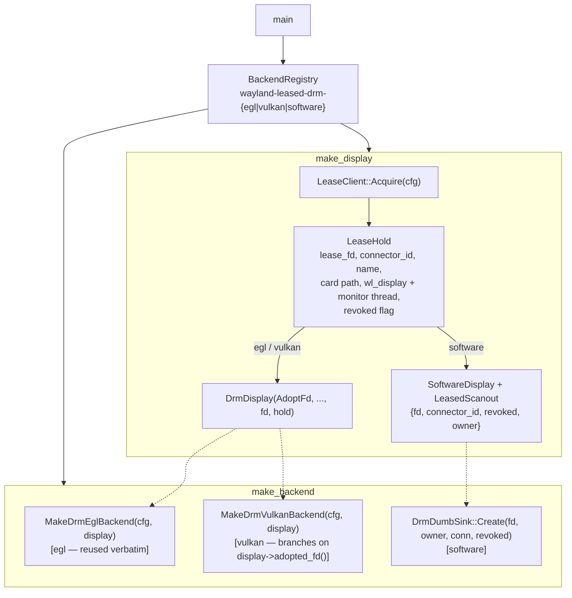

# wayland_leased_drm backend

Takes exclusive control of a DRM connector from a running Wayland compositor via
`wp_drm_lease_device_v1` (drm-lease-v1, staging), then scans out on the leased fd
through one of the existing DRM present paths.

The Wayland connection is used **only** to negotiate the lease and to watch for
its revocation. There is no `wl_surface` and no compositor-composited path: this
is not a Wayland client in the usual sense, it is a DRM client that asks a
compositor for a connector instead of grabbing a card. Input comes from evdev,
not from the compositor — with no surface there is no keyboard or pointer focus
to receive.

Target use cases: an instrument cluster or HUD panel leased from a primary IVI
compositor, and any deployment where one process must own a connector while a
compositor owns the rest of the card.

## Features

| Capability | Status | Toggle / scope |
|---|---|---|
| DRM connector lease via `wp_drm_lease_device_v1` (drm-lease-v1, staging) | Built-in | `BUILD_BACKEND_WAYLAND_LEASED_DRM` |
| EGL/GBM scanout on the leased fd | Opt-in | `wayland-leased-drm-egl` key; `BUILD_BACKEND_DRM_KMS_EGL` |
| Vulkan scanout on the leased fd | Opt-in | `wayland-leased-drm-vulkan` key; `BUILD_BACKEND_DRM_KMS_VULKAN` |
| CPU + dumb-buffer scanout on the leased fd | Opt-in | `wayland-leased-drm-software` key; `BUILD_BACKEND_SOFTWARE` + `BUILD_SOFTWARE_SINK_DRM` |
| Read-only connector probe (`--lease-list-connectors`) | Built-in | Always; scriptable exit codes |
| Revocation watch (`finished` / connection loss) on a monitor thread | Built-in | Always; latches `LeaseHold::revoked()` |
| Bounded negotiation deadline | Built-in | `--lease-timeout-ms` (default 5000) |
| Reacquire-and-rebuild after revocation | Not implemented | Deferred — revoke stops updates until process restart |

---

## Architecture

Two axes, deliberately orthogonal:

- **Acquisition** — how the DRM fd is obtained: direct open (`drm-kms-*`) vs
  leased (here).
- **Renderer** — how frames are produced: EGL/GBM, Vulkan, or CPU + dumb buffers.

The lease only changes acquisition. That is why the egl tier's `make_backend` is
`MakeDrmEglBackend` **unchanged**: the adopted-fd path is a construction tag on
`DrmDisplay`, not a subclass, so the backend factory cannot tell the difference.



### Why compound registry keys

The renderer determines the display type (`DrmDisplay` vs `SoftwareDisplay`), and
`BackendDescriptor` requires `make_backend` to receive the concrete `IDisplay`
its own `make_display` produced. A single key with an internal renderer switch
would have to resolve the renderer *before* `make_display` runs — re-implementing
key resolution inside a descriptor. Three keys keep the invariant.

### What the adopted-fd path does differently

The compositor, not this process, is the lessor:

- **No `drmSetMaster`, no foreground-VT guard.** The lease fd is already master
  over its leased object set; the compositor owns the VT.
- **No `drmDropMaster` at teardown.** The lease is returned by destroying the
  `wp_drm_lease_v1` object, which lets the compositor revoke and re-advertise.
- **No libseat session.** The compositor already holds the session controller for
  the seat; taking it would fight. Input falls back to direct evdev.
- **Input can be duplicated, and defaults to off under a host session.** A leased
  client has no `wl_surface`, so the compositor delivers it no input — its only
  source is libinput on `/dev/input/event*`, and those reads are *ungrabbed*. On
  a host with a live Wayland session that means every keystroke and pointer event
  reaches **both** this process and the session compositor (input is duplicated,
  not stolen). `lease_input` controls it: `auto` (default) reads evdev on an
  embedded target — no `WAYLAND_DISPLAY` — but disables it when a host session is
  detected, warning why; `on` forces evdev even under a session (an embedded box
  running its own compositor, with input devices partitioned between them); `off`
  never reads evdev. `--drm-no-seat` does **not** affect this — it bypasses
  libseat, not input.
- **Outputs are enumerated through the lease fd**, whose resource view the kernel
  filters to the leased objects. Re-opening the card by path would both show
  connectors we do not hold *and* require permissions a leased client may not
  have — the whole point of leasing is not needing them.

The fd is **borrowed**: `drm::Device::from_fd` does not close it, and neither does
the sink. The `LeaseHold` owns it, and must outlive everything built on it. That
is why the display holds the hold.

### Revocation

Revocation is normal, not exceptional: **every VT switch away from the compositor
is a revoke**, because the compositor loses DRM master. Hot-unplug and compositor
exit do it too. It arrives as `wp_drm_lease_v1.finished` on the monitor thread,
which latches `LeaseHold::revoked()`.

What the kernel does, verified against a real lease on vkms (see
`test/unit_test/leased_drm_vkms-test`):

- The KMS objects vanish from the fd's view — every commit naming them fails.
- **The fd stays open and remains a functional render fd**: GEM allocation and
  prime export still succeed. Leases partition mode objects only.

Renderers gate on `revoked()`. The software tier drops the frame and *parks the
vsync source* rather than discarding: parking makes the engine stall (the
documented steady state), whereas handing the baton back would spin the UI and
raster threads at 100% CPU with nothing reaching a panel.

Note `wp_drm_lease_connector_v1.withdrawn` **post-grant does not revoke** — the
spec is explicit that the lease is unaffected; just destroy the offer object.

Reacquire-and-rebuild is not implemented yet; today a revoked lease means
the panel stops updating until the process is restarted.

### File map

| Path | Responsibility |
|------|----------------|
| [lease_client.h](lease_client.h) | `LeaseClient` / `LeaseHold` / `LeaseConfig` / `LeaseOffer` API; `RevokeCause`, `LeaseError` enums; `MaybeListLeaseConnectors` entry point |
| [lease_client.cc](lease_client.cc) | drm-lease-v1 negotiation state machine, monitor thread, revocation latch, read-only `Probe`, connector/device selection |

### Threading model

Negotiation is synchronous with a deadline on the caller's thread. Once granted,
the `wl_display` moves to a **monitor thread** that lives for the process
lifetime, so `finished` and `withdrawn` are always observed. The monitor thread
latches `LeaseHold::revoked()` and runs `LeaseConfig::on_revoked` exactly once —
either on the monitor thread, or inline on the caller's thread from `Acquire()`
itself if `finished` arrived in the same dispatch batch as `lease_fd`. The
handler must be cheap and must not block: the monitor thread is what teardown
joins. `LatchRevoked` is idempotent and safe from either thread. Renderers read
`revoked()` with acquire ordering; once true it never clears (reacquire builds a
new `LeaseHold`). The monitor thread must outlive every backend built on the
lease fd, so the display in every family owns the `LeaseHold`.

---

## Read this first: can you actually get a lease?

Two things must both be true, and the second one is what usually bites.

**The compositor must implement drm-lease-v1.** Per the wayland.app support
matrix: KWin, the wlroots family (Sway, labwc, niri, Wayfire, …), Mutter,
Hyprland and COSMIC do. **Weston does not**, and therefore neither do AGL's
Weston-derived compositors. If your target is agl-compositor, this backend is
inert without compositor-side work.

**The compositor must be willing to offer your connector.** This is the real
gate. The protocol comes from VR, and the wlroots family only offers a connector
for leasing when its EDID carries the **non-desktop** flag; a compositor claims
every ordinary connector for its own compositing. On a normal desktop the result
is that the global exists and offers nothing:

```
$ wayland-info | grep -A1 drm_lease
interface: 'wp_drm_lease_device_v1', version: 1, name: 27
        path: /dev/dri/card1
```

...while every connector reports `"non-desktop" (immutable): range [0, 1] = 0`,
and enumeration completes with **zero offers**. `non-desktop` is immutable — you
cannot set it at runtime. Getting a lease from such a host needs one of: an EDID
that trips the kernel's `EDID_QUIRK_NON_DESKTOP` list (`drm.edid_firmware=`), a
compositor patch/config, or a compositor built for the job.

Ask the binary rather than assuming:

```bash
homescreen --lease-list-connectors        # no bundle required
```

It probes read-only (stopping before `create_lease_request`, so it is safe
against a live session) and prints what the compositor will actually lease. Exit
codes are scriptable, and separate the two failures that look identical from the
outside:

| exit | meaning |
|---|---|
| 0 | connectors listed |
| 1 | reached a lease device, but it offers **nothing** — the non-desktop gate above |
| 2 | no Wayland session, or the compositor has no drm-lease-v1 |

### Status

| Tier | Registry key | Requires | State |
|---|---|---|---|
| EGL | `wayland-leased-drm-egl` | `BUILD_BACKEND_DRM_KMS_EGL` | registered |
| Software | `wayland-leased-drm-software` | `BUILD_BACKEND_SOFTWARE` + `BUILD_SOFTWARE_SINK_DRM` | registered |
| Vulkan | `wayland-leased-drm-vulkan` | `BUILD_BACKEND_DRM_KMS_VULKAN` | registered — least lease-coupled of the three: the VkDevice was never created from the KMS fd, so only scanout/modeset touches the lease |

A tier whose renderer stack is not built is **refused, not substituted**. Leasing is
the difference between driving a connector a compositor handed you and grabbing a
card outright, so falling back to an unleased backend would do the opposite of
what was configured, on hardware you may not own.

Scope today: one connector per lease, one lease per process. Multi-connector
leases and lease-per-view are deferred; the protocol supports both.

---

## Build steps

### Configure + build

```bash
cmake -B build -G Ninja \
  -DBUILD_BACKEND_WAYLAND_LEASED_DRM=ON \
  -DBUILD_BACKEND_DRM_KMS_EGL=ON        # or: -DBUILD_BACKEND_SOFTWARE=ON
```

The configure output says which tiers are registered.

### Dependencies

A lease-only build (no surface backends) links `wayland-client` alone —
`wayland-cursor`, `xkbcommon` and `wayland-protocols` are surface-backend
dependencies this client does not have. The lease client also links `libdrm`
(`PkgConfig::DRM`): `drmGetDeviceNameFromFd2()` resolves the lease/enumeration fd
to a node path. On a cross sysroot `xf86drm.h` lives under `<libdrm/>`, so the
include dir must come from pkg-config rather than the default search path.

`drm-lease-v1.xml` is vendored under `shell/wayland/protocols/` because the
staging XML only ships with wayland-protocols >= 1.22 and the project floor is
1.20.

### Build matrix

| Config | CMake flags | Present path compiled in |
|--------|-------------|--------------------------|
| EGL lease | `-DBUILD_BACKEND_WAYLAND_LEASED_DRM=ON -DBUILD_BACKEND_DRM_KMS_EGL=ON` | `wayland-leased-drm-egl` → `MakeDrmEglBackend` (EGL/GBM) |
| Vulkan lease | `-DBUILD_BACKEND_WAYLAND_LEASED_DRM=ON -DBUILD_BACKEND_DRM_KMS_VULKAN=ON` | `wayland-leased-drm-vulkan` → `MakeDrmVulkanBackend` |
| Software lease | `-DBUILD_BACKEND_WAYLAND_LEASED_DRM=ON -DBUILD_BACKEND_SOFTWARE=ON -DBUILD_SOFTWARE_SINK_DRM=ON` | `wayland-leased-drm-software` → `DrmDumbSink` (CPU + dumb buffers) |

A tier whose renderer stack is not built is refused, not substituted (see
[Status](#status)).

---

## Running

The compositor must implement drm-lease-v1 **and** be willing to offer the
connector — see [Read this first](#read-this-first-can-you-actually-get-a-lease).
Confirm with `homescreen --lease-list-connectors` before launching a bundle.

```bash
homescreen --backend=wayland-leased-drm-egl --lease-connector=HDMI-A-1 -b <bundle>
```

Failures are fatal by design. A leased backend that cannot get its lease has
nothing to fall back to:

```
[E] [leased-drm] could not acquire a lease: no connectors offered for leasing
```

### CLI Flags

| Flag | What it does |
|------|-------------|
| `--backend` | `wayland-leased-drm[-vulkan\|-egl\|-software]`; the bare family name resolves vulkan → egl → software among the tiers this build registered. Name a tier explicitly to pin it. TOML: `[view.backend] type` |
| `--lease-connector` | Connector to request by name. Unset + one offer takes it; unset + several is fatal and lists them. TOML: `[view.backend.lease] connector` |
| `--lease-device` | Which `wp_drm_lease_device_v1` when several are advertised (one per DRM node): index or node path. TOML: `[view.backend.lease] device` |
| `--lease-timeout-ms` | Bound on the whole negotiation (default 5000). TOML: `[view.backend.lease] timeout_ms` |
| `--lease-list-connectors` | Read-only probe of what the compositor will lease; prints offers and exits with a scriptable code. No bundle required |

The timeout is load-bearing, not cosmetic: the spec lets a compositor defer the
DRM fd until it regains DRM master, so without a bound a VT-switched-away
compositor would hang startup indefinitely. Every wait in the negotiation is
bounded by it, including the roundtrips.

### Env vars

| Env | Default | Effect |
|------|---------|--------|
| `HOMESCREEN_LEASE_CONNECTOR` | unset | Same as `--lease-connector` |
| `HOMESCREEN_LEASE_DEVICE` | unset | Same as `--lease-device` |
| `HOMESCREEN_LEASE_TIMEOUT_MS` | `5000` | Same as `--lease-timeout-ms` |

The `drm_*` tuning knobs pass through unchanged for the egl tier, and
`IVI_SW_DRM_MODE` / format / dither for the software tier — those describe how to
drive a connector, which a lease does not change. `IVI_SW_SINK` is **not**
consulted on the leased software path: the backend key already chose the sink.

---

## Diagnostics/Debug

Reach for `homescreen --lease-list-connectors` first when a leased backend will
not start. It runs before config parsing (raw `argv`, no bundle required), probes
read-only, and distinguishes the two failures that look identical from the
outside via scriptable exit codes: `0` offers listed, `1` reached a lease device
but zero connectors offered (the non-desktop gate), `2` no Wayland session or no
drm-lease-v1. It reads `--lease-device` and `--lease-timeout-ms` off `argv` for
the same reason.

Revocation causes are logged distinctly because they demand different operator
actions (`RevokeCause`): `kFinished` (`wp_drm_lease_v1.finished` — VT switch away
or hot-unplug, routine and self-healing on VT return), `kConnectionLost` (the
compositor exited or crashed), and `kMonitorFailure` (poll error on the monitor
thread; the lease's true state is unknown, treated as lost).

Negotiation failures surface as `LeaseError` values, each a distinct operator
signal: `kNoWaylandSession`, `kConnectFailed`, `kNoLeaseDevice`,
`kDeviceAmbiguous`, `kDeviceNotFound`, `kNoOffers`, `kConnectorAmbiguous`,
`kConnectorNotFound`, `kDenied` (compositor sent `finished` instead of
`lease_fd`), `kTimeout`, `kProtocolError`.

### Tests

| Tier | Target | Needs |
|---|---|---|
| T1 — protocol, against a mock compositor | `homescreen_lease_client_ut_test_driver` | nothing (private socket in a temp `XDG_RUNTIME_DIR`) |
| T2 — kernel-real lease | `homescreen_leased_drm_vkms_ut_test_driver` | vkms + DRM master |

T1 covers the negotiation state machine end to end: grant, denial, both
revocation timings, connector/device selection and its ambiguous and not-found
variants, the deferred-enumeration deadline, and fd-leak gates (LeakSanitizer
tracks memory, not descriptors).

T2 makes a genuine lease with `drmModeCreateLease` and feeds it to the real code,
which is the only way to reach these paths on a desktop — no compositor here will
offer a connector. It **skips itself** without vkms + DRM master, so it is safe to
run anywhere.

Getting master for T2 is the awkward part. DRM grants master to the **first
opener** of a node, and a running compositor takes it: wlroots hot-adds vkms via
udev when the module loads, so `drmSetMaster` returns `EBUSY` even under root
(and `EACCES` unprivileged, which misleadingly looks like a permissions problem).
Run it from a **bare VT with no compositor**, where the test is the first opener
and gets master implicitly:

```bash
sudo modprobe vkms
# switch to a VT with no compositor running
./homescreen_leased_drm_vkms_ut_test_driver
```

Alternatively pin the compositor away from vkms (`WLR_DRM_DEVICES`) or create a
private device via `/sys/kernel/config/vkms`.

---

## References

- [drm-lease-v1 (staging) protocol](https://gitlab.freedesktop.org/wayland/wayland-protocols/-/blob/main/staging/drm-lease/drm-lease-v1.xml) — `wp_drm_lease_device_v1`
- [wayland.app drm-lease-v1 support matrix](https://wayland.app/protocols/drm-lease-v1)
- [drm_kms_egl backend](../drm_kms_egl/README.md) — direct-open EGL/GBM present path reused here
- [drm_kms_vulkan backend](../drm_kms_vulkan/README.md) — direct-open Vulkan present path reused here
- [software backend](../software/README.md) — CPU + dumb-buffer sink reused here
- [wayland_egl backend](../wayland_egl/README.md) — sibling surface backend
- `libdrm` (`PkgConfig::DRM`) — `drmGetDeviceNameFromFd2`, `drmModeCreateLease`
