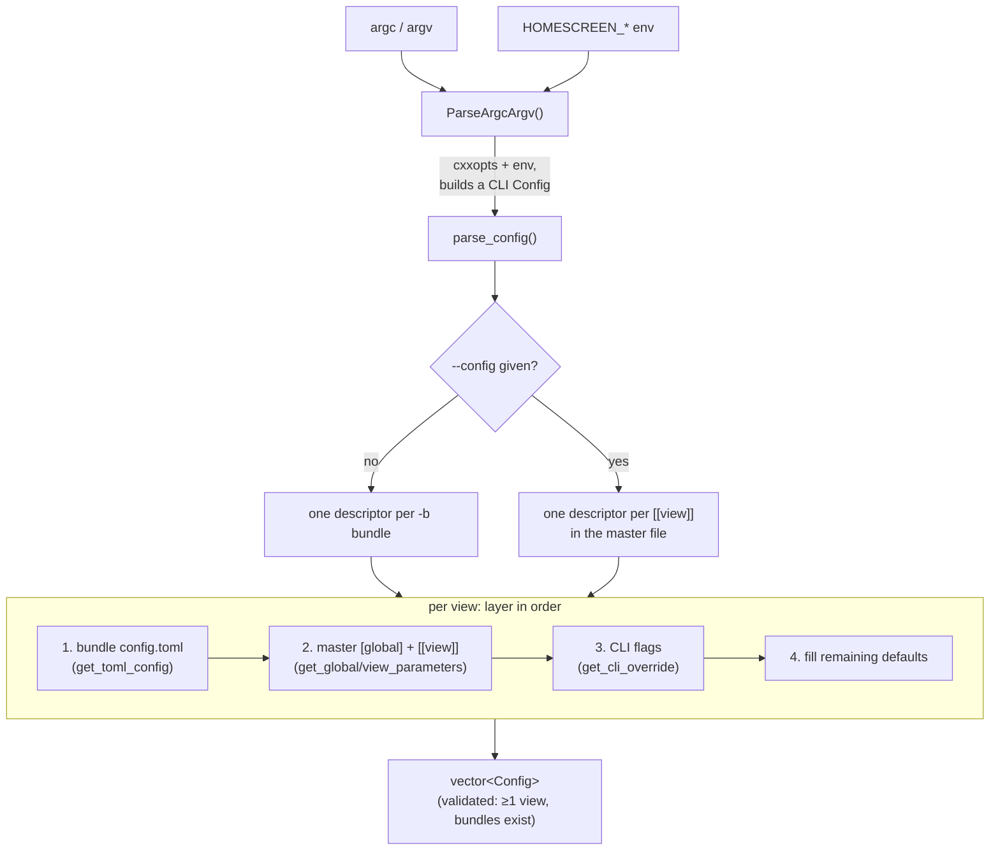

# Configuration

Parses the process's runtime configuration — the command line plus one or more
`config.toml` files — into a `std::vector<Configuration::Config>`, one entry per
view, that the rest of the embedder consumes. This is the single place where CLI
flags, per-bundle TOML, a master `--config` file, environment variables, and
built-in defaults are layered into a final answer.

Everything downstream (`App`, `FlutterView`, the backends, the crash handler,
the watchdog) reads a resolved `Config`; nothing else re-parses argv or TOML.

## Features

| Capability | Status | Toggle / scope |
|---|---|---|
| CLI parsing (`cxxopts`) | Built-in | Always |
| Per-bundle `config.toml` (`-b`) | Built-in | Always |
| Master `--config` file with multiple `[[view]]` | Built-in | Always |
| Per-view layering (defaults → bundle → master → CLI) | Built-in | Always |
| `HOMESCREEN_DRM_*` / `HOMESCREEN_LEASE_*` env overrides | Built-in | DRM / leased-DRM knobs only |
| Accessibility feature bit-mask normalization | Built-in | Always |
| Multi-output binding (`[[view.output]]`) | Built-in | Always |
| `[global]` / `[sentry]` / `[watchdog]` process tables | Built-in | Read by crash handler / watchdog |
| `[hud]` appearance table | Parsed always; applied only with `BUILD_HUD` | Compositor HUD |
| Config-reference generation (docs) | Tooling | `scripts/gen_config_reference.py` |

---

## Architecture



`Configuration` is an all-`static` utility class (construction is deleted). The
public entry point is `ParseArgcArgv()`; the rest of the surface exists so the
unit tests can exercise individual layers.

- **`ParseArgcArgv(argc, argv)`** — the only entry point `main()` calls. Defines
  the `cxxopts` option groups (Global / View / Shell / Backend / DRM / Lease),
  parses argv into a single "CLI" `Config`, applies `HOMESCREEN_*` env fallbacks,
  then hands off to `parse_config()`. Prints `--help` and exits; calls
  `exit(EXIT_FAILURE)` on any fatal parse/validation error.
- **`parse_config(cli_config)`** — turns the CLI `Config` into the final
  per-view vector. Builds a list of view descriptors (from `-b` bundles, or from
  the `--config` master file's `[[view]]` entries), then for each one layers the
  four sources in order and fills defaults.
- **`get_toml_config(path, instance)`** — loads a bundle's own `config.toml`
  (the base layer). Missing file is fine (no-op); a malformed file is fatal.
- **`get_global_parameters(root, instance)`** — overlays the process-level
  `[global]` table, copying each key only when present and correctly typed.
- **`get_view_parameters(view_tbl, instance)`** — overlays one `[[view]]`
  (or singular `[view]`) table: geometry, `[view.args]`, `[view.shell]`,
  `[view.backend]` (+ `.drm` / `.lease`), `[view.output]`, and `[hud]`.
- **`get_cli_override(bundle_path, instance, cli)`** — applies CLI values last
  (they win), and sets the resolved `bundle_path`.
- **`mask_accessibility_features(flags)`** — clamps the accessibility bit-mask to
  the valid `FlutterAccessibilityFeature` range.
- **`PrintConfig(config)`** — dumps a resolved config to the log at startup.

Two parsing notes that the source makes load-bearing:

- TOML has no value references, so "same as the view" defaults (activation area,
  width/height) are resolved in `parse_config()` after layering, not in the file.
- A later layer's `[[view.output]]` **replaces** an earlier layer's extra
  outputs rather than appending, so `additional_outputs` is cleared before a
  layer repopulates it.

### File map

```
shell/configuration/
├── configuration.h    # Config struct (the resolved schema) + static API
├── configuration.cc   # cxxopts CLI, TOML layering, env fallbacks, defaults
└── README.md          # this file
```

Related, outside this folder:

```
cmake/config_common.h.in                 # kDefaultViewWidth/Height, kDefaultAppId,
                                          #   kViewConfigToml, kApplicationName, ...
shell/display/output.h                    # homescreen::OutputMatch (the [view.output] type)
scripts/gen_config_reference.py           # generates the README config/CLI tables
test/unit_test/configuration-test-case/   # unit tests (see Diagnostics)
```

---

## Running

`Configuration` has no separate build or run step — it links into the
`homescreen` binary and runs during startup, before `App` is constructed. The
usage surface it defines (all CLI flags, all `config.toml` keys, and the layering
order) is documented in the top-level [README](../../README.md), whose CLI and
configuration-reference tables are generated from this parser by
[`scripts/gen_config_reference.py`](../../scripts/gen_config_reference.py) and
must not be hand-edited.

At startup the resolved config for each view is written to the log via
`PrintConfig()` (at `info` level) — `[global]`, `[view]`, and (with AGL) the
activation area. Raise verbosity with `IHS_LOG_LEVEL=debug` to see the layering
decisions and any warnings (unrecognized DRM enum values, out-of-range
`timeout_ms`, malformed input transforms, etc.).

### Parameter loading order

Resolved per view; later layers override earlier ones key-by-key. Only
`[view.args]` (engine/dart) and unmatched CLI options are additive (appended):

1. built-in defaults (`config_common.h`)
2. the bundle's own `<bundle>/config.toml`
3. the `--config` master file's matching `[[view]]` entry (when given)
4. command-line flags — override everything, applied process-wide

### Env vars

CLI flags win; these fill only when the matching flag is absent. Empty string is
treated as unset.

| Env | Default | Effect |
|------|---------|--------|
| `HOMESCREEN_DRM_DEVICE` | *(rank-pick)* | `--drm-device` |
| `HOMESCREEN_DRM_CONNECTOR` | *(rank-pick)* | `--drm-connector` |
| `HOMESCREEN_DRM_MODE` | *(preferred)* | `--drm-mode` |
| `HOMESCREEN_DRM_COMPOSITOR` | `auto` | `--drm-compositor` |
| `HOMESCREEN_DRM_MODESET` | `auto` | `--drm-modeset` |
| `HOMESCREEN_DRM_ALLOW_NONBLOCK_MODESET` | `auto` | `--drm-allow-nonblock-modeset` |
| `HOMESCREEN_DRM_PRIMARY_FORMAT` | `auto` | `--drm-primary-format` |
| `HOMESCREEN_DRM_OVERLAY_PLANES` | `auto` | `--drm-overlay-planes` |
| `HOMESCREEN_DRM_EXPLICIT_SYNC` | `auto` | `--drm-explicit-sync` |
| `HOMESCREEN_DRM_ASYNC_FLIP` | `auto` | `--drm-async-flip` |
| `HOMESCREEN_DRM_STAGE_CURSOR` | `auto` | `--drm-stage-cursor` |
| `HOMESCREEN_DRM_ROTATION` | `0` | `--drm-rotation` (rejected unless `0\|90\|180\|270`) |
| `HOMESCREEN_DRM_NO_SEAT` | *(unset)* | `--drm-no-seat`; truthy on `1`/`true`/`yes` |
| `HOMESCREEN_LEASE_DEVICE` | *(sole device)* | `--lease-device` |
| `HOMESCREEN_LEASE_CONNECTOR` | *(sole offer)* | `--lease-connector` |
| `HOMESCREEN_LEASE_ON_REVOKE` | `exit` | `--lease-on-revoke` |
| `HOMESCREEN_LEASE_TIMEOUT_MS` | `5000` | `--lease-timeout-ms` (must be `1..2^32-1`) |

---

### Key defaults

Resolved in `parse_config()` from `config_common.h` when a value is unset/zero:

| Key | Default | Constant |
|-----|---------|----------|
| `app_id` | `com.toyotaconnected.homescreen` | `kDefaultAppId` |
| view `width` | `1920` | `kDefaultViewWidth` |
| view `height` | `720` | `kDefaultViewHeight` |
| `pixel_ratio` | `1.0` | `kDefaultPixelRatio` |
| `window_type` | `BG` for the AGL shell, else `NORMAL` | — |
| activation area | full view extent when zero | — |
| per-bundle config filename | `config.toml` | `kViewConfigToml` |

---

## Diagnostics/Debug

- **Watch the layering.** Run with `IHS_LOG_LEVEL=debug` and read the
  `PrintConfig()` output to confirm which values survived. Warnings identify
  most soft failures: unrecognized DRM enum strings fall back to `auto`,
  out-of-range `timeout_ms` falls back to the default, and malformed
  `--input-transform` specs are skipped downstream in `DrmSeat`.
- **Fatal errors call `exit(EXIT_FAILURE)`** with a `critical` log line: a
  missing/malformed `--config` file, a `[[view]]` without a `bundle`, a bundle
  path that is not a directory, no views configured at all, or a flag given
  without its required argument. These happen before `App` is built, so a bad
  config never reaches the engine.
- **Unit tests** cover the layers directly in
  [`test/unit_test/configuration-test-case/`](../../test/unit_test/configuration-test-case/):
  `test_case_configuration.cc` (TOML parse + defaults),
  `test_case_configuration_getCliOverrides.cc` (CLI precedence), and
  `test_case_configuration_PrintConfig.cc`. Build with `-DBUILD_UNIT_TESTS=ON`
  and run via `ctest`. Fixture TOML files live in that directory's `files/`.

---

## References

- Top-level [README](../../README.md) — the generated CLI and
  `config.toml` reference tables, the `config.toml` schema walkthrough, and
  multi-display examples.
- [`docs/config-examples/`](../../docs/config-examples/README.md) — runnable
  per-scenario configs and an annotated all-keys `reference.toml`.
- [`docs/specs/ARCHITECTURE.md`](../../docs/specs/ARCHITECTURE.md) §3.5 —
  where configuration sits in the embedder.
- [`cmake/config_common.h.in`](../../cmake/config_common.h.in) — compile-time
  defaults and identifiers.
- [`shell/display/output.h`](../../shell/display/output.h) —
  `homescreen::OutputMatch`, the `[view.output]` binding type.
- [`backend/wayland_leased_drm/lease_client.h`](../../shell/backend/wayland_leased_drm/lease_client.h)
  — `LeaseConfig`, the semantics behind the `lease_*` keys.
- [tomlplusplus](https://github.com/marzer/tomlplusplus) — TOML parser
  (exceptions disabled). [cxxopts](https://github.com/jarro2783/cxxopts) — CLI parser.
