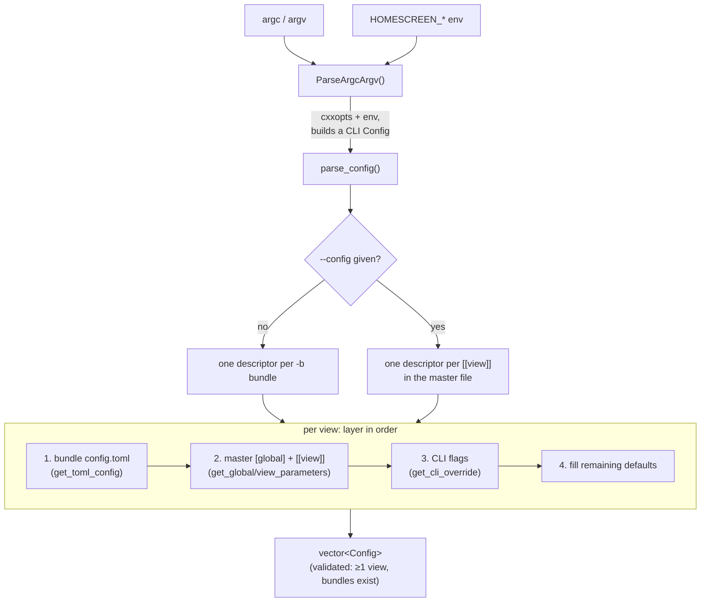

# Configuration

Parses the process's runtime configuration — the command line plus one or more
`config.toml` files — into a `std::vector<Configuration::Config>`, one entry per
view, that the rest of the embedder consumes. This is the single place where CLI
flags, per-bundle TOML, a master `--config` file, environment variables, and
built-in defaults are layered into a final answer.

Everything downstream (`App`, `FlutterView`, the backends, the crash handler,
the watchdog) reads a resolved `Config`.

## Features

| Capability | Status | Toggle / scope |
|---|---|---|
| CLI parsing (`cxxopts`) | Built-in | Always |
| Per-bundle `config.toml` (`-b`) | Built-in | Always |
| Master `--config` file with multiple `[[view]]` | Built-in | Always |
| Per-view layering (defaults → bundle → master → CLI) | Built-in | Always |
| `HOMESCREEN_DRM_*` / `HOMESCREEN_LEASE_*` env overrides | Built-in | DRM / leased-DRM knobs only |
| Accessibility feature bit-mask normalization | Built-in | Always |
| Multi-output binding (`[[view.output]]`) | Built-in | Always |
| `[global]` | Built-in | Always |
| `[sentry]` | Optional | See [`CrashHandler`](../../docs/specs/ARCHITECTURE.md) |
| `[watchdog]` | Optional | See [`Watchdog`](../../docs/specs/ARCHITECTURE.md) |
| `[hud]` appearance table | Parsed always; applied only with `BUILD_HUD` | Compositor HUD |
| Config-reference generation (docs) | Tooling | `scripts/gen_config_reference.py` |

---

## Architecture



`Configuration` is an all-`static` utility class (construction is deleted). The
public entry point is `ParseArgcArgv()`; the rest of the surface exists so the
unit tests can exercise individual layers.

- **`ParseArgcArgv(argc, argv)`** — the only entry point `main()` calls. Defines
  the `cxxopts` option groups (Global / View / Shell / Backend / DRM / Lease),
  parses argv into a single "CLI" `Config`, applies `HOMESCREEN_*` env fallbacks,
  then hands off to `parse_config()`. Prints `--help` and exits; calls
  `exit(EXIT_FAILURE)` on any fatal parse/validation error.
- **`parse_config(cli_config)`** — turns the CLI `Config` into the final
  per-view vector. Builds a list of view descriptors (from `-b` bundles, or from
  the `--config` master file's `[[view]]` entries), then for each one layers the
  four sources in order and fills defaults.
- **`get_toml_config(path, instance)`** — loads a bundle's own `config.toml`
  (the base layer). Missing file is fine (no-op); a malformed file is fatal.
- **`get_global_parameters(root, instance)`** — overlays the process-level
  `[global]` table, copying each key only when present and correctly typed.
- **`get_view_parameters(view_tbl, instance)`** — overlays one `[[view]]`
  (or singular `[view]`) table: geometry, `[view.args]`, `[view.shell]`,
  `[view.backend]` (+ `.drm` / `.lease`), `[view.output]`, and `[hud]`.
- **`get_cli_override(bundle_path, instance, cli)`** — applies CLI values last
  (they win), and sets the resolved `bundle_path`.
- **`mask_accessibility_features(flags)`** — clamps the accessibility bit-mask to
  the valid `FlutterAccessibilityFeature` range.
- **`PrintConfig(config)`** — dumps a resolved config to the log at startup.

Two parsing notes that the source makes load-bearing:

- TOML has no value references, so "same as the view" defaults (activation area,
  width/height) are resolved in `parse_config()` after layering, not in the file.
- A later layer's `[[view.output]]` **replaces** an earlier layer's extra
  outputs rather than appending, so `additional_outputs` is cleared before a
  layer repopulates it.

### File map

```
shell/configuration/
├── configuration.h    # Config struct (the resolved schema) + static API
├── configuration.cc   # CLI opts, TOML, env, defaults
└── README.md          # this file
```

Related, outside this folder:

```
cmake/config_common.h.in                 # kDefaultViewWidth/Height, kDefaultAppId,
                                          #   kViewConfigToml, kApplicationName, ...
shell/display/output.h                    # homescreen::OutputMatch (the [view.output] type)
scripts/gen_config_reference.py           # generates the README config/CLI tables
test/unit_test/configuration-test-case/   # unit tests (see Diagnostics)
```

---

## Running

`Configuration` has no separate build or run step — it links into the
`homescreen` binary and runs during startup, before `App` is constructed. The
usage surface it defines — all CLI flags, all `config.toml` keys, and the
layering order — is documented in the sections below. The CLI and
configuration-reference tables are generated from this parser by
[`scripts/gen_config_reference.py`](../../scripts/gen_config_reference.py) (so
they cannot drift) and **must not be hand-edited**.

At startup the resolved config for each view is written to the log via
`PrintConfig()` (at `info` level) — `[global]`, `[view]`, and (with AGL) the
activation area. Raise verbosity with `IHS_LOG_LEVEL=debug` to see the layering
decisions and any warnings (unrecognized DRM enum values, out-of-range
`timeout_ms`, malformed input transforms, etc.).

### Command line options

`-h` / `--help` prints the grouped option list. CLI flags override TOML and apply
process-wide (a single `-w` clobbers every view's width).

A bundle (`-b`) directory has this structure:

```
  Flutter Application (bundle folder)
    data/flutter_assets
    data/icudtl.dat (optional - overrides system path)
    lib/libapp.so
    lib/libflutter_engine.so (optional - overrides system path)
```

`-b` is repeatable (one view per bundle); `--config <file>` instead points at a
master TOML listing several `[[view]]` entries (each with its own `bundle`). This
opens two 1280x1024 windows running the gallery app:

```
homescreen -b $HOME/app/gallery/.desktop-homescreen -b $HOME/app/gallery/.desktop-homescreen -w 1280 --height 1024
```

Unrecognized options (and `--engine-arg`) are forwarded to the engine command
line (`command_line_argv`); `--dart-arg` passes args to the Dart entrypoint
`main(List<String>)`. The full list below is generated from the binary's `--help`
by [`scripts/gen_config_reference.py`](../../scripts/gen_config_reference.py)
(kept in sync; do not edit by hand):

<!-- BEGIN CLI-REFERENCE (generated by scripts/gen_config_reference.py) -->

```text
Usage:
  homescreen [OPTION...]

  -h, --help        Print this help and exit
  -b, --bundle arg  Path to a bundle directory (repeatable; required unless 
                    --config is given)
      --config arg  Path to a master config.toml defining one or more [[view]] 
                    entries (each with its own 'bundle'); overrides per-bundle 
                    config.toml

 Global options:
      --app-id arg              Application id (sets [global].app_id; used by 
                                all shells)
      --xdg-shell-app-id arg    Deprecated alias for --app-id
  -t, --cursor-theme arg        Cursor theme name (e.g. DMZ-White)
  -c, --disable-cursor          Hide the pointer cursor
  -d, --debug-backend           Enable backend debug logging
      --wayland-event-mask arg  Wayland input events to mask (e.g. 
                                pointer-axis,keyboard)

 View options:
  -w, --width arg               View width in px
      --height arg              View height in px
  -o, --output-index arg        wl_output index to place the view on
  -p, --pixel-ratio arg         Device pixel ratio
  -f, --fullscreen              Start fullscreen
  -a, --accessibility-flags arg
                                Accessibility feature bit mask (decimal / 0x.. 
                                / 0..)
      --engine-arg arg          Engine / Dart VM switch -> command_line_argv 
                                (repeatable). Unrecognized options are also 
                                forwarded here.
      --dart-arg arg            Argument to the Dart entrypoint 
                                main(List<String>) -> dart_entrypoint_argv 
                                (repeatable)

 Shell options:
      --shell arg           Wayland compositor-protocol shell: 
                            auto|xdg|agl|ivi|simple (default auto)
      --window-type arg     AGL window role: BG|PANEL_*|NORMAL (AGL shell only)
      --ivi-surface-id arg  ivi-shell numeric surface id

 Backend options:
      --backend arg  Active backend: 
                     wayland-egl|wayland-vulkan|drm-kms-egl|drm-kms-vulkan|softw
                     are (default: env-aware -- a Wayland session selects 
                     wayland-egl, else drm-kms-egl)

 DRM options:
      --drm-list-modes [=arg(=)]
                                List the active backend's scanout modes and 
                                exit (optional device path; defaults to 
                                --drm-device or the backend default)
      --drm-device arg          DRM device path (e.g. /dev/dri/card0)
      --drm-connector arg       DRM connector to drive (e.g. eDP-1, HDMI-A-1); 
                                default rank-picks
      --drm-mode arg            DRM mode <WxH@R> (e.g. 1920x1080@120); default 
                                = preferred mode
      --drm-rotation arg        DRM scanout rotation in degrees: 0|90|180|270 
                                (default 0)
      --drm-compositor arg      DRM compositor strategy: auto|planes|gl
      --drm-modeset arg         DRM modeset API: auto|legacy|atomic
      --drm-allow-nonblock-modeset arg
                                Allow NONBLOCK | ALLOW_MODESET atomic commits: 
                                auto|yes|no
      --drm-primary-format arg  Primary plane format: 
                                auto|xrgb8888|xbgr8888|argb8888|abgr8888|rgb565
      --drm-overlay-planes arg  Use overlay planes: auto|yes|no
      --drm-explicit-sync arg   Use IN_FENCE_FD / OUT_FENCE_PTR on commits: 
                                auto|yes|no
      --drm-async-flip arg      Use DRM_MODE_PAGE_FLIP_ASYNC on flip-only 
                                commits: auto|yes|no
      --drm-stage-cursor arg    Stage the HW cursor into the compositor commit: 
                                auto|yes|no
      --drm-no-seat             Bypass libseat: open /dev/dri + input directly 
                                and self-acquire DRM master, skipping the 
                                foreground-VT guard (headless/SSH/kiosk; you 
                                must ensure nothing else holds the display)
      --input-transform arg     Per-device pointer transform (repeatable): 
                                "<device-name-substring>=<0|90|180|270>[,flip-x]
                                [,flip-y]"
```

<!-- END CLI-REFERENCE -->

### Configuration reference (all options)

The table below lists every key the parser reads. It is generated from the
parser by [`scripts/gen_config_reference.py`](../../scripts/gen_config_reference.py)
(so it cannot drift). For runnable per-scenario configs see
[`docs/config-examples/`](../../docs/config-examples/); for an annotated all-keys
file see
[`docs/config-examples/reference.toml`](../../docs/config-examples/reference.toml).
"applies to": `agl`/`ivi` = that shell only; `drm`/`drm/sw` = those backends'
`[view.backend.drm]` table; `wayland` = Wayland backends; `all` = always.

<!-- BEGIN CONFIG-REFERENCE (generated by scripts/gen_config_reference.py) -->

| table | key | type | default | values | applies to |
|---|---|---|---|---|---|
| `[global]` | `app_id` | `string` | `homescreen` | `string` | all |
| `[global]` | `cursor_theme` | `string` | `—` | `string` | all |
| `[global]` | `debug_backend` | `bool` | `false` | `true\|false` | all |
| `[global]` | `disable_cursor` | `bool` | `false` | `true\|false` | all |
| `[global]` | `wayland_event_mask` | `string` | `—` | `comma/space list` | wayland |
| `[sentry]` | `attachments` | `string` | `[]` | `array<path>` | all |
| `[sentry]` | `env` | `string` | `(built-in)` | `string` | all |
| `[sentry]` | `release` | `string` | `—` | `string` | all |
| `[sentry]` | `tags` | `string` | `{}` | `table<string,string>` | all |
| `[[view]]` | `accessibility_features` | `int` | `0` | `int bitmask` | all |
| `[[view]]` | `bundle` | `string` | `(from -b)` | `path` | --config |
| `[[view]]` | `fullscreen` | `bool` | `false` | `true\|false` | all |
| `[[view]]` | `height` | `int` | `720` | `int` | all |
| `[[view]]` | `output_index` | `int` | `0` | `int` | all |
| `[[view]]` | `pixel_ratio` | `float` | `1.0` | `float` | all |
| `[[view]]` | `width` | `int` | `1920` | `int` | all |
| `[view.args]` | `dart` | `array<string>` | `[]` | `array<string>` | all |
| `[view.args]` | `engine` | `array<string>` | `[]` | `array<string>` | all |
| `[view.shell]` | `surface_id` | `int` | `—` | `int` | ivi |
| `[view.shell]` | `type` | `string` | `auto` | `auto\|xdg\|agl\|ivi\|simple` | all |
| `[view.shell.window]` | `type` | `string` | `NORMAL` | `BG\|PANEL_TOP\|PANEL_BOTTOM\|PANEL_LEFT\|PANEL_RIGHT\|NORMAL` | agl |
| `[view.shell.window.activation_area]` | `height` | `int` | `view.height` | `int` | agl |
| `[view.shell.window.activation_area]` | `width` | `int` | `view.width` | `int` | agl |
| `[view.shell.window.activation_area]` | `x` | `int` | `0` | `int` | agl |
| `[view.shell.window.activation_area]` | `y` | `int` | `0` | `int` | agl |
| `[view.backend]` | `type` | `string` | `(env-aware)` | `wayland-egl\|wayland-vulkan\|drm-kms-egl\|drm-kms-vulkan\|software` | all |
| `[view.backend.drm]` | `allow_nonblock_modeset` | `string` | `auto` | `auto\|yes\|no` | drm |
| `[view.backend.drm]` | `async_flip` | `string` | `auto` | `auto\|yes\|no` | drm |
| `[view.backend.drm]` | `compositor` | `string` | `auto` | `auto\|planes\|gl` | drm |
| `[view.backend.drm]` | `connector` | `string` | `(rank-pick)` | `e.g. eDP-1, HDMI-A-1` | drm/sw |
| `[view.backend.drm]` | `device` | `string` | `(rank-pick)` | `/dev/dri/cardN` | drm/sw |
| `[view.backend.drm]` | `explicit_sync` | `string` | `auto` | `auto\|yes\|no` | drm |
| `[view.backend.drm]` | `input_transforms` | `array<string>` | `[]` | `array<string>` | drm/sw |
| `[view.backend.drm]` | `mode` | `string` | `(preferred)` | `<W>x<H>@<R>` | drm/sw |
| `[view.backend.drm]` | `modeset` | `string` | `auto` | `auto\|legacy\|atomic` | drm |
| `[view.backend.drm]` | `no_seat` | `bool` | `false` | `true\|false` | drm/sw |
| `[view.backend.drm]` | `overlay_planes` | `string` | `auto` | `auto\|yes\|no` | drm |
| `[view.backend.drm]` | `primary_format` | `string` | `auto` | `auto\|xrgb8888\|xbgr8888\|argb8888\|abgr8888\|rgb565` | drm |
| `[view.backend.drm]` | `rotation` | `int` | `0` | `0\|90\|180\|270` | drm |
| `[view.backend.drm]` | `stage_cursor` | `string` | `auto` | `auto\|yes\|no` | drm |
| `[view.backend.lease]` | `connector` | `string` | `(sole offer)` | `e.g. HDMI-A-1` | leased |
| `[view.backend.lease]` | `device` | `string` | `(sole device)` | `index or /dev/dri/cardN` | leased |
| `[view.backend.lease]` | `on_revoke` | `string` | `exit` | `exit\|gate` | leased |
| `[view.backend.lease]` | `timeout_ms` | `int` | `5000` | `> 0` | leased |
| `[view.output]` | `drm_connector` | `string` | `(none)` | `e.g. HDMI-A-1` | drm |
| `[view.output]` | `index` | `int` | `(none)` | `int` | all |
| `[view.output]` | `name` | `string` | `(primary)` | `e.g. DP-1, HDMI-A-1` | all |
| `[view.output]` | `on_disconnect` | `string` | `suspend` | `suspend\|teardown` | all |
| `[view.output]` | `preload` | `bool` | `false` | `true\|false` | all |
| `[view.output]` | `serial` | `string` | `(none)` | `EDID serial` | drm |
| `[view.output]` | `touch_device` | `string` | `(primary)` | `device-name substring` | all |
| `[view.output]` | `wl_name` | `string` | `(none)` | `e.g. DP-1` | wayland |
| `[view.output]` | `x` | `int` | `0` | `int (px)` | all |
| `[view.output]` | `y` | `int` | `0` | `int (px)` | all |
| `[view.engine]` | `merge_render_platform` | `bool` | `false` | `true\|false` | all |
| `[view.hud]` | `bg_alpha` | `float` | `0.75` | `float [0,1]` | all |
| `[view.hud]` | `corner` | `string` | `top-left` | `top-left\|top-right\|bottom-left\|bottom-right` | all |
| `[view.hud]` | `enable` | `bool` | `false` | `true\|false` | all |
| `[view.hud]` | `font_scale` | `float` | `1.0` | `float` | all |
| `[view.hud]` | `margin` | `float` | `12` | `float (px)` | all |
| `[view.hud]` | `text_color` | `string` | `#FFFFFF` | `#RRGGBB or #RRGGBBAA` | all |

<!-- END CONFIG-REFERENCE -->

### config.toml

Each bundle has a `config.toml` at its root (the `-b <bundle>` directory). A
master file passed with `--config <file>` may instead define several `[[view]]`
entries, each with its own `bundle`. Comments are allowed, an empty file is
valid, and CLI flags override the file.

The schema is grouped by table:

- `[global]` — process-level: `app_id`, cursor, `wayland_event_mask`,
  `debug_backend`, and the optional `[sentry]` table.
- `[[view]]` — one per view: geometry, plus
  - `[view.args]` — `engine` (→ engine/Dart VM command line) and `dart`
    (→ Dart `main()` args),
  - `[view.shell]` — `type`; for AGL, `[view.shell.window]` (role) and
    `[view.shell.window.activation_area]`; for ivi, `surface_id`,
  - `[view.backend]` — `type`; for DRM/software, the `[view.backend.drm]` knobs,
  - `[view.output]` — pin the view to a physical output by connector /
    `wl_output` name, place its display in the combined pointer space (`x`/`y`),
    and bind a touch panel (`touch_device`).

Every key (type, default, valid values, applies-to) is in the
[Configuration reference](#configuration-reference-all-options) above — that
table is generated from the parser. Runnable per-scenario files are in
[`docs/config-examples/`](../../docs/config-examples/); a single annotated
all-keys file is
[`docs/config-examples/reference.toml`](../../docs/config-examples/reference.toml);
a minimal default is in [`config.toml`](../../config.toml).

A minimal AGL background view:

```toml
[global]
app_id = 'homescreen'

[[view]]
width = 1920
height = 1080

  [view.shell]
  type = 'agl'
    [view.shell.window]
    type = 'BG'
      [view.shell.window.activation_area]
      x = 0
      y = 64
      width = 1920
      height = 1016

  [view.backend]
  type = 'wayland-egl'
```

### Multiple displays

Drive several displays from one process by launching one view per output — a
repeated `-b <bundle>` on the command line, or several `[[view]]` entries in a
`--config` master file — each pinned to a connector with `[view.output]`. On a
DRM card with two monitors:

```toml
[global]
app_id = 'homescreen'

[[view]]
bundle = '/usr/share/gallery'
  [view.backend]
  type = 'drm-kms-egl'
    [view.backend.drm]
    device = '/dev/dri/card1'
  [view.output]
  drm_connector = 'HDMI-A-1'
  x = 0            # position in the combined pointer space

[[view]]
bundle = '/usr/share/cluster'
  [view.backend]
  type = 'drm-kms-egl'
    [view.backend.drm]
    device = '/dev/dri/card1'
  [view.output]
  drm_connector = 'DP-1'
  x = 1920         # placed to the right of HDMI-A-1
```

The `x`/`y` values lay the displays out in a shared pointer space so the cursor
crosses between them as arranged, and a single cursor is shown on whichever
display the pointer is over. `touch_device` binds a touch panel (by libinput
device-name substring) to the view on its display.

> Breaking change vs. earlier releases: the flat `[window_activation_area]`
> table, `view.window_type`, `view.shell`/`view.backend` strings, `view.vm_args`,
> and the `view.drm_*`/`view.ivi_surface_id` keys were replaced by the nested
> tables above (`[view.shell.window.activation_area]`, `[view.shell].type`,
> `[view.backend].type`, `[view.args].engine`/`dart`, `[view.backend.drm].*`,
> `[view.shell].surface_id`).

### Parameter loading order

Resolved per view; later layers override earlier ones key-by-key. Only
`[view.args]` (engine/dart) and unmatched CLI options are additive (appended):

1. built-in defaults (`config_common.h`)
2. the bundle's own `<bundle>/config.toml`
3. the `--config` master file's matching `[[view]]` entry (when given)
4. command-line flags — override everything, applied process-wide

### Env vars

CLI flags win; these fill only when the matching flag is absent. Empty string is
treated as unset.

| Env | Default | Effect |
|------|---------|--------|
| `HOMESCREEN_DRM_DEVICE` | *(rank-pick)* | `--drm-device` |
| `HOMESCREEN_DRM_CONNECTOR` | *(rank-pick)* | `--drm-connector` |
| `HOMESCREEN_DRM_MODE` | *(preferred)* | `--drm-mode` |
| `HOMESCREEN_DRM_COMPOSITOR` | `auto` | `--drm-compositor` |
| `HOMESCREEN_DRM_MODESET` | `auto` | `--drm-modeset` |
| `HOMESCREEN_DRM_ALLOW_NONBLOCK_MODESET` | `auto` | `--drm-allow-nonblock-modeset` |
| `HOMESCREEN_DRM_PRIMARY_FORMAT` | `auto` | `--drm-primary-format` |
| `HOMESCREEN_DRM_OVERLAY_PLANES` | `auto` | `--drm-overlay-planes` |
| `HOMESCREEN_DRM_EXPLICIT_SYNC` | `auto` | `--drm-explicit-sync` |
| `HOMESCREEN_DRM_ASYNC_FLIP` | `auto` | `--drm-async-flip` |
| `HOMESCREEN_DRM_STAGE_CURSOR` | `auto` | `--drm-stage-cursor` |
| `HOMESCREEN_DRM_ROTATION` | `0` | `--drm-rotation` (rejected unless `0\|90\|180\|270`) |
| `HOMESCREEN_DRM_NO_SEAT` | *(unset)* | `--drm-no-seat`; truthy on `1`/`true`/`yes` |
| `HOMESCREEN_LEASE_DEVICE` | *(sole device)* | `--lease-device` |
| `HOMESCREEN_LEASE_CONNECTOR` | *(sole offer)* | `--lease-connector` |
| `HOMESCREEN_LEASE_ON_REVOKE` | `exit` | `--lease-on-revoke` |
| `HOMESCREEN_LEASE_TIMEOUT_MS` | `5000` | `--lease-timeout-ms` (must be `1..2^32-1`) |

---

### Key defaults

Resolved in `parse_config()` from `config_common.h` when a value is unset/zero:

| Key | Default | Constant |
|-----|---------|----------|
| `app_id` | `com.toyotaconnected.homescreen` | `kDefaultAppId` |
| view `width` | `1920` | `kDefaultViewWidth` |
| view `height` | `720` | `kDefaultViewHeight` |
| `pixel_ratio` | `1.0` | `kDefaultPixelRatio` |
| `window_type` | `BG` for the AGL shell, else `NORMAL` | — |
| activation area | full view extent when zero | — |
| per-bundle config filename | `config.toml` | `kViewConfigToml` |

---

## Diagnostics/Debug

- **Watch the layering.** Run with `IHS_LOG_LEVEL=debug` and read the
  `PrintConfig()` output to confirm which values survived. Warnings identify
  most soft failures: unrecognized DRM enum strings fall back to `auto`,
  out-of-range `timeout_ms` falls back to the default, and malformed
  `--input-transform` specs are skipped downstream in `DrmSeat`.
- **Fatal errors call `exit(EXIT_FAILURE)`** with a `critical` log line: a
  missing/malformed `--config` file, a `[[view]]` without a `bundle`, a bundle
  path that is not a directory, no views configured at all, or a flag given
  without its required argument. These happen before `App` is built, so a bad
  config never reaches the engine.
- **Unit tests** cover the layers directly in
  [`test/unit_test/configuration-test-case/`](../../test/unit_test/configuration-test-case/):
  `test_case_configuration.cc` (TOML parse + defaults),
  `test_case_configuration_getCliOverrides.cc` (CLI precedence), and
  `test_case_configuration_PrintConfig.cc`. Build with `-DBUILD_UNIT_TESTS=ON`
  and run via `ctest`. Fixture TOML files live in that directory's `files/`.

---

## References

- Top-level [README](../../README.md) — the generated CLI and
  `config.toml` reference tables, the `config.toml` schema walkthrough, and
  multi-display examples.
- [`docs/config-examples/`](../../docs/config-examples/README.md) — runnable
  per-scenario configs and an annotated all-keys `reference.toml`.
- [`docs/specs/ARCHITECTURE.md`](../../docs/specs/ARCHITECTURE.md) §3.5 —
  where configuration sits in the embedder.
- [`cmake/config_common.h.in`](../../cmake/config_common.h.in) — compile-time
  defaults and identifiers.
- [`shell/display/output.h`](../../shell/display/output.h) —
  `homescreen::OutputMatch`, the `[view.output]` binding type.
- [`backend/wayland_leased_drm/lease_client.h`](../../shell/backend/wayland_leased_drm/lease_client.h)
  — `LeaseConfig`, the semantics behind the `lease_*` keys.
- [tomlplusplus](https://github.com/marzer/tomlplusplus) — TOML parser
  (exceptions disabled). [cxxopts](https://github.com/jarro2783/cxxopts) — CLI parser.
