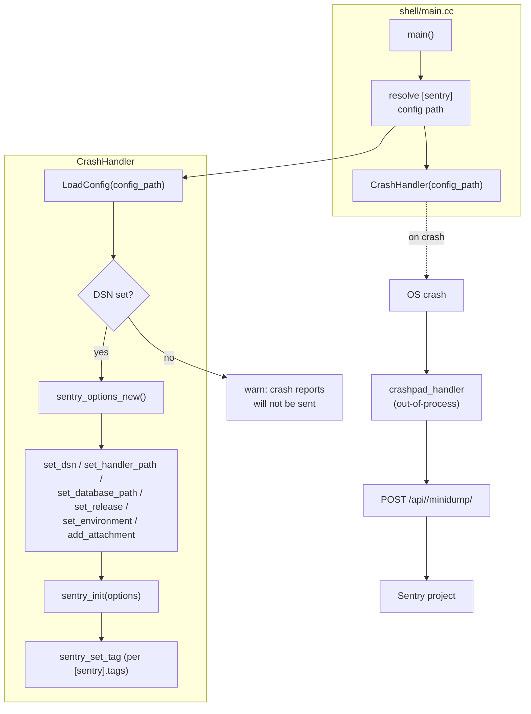

# Crash Handler

The Crash Handler is an optional Sentry crash-reporting subsystem. When a fatal
exception (e.g. a segfault) tears down the process, it captures a minidump of
the crashed state and uploads it to a Sentry project so the failure can be
triaged after the fact. It is built on [sentry-native] and its bundled
`crashpad_handler` daemon, which performs the out-of-process upload.

The handler is process-level: it is constructed once in `main.cc` before the
Flutter engine starts, reads a single `[sentry]` config table for metadata, and
stays resident for the lifetime of the process. It deliberately does **not**
log, schedule, or otherwise touch the shell reactor — it only arms the
sentry-native machinery so the OS-level crash path can do its work.

## Features

| Capability | Status | Toggle / scope |
|---|---|---|
| Enable crash handler | Optional | `BUILD_CRASH_HANDLER=ON` |
| Sentry DSN from environment | Built-in | `SENTRY_DSN` |
| Release tag | Built-in | `[sentry].release` in `config.toml` |
| Environment tag | Built-in | `[sentry].env` in `config.toml` |
| Custom tags | Built-in | `[sentry].tags` in `config.toml` |
| File attachments | Built-in | `[sentry].attachments` in `config.toml` |
| Symbolication on upload | Built-in | Always on |
| Integration test (self-crash) | Optional | `INTEGRATION_TEST_CRASH_HANDLER=ON` |

---

## Architecture



- **Config sourcing.** `CrashHandler::LoadConfig()` parses a `config.toml`
  (the `--config` master file when given, otherwise the first bundle's
  `config.toml`) and extracts the optional `[sentry]` table. The DSN itself is
  read from the `SENTRY_DSN` environment variable, not from the TOML — this is
  a hard requirement; an empty DSN disables the handler.
- **Initialization.** When a DSN is present, the handler builds a
  `sentry_options_t`, points it at the on-target `crashpad_handler` binary
  (`kCrashpadBinaryPath`, baked in from `CRASHPAD_RUNTIME_PATH`), sets the
  database path under `$XDG_CONFIG_HOME/.sentry`, applies release / env /
  attachments, then calls `sentry_init()`.
- **Crash path.** After `sentry_init()` returns, the process is instrumented.
  On a fatal signal, the OS hands control to crashpad's signal handler, which
  writes a minidump and asks the (separately-running) `crashpad_handler` daemon
  to upload it to Sentry. The main process is not involved.
- **Shutdown.** On clean exit, `~CrashHandler()` calls `sentry_close()` to
  tear down any state sentry-native holds. `main.cc` deliberately calls
  `crash_handler.release()` before returning so this teardown runs after the
  rest of the shell has unwound.

### File map

| Path | Role |
|------|------|
| [`crash_handler.h`](crash_handler.h) | Public `CrashHandler` class, `SentryConfig` struct, and the integration-test hook. |
| [`crash_handler.cc`](crash_handler.cc) | Config parsing, sentry-native initialization, and `crashpad_handler` path resolution. |
| [`../main.cc`](../main.cc) | Constructs the handler early in `main()` and releases it before return. |

### Threading model

- **Caller thread (main).** `CrashHandler` is constructed on the main thread
  during startup, before any reactor runs. The constructor does all work
  synchronously; there is no background thread owned by this class.
- **`crashpad_handler` (out-of-process).** After `sentry_init()`, sentry-native
  spawns a separate `crashpad_handler` daemon. The daemon performs the actual
  minidump upload asynchronously, so a slow Sentry endpoint cannot block the
  homescreen process.

---

## Build steps

### Dependencies

- **sentry-native** (build, required when enabled) — the crash-reporting C SDK
  plus the `crashpad_handler` binary it ships. Build it separately from
  [getsentry/sentry-native](https://github.com/getsentry/sentry-native):

  ```bash
  git clone https://github.com/getsentry/sentry-native
  cd sentry-native && mkdir build && cd build
  cmake .. -DCMAKE_BUILD_TYPE=RelWithDebInfo -DCMAKE_STAGING_PREFIX=$(pwd)/out/usr
  make install
  ```

- **crashpad_handler** (runtime, required) — the crashpad client binary. It
  must be reachable at `kCrashpadBinaryPath` on the deployed target (see below).
- **curl** (runtime, optional) — required for HTTPS transport to Sentry.
  For plaintext HTTP (e.g. the integration test's fake Sentry), curl is not
  needed.

### Configure + build

The handler is gated by CMake options:

- `-DBUILD_CRASH_HANDLER=ON`: Enables the core subsystem and links
  `sentry::sentry`.
- `-DINTEGRATION_TEST_CRASH_HANDLER=ON`: Enables the self-crash integration
  test (`scripts/crash_handler_integration.sh`).

When `BUILD_CRASH_HANDLER=ON`, configure must locate sentry-native and
`crashpad_handler`. The search order is:

1. `SENTRY_NATIVE_LIBDIR` (if set) — caller-pinned staging prefix.
2. CMake config mode via `find_package(sentry CONFIG)` — honors
   `CMAKE_PREFIX_PATH` / `CMAKE_FIND_ROOT_PATH`.
3. Fallback scan of `<SENTRY_NATIVE_LIBDIR | CMAKE_INSTALL_PREFIX>/{lib,lib64,cmake}/cmake/sentry`.

`CRASHPAD_BINARY_DIR` is validated as a configure-time sanity gate (must
contain `crashpad_handler`); it is **not** the path baked into the binary.
`CRASHPAD_RUNTIME_PATH` is what is baked in and handed to sentry at runtime;
it defaults to the resolved `CRASHPAD_BINARY_DIR` for native builds and to
`/usr/bin/crashpad_handler` for cross builds. Override with
`-DCRASHPAD_RUNTIME_PATH=...` when the target differs.

Example (native build with a staged sentry):

```bash
mkdir build && cd build
cmake .. -DBUILD_CRASH_HANDLER=ON \
    -DSENTRY_NATIVE_LIBDIR=$(pwd)/../sentry-native/build/out/usr/lib \
    -DCRASHPAD_BINARY_DIR=$(pwd)/../sentry-native/build/out/usr/bin
make -j
```

### Build matrix

| Config | CMake flags | Present path compiled in |
|--------|-------------|--------------------------|
| Disabled | `BUILD_CRASH_HANDLER=OFF` (default) | none |
| Enabled | `BUILD_CRASH_HANDLER=ON` | sentry-native + crashpad_handler |
| Integration test | `BUILD_CRASH_HANDLER=ON`, `INTEGRATION_TEST_CRASH_HANDLER=ON` | as above + self-crash hook |

---

## Running

### Runtime requirements

- A Sentry project with a valid DSN (public key + secret key + project ID).
- The `crashpad_handler` binary present at `kCrashpadBinaryPath` on the target
  (typically `/usr/bin/crashpad_handler` for cross builds).
- Outbound network access to the Sentry endpoint (HTTP or HTTPS).

### Env vars

| Env | Default | Effect |
|------|---------|--------|
| `SENTRY_DSN` | `—` | **Required.** The Sentry DSN. Without it, the handler logs a warning and does nothing. |
| `XDG_CONFIG_HOME` | `$HOME/.config` | Parent directory for the crashpad database (`.sentry/` is created inside it). |

### Config.toml

The `[sentry]` table is optional and process-level. The DSN comes from
`$SENTRY_DSN`; this table only adds metadata. Omit the whole table to disable.

```toml
[sentry]
release = '1.0.0'
env = 'production'
tags = { board = 'dev-board' }   # [sentry.tags] table
attachments = []
```

| Key | Type | Default | Notes |
|-----|------|---------|-------|
| `release` | string | `—` | Sentry release tag. |
| `env` | string | `@CMAKE_BUILD_TYPE@` | Sentry environment. |
| `tags` | table<string,string> | `{}` | Extra Sentry tags, applied post-init via `sentry_set_tag`. |
| `attachments` | array<path> | `[]` | Files attached to crash reports. |

### Logs

The handler logs the following to the shell log:
- **Warn**: DSN empty, config file missing, `crashpad_handler` not found at
  `kCrashpadBinaryPath`.
- **Error**: `sentry_options_new()` failed (likely OOM), `sentry_init()` failed.
- **Info**: nothing (the handler is quiet on success; Sentry's own client
  logs nothing by default — set `sentry_options_set_debug` to 1 to enable).

---

## Diagnostics/Debug

### Integration test

The crash-handler integration test builds the embedder with
`INTEGRATION_TEST_CRASH_HANDLER=ON`, runs it against a fake Sentry endpoint,
and verifies that a crash report (minidump) was delivered.

The test does **not** require a Flutter app, `libflutter_engine.so`, or the
Flutter SDK — the crash fires in `main()` right after arg-parse, before any
engine `Run`, so no Dart content is ever compiled or loaded.

```bash
./scripts/crash_handler_integration.sh
```

Env (all optional):
- `EMB`: emb executable (default: `emb` on PATH).
- `MOCK_PORT`: fake Sentry port (default: `5000`).

The test runs up to two attempts (the crashpad upload is asynchronous and
out-of-process, so a transient failure on the first attempt is retried).

### Manual verification

To manually confirm the handler is working:

```bash
export SENTRY_DSN="http://public@127.0.0.1:5000/1"   # or your real DSN
homescreen -b ./my-bundle --f
# then, from another terminal, kill -SEGV <pid>
```

Check the Sentry project dashboard for the received event.

### Symbolication

To resolve stack traces in Sentry, debug binaries and symbols must be uploaded
via [sentry-cli](https://docs.sentry.io/cli/installation/):

```bash
sentry-cli debug-files upload <build-dir>
```

---

## References

- [ARCHITECTURE.md §6.2 (Crash Handler)](../../docs/specs/ARCHITECTURE.md)
- [getsentry/sentry-native](https://github.com/getsentry/sentry-native)
- [Sentry docs](https://docs.sentry.io/)
- [sentry-cli](https://docs.sentry.io/cli/installation/)
