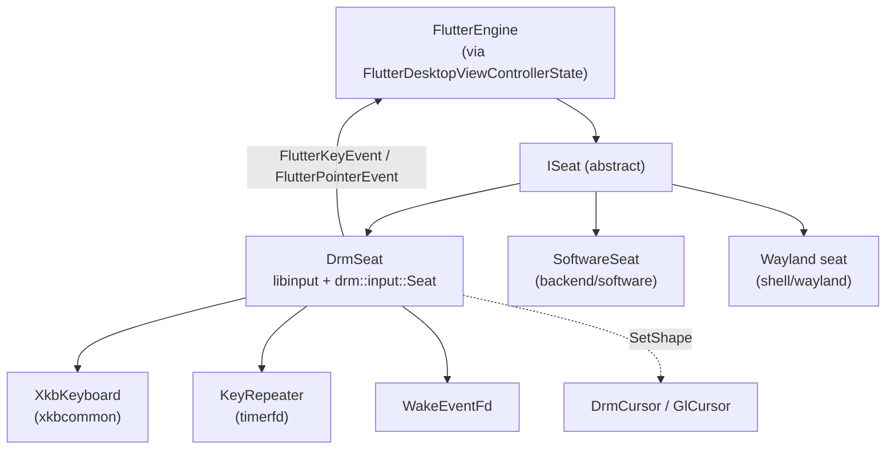

# input/

The input subsystem: the single place raw device input is turned into Flutter
input. It consumes host input (`libinput` on DRM, Wayland seats otherwise),
does the keyboard translation (xkb) and auto-repeat, and forwards events to
the running Flutter engine as `FlutterKeyEvent` / `FlutterPointerEvent`.

The `ISeat` interface is the seam: each backend pairs with a concrete seat
(`DrmSeat` for DRM-KMS, `SoftwareSeat` for the software backend, a
Wayland seat for Wayland). The backend-shared keyboard core (xkb translation
+ key-repeat) lives here so every libinput-backed seat behaves identically.

---

## Features

| Capability | Status | Toggle / scope |
|---|---|---|
| `ISeat` abstraction | ✓ | Always compiled |
| `DrmSeat` — libinput-backed seat for DRM-KMS | ✓ | `-DBUILD_BACKEND_DRM_KMS_EGL=ON` or `-DBUILD_BACKEND_DRM_KMS_VULKAN=ON` |
| `XkbKeyboard` — xkbcommon translation, shared | ✓ | libinput seats |
| `KeyRepeater` — timerfd-driven auto-repeat, shared | ✓ | libinput seats |
| `WakeEventFd` — eventfd waker, shared | ✓ | libinput seats |
| Cursor shape / position sinks (HW plane + composited) | ✓ | DRM-KMS backends |
| Multi-display pointer routing (`ViewRegion` layout) | ✓ | DRM-KMS backends |
| Touch bonding (`touch_device` libinput name match) | ✓ | DRM-KMS backends |
| VT-switch (`Ctrl+Alt+F<n>`) handler | ✓ | `DrmSeat` |
| Session pause / resume (libseat VT round-trip) | ✓ | `DrmSeat` + libseat |
| Hot-swap xkb keymap (dormant — future settings channel) | ✓ | `DrmSeat` |
| Motion-to-photon input endpoint | ✓ | `IVI_M2P_PROFILE` (or `IVI_PROFILE`) |

---

## Architecture

`DrmSeat` runs a dedicated dispatch thread that pumps `drm::input::Seat`
events. Events received before the Flutter engine is up are dropped. When a
libseat session is live, the seat opens `/dev/input/event*` through the
session's `InputDeviceOpener`, giving input fds the same revocable lifetime as
the DRM fd.

### Module responsibilities

- **`ISeat`** ([iseat.h](iseat.h)) — the lifecycle contract. `Start` / `Stop`
  / `SetViewControllerState`. `SetViewControllerState` is safe to call at any
  time, including before the engine is running; `nullptr` pauses delivery.
- **`DrmSeat`** ([drm_seat.{h,cc}](drm_seat.h)) — the libinput-backed seat.
  Owns the dispatch thread, the `ViewRegion` map for multi-display pointer
  routing, the HW / composited cursor, and the VT-switch / session-pause
  handlers. `SetViewport`, `SetRegionLayout`, `SetCursor`, `SetGlCursor`,
  `SetInputTransforms`, `SetCursorRotation` are all wired before `Start`.
- **`XkbKeyboard`** ([xkb_keyboard.{h,cc}](xkb_keyboard.h)) — owns the
  xkbcommon context, keymap, and state. `ProcessKey` resolves a keycode and
  advances modifier state; `ResolveSym` does so without mutating. Shared by
  every libinput-backed seat.
- **`KeyRepeater`** ([key_repeater.{h,cc}](key_repeater.h)) — timerfd-driven
  key auto-repeat. Defaults match X11/Wayland convention (600 ms delay, 25 Hz).
  Synthesized repeats re-resolve the held key against the keyboard's current
  state each tick, so a Shift/AltGr level change mid-hold takes effect on the
  next repeat.
- **`WakeEventFd`** ([wake_event_fd.{h,cc}](wake_event_fd.h)) — RAII eventfd
  that breaks a seat's dispatch `poll()` out of an infinite block when a
  cross-thread flag changes (stop, session pause/resume, keymap reload).
- **`KeymapConfig`** / **`KeymapOptions`** — owned-string variants of the
  RMLVO options, safe to pass across threads.
- **`ICursorPositionSink`** ([cursor_position_sink.h](cursor_position_sink.h))
  — the composited-cursor sink. Pushes pointer positions (in
  render/viewport pixels) to a cursor that has no hardware plane — e.g. the
  EGL backend's `GlCursor` on display controllers (i.MX LCDIF, etc.) that
  expose only a primary plane.
- **`ICursorShapeSink`** ([../display/icursor_shape_sink.h](../display/icursor_shape_sink.h))
  — the cursor-shape retarget seam. `IDisplay::ActivateSystemCursor` calls
  `SetShape` to swap the live sprite regardless of which concrete cursor the
  backend is using.

### Threading model

- **Seat dispatch thread** — runs `DispatchLoop`, pumps libinput / drm-cxx
  events, calls `KeyCallback` into the embedder. All calls into
  `XkbKeyboard` / `KeyRepeater` come from here.
- **`WakeEventFd`** — the dispatch `poll()` watches the libinput fd, the
  repeater timer fd, and the wake fd. A write to the wake fd breaks the poll
  so the next iteration can pick up a stop / pause / reload.
- **Session libseat dispatch thread** — `DrmSeat::OnSessionPaused` /
  `OnSessionResumed` are called from the libseat dispatch thread, NOT the seat
  dispatch thread. They flip a pending flag; `DispatchLoop` picks it up on
  the next iteration and calls the matching libinput suspend/resume on the
  right thread.

---

## Build steps

### Configure + build

| Source | Gate |
|--------|------|
| `input/iseat.h` | Always (header) |
| `input/xkb_keyboard.cc`, `input/key_repeater.cc`, `input/wake_event_fd.cc` | `BUILD_SOFTWARE_INPUT_LIBINPUT` or `BUILD_BACKEND_DRM_KMS_EGL` or `BUILD_BACKEND_DRM_KMS_VULKAN` |
| `input/drm_seat.cc` | `BUILD_BACKEND_DRM_KMS_EGL` or `BUILD_BACKEND_DRM_KMS_VULKAN` |

### Dependencies

- **libinput** — evdev + multi-touch.
- **xkbcommon** — keymap + modifier state.
- **libseat** (optional) — `/dev/input/event*` opener for the DRM-KMS path.

---

## Running

### Pointer routing across displays

Multiple views can share one seat (several displays on one DRM card). Each
view declares its rectangle in the combined pointer space via
`DrmSeat::SetRegionLayout` + `SetViewport`. The pointer accumulates in
combined space; the region under it receives events in its own local (render)
coordinates and owns the sprite that tracks it.

### Touch bonding

A touch panel reports absolute coordinates in its own space with no cursor,
so unlike a mouse it cannot be routed by pointer position. Each view can name
a touch panel via `DrmSeat::SetRegionTouchDevice` (a libinput device-name
substring); touches from that panel route to that view instead of the primary.

### VT switch

`Ctrl+Alt+F<n>` is intercepted from libinput's stream before it reaches the
kernel's keymap-layer handler. `DrmSeat::SetVtSwitchHandler` installs the
handler; returning `true` consumes the event so it does not also reach
Flutter.

### Keyboard LEDs

`XkbKeyboard::Leds()` returns the Caps/Num/Scroll lock latch. `DrmSeat`
pushes this to the physical LEDs at startup and on every device-add.

---

## Diagnostics/Debug

- **`IVI_M2P_PROFILE=1`** (or `IVI_PROFILE=1`) — enables the motion-to-photon
  profiler. Input batches are fed from `DrmSeat::HandleEvent` and
  `SoftwareSeat` via the shared `MotionToPhoton::RecordInput`.
- **`HOMESCREEN_DRM_NO_SEAT=1`** — bypass libseat. `DrmSeat` then opens
  `/dev/input/event*` directly and applies the legacy `K_OFF` TTY keyboard-mode
  hack.
- **`--drm-no-seat` / `HOMESCREEN_DRM_NO_SEAT`** — skip the libseat session
  entirely. The seat's `InputDeviceOpener` is empty, and the seat falls back
  to direct evdev.
- **Degraded poll mode** — when `eventfd()` fails at construction, the seat
  degrades to a 100 ms `poll` timeout. A warning is logged once.

---

## Known limitations

- **Hot-swap keymap is dormant.** `DrmSeat::ReloadKeymap` is implemented but
  has no caller today; it is intended for a future settings/locale channel.
- **Events before the engine is up are dropped.** The state pointer resolves
  to a null engine handle in that window.
- **Multi-seat is not supported.** There is one `ISeat` per display; a
  multi-seat configuration (e.g. a touchscreen + a mouse + a keyboard on
  different seats) requires the backends to coordinate.
- **`DrmSeat::SetInputTransforms`** rotates/reflects relative-pointer deltas
  for devices bolted to a rotated chassis (e.g. the Steam Deck's right
  trackpad). Unmatched devices (an external mouse) are left alone.

---

## References

- [`shell/input/iseat.h`](iseat.h) — `ISeat` interface
- [`shell/input/drm_seat.h`](drm_seat.h) — `DrmSeat`
- [`shell/input/xkb_keyboard.h`](xkb_keyboard.h) — `XkbKeyboard`
- [`shell/input/key_repeater.h`](key_repeater.h) — `KeyRepeater`
- [`shell/input/wake_event_fd.h`](wake_event_fd.h) — `WakeEventFd`
- [`shell/display/README.md`](../display/README.md) — the cursor sinks that
  `DrmSeat` pushes to
- [`shell/backend/software/README.md`](../backend/software/README.md) — the
  `SoftwareSeat` that reuses `XkbKeyboard` + `KeyRepeater`
- [`shell/profiling/README.md`](../profiling/README.md) — the
  motion-to-photon profiler fed from `DrmSeat`
