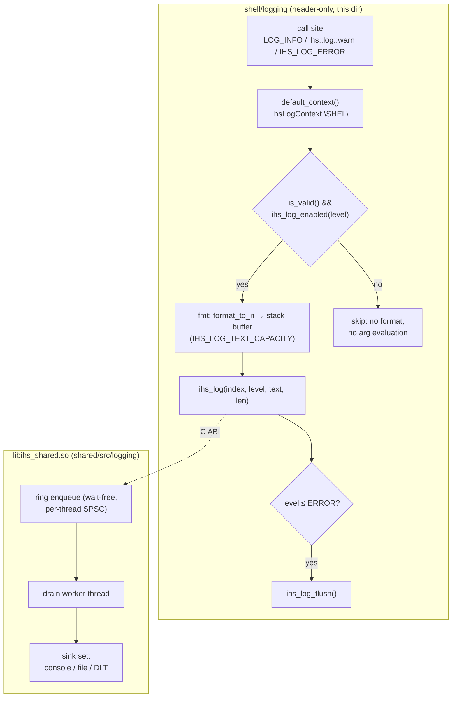

# Logging

Defines the **process-wide default logging context** for shell log lines and the
thin, header-only C++ layer every in-tree call site uses to emit them. A shell
log call (`LOG_INFO`, `ihs::log::warn`, `IHS_LOG_ERROR`, …) formats a line with
[fmt](https://fmt.dev) in the calling thread, then hands the finished text to the
`ihs_shared` logging C ABI (`ihs_log`), which fans it out to the configured sinks
(console / file / DLT). The formatting layer lives here, shell-side; the ring,
drain worker, sink set, and the DLT bridge live in exactly one place at
runtime — `libihs_shared.so` (see [ARCHITECTURE.md §6.4 / §7.2](../../docs/specs/ARCHITECTURE.md)) — so the
process never holds two copies of that state.

This directory is headers only ([`logging.h`](logging.h) and
[`logger.hpp`](logger.hpp)); it owns no `.cpp` and links no library of its own.
The predecessor spdlog console/DLT loggers are retired — this surface is their
single replacement, and it deliberately preserves their observable semantics
(flush-on-error, release-stripped debug/trace).

## Features

| Capability | Status | Toggle / scope |
|---|---|---|
| Process-wide default context (`"SHEL"`) | Built-in | Opened lazily on first log after `ihs_log_start` |
| Level-gated call sites (`ihs_log_enabled` before formatting) | Built-in | Always |
| fmt `{}`-style formatted overloads (compile-time checked) | Built-in | `logging.h` levels + `IHS_LOG_*` macros |
| Verbatim (non-formatting) overloads for runtime strings | Built-in | One-argument `ihs::log::*` calls |
| Flush-on-error (error/fatal drain synchronously) | Built-in | Records at `IHS_LEVEL_ERROR` or worse |
| Release-stripped diagnostics (`IHS_DEBUG` / `IHS_TRACE`) | Built-in | Compiled out under `NDEBUG` |
| Per-site explicit context (`IhsLogContext` + `IHS_LOG_*`) | Built-in | Plugins / non-default tags |
| DLT sink | Optional | `-DENABLE_DLT=ON` (in `ihs_shared`) + `IHS_LOG_SINK=dlt` |
| Runtime sink / level / file selection | Built-in | `IHS_LOG_SINK`, `IHS_LOG_LEVEL`, `IHS_LOG_FILE*` env |

---

## Architecture

The shell side is a formatting shim. Everything after `ihs_log` — the per-thread
ring, the drain worker, and the sinks — is owned by `ihs_shared` and reached
only through the C ABI in [`shared/include/ihs/logging.h`](../../shared/include/ihs/logging.h).

- **`ihs::log::default_context()`** ([logging.h](logging.h)) — the single
  process-wide context, tag `"SHEL"`, description `"ivi-homescreen shell"`.
  Opened lazily on first use. If a log happens before `ihs_log_start`, the open
  returns an invalid handle; rather than cache that permanently (which would
  wedge all logging), it re-attempts while invalid so logging recovers once the
  bridge is up. The pre-start window is single-threaded, so the re-open needs no
  synchronization.
- **`ihs::log::{trace,debug,info,warn,error,critical}`** — two overloads each: a
  *verbatim* form (`std::string_view` — emitted as-is, safe for runtime strings
  containing `{`/`}`) and a compile-time-checked *formatted* form (a literal +
  ≥1 argument). A bare one-argument call always resolves to the verbatim
  overload, so it never goes through the formatter.
- **`detail::emit_raw` / `detail::emit_fmt`** — run the `ihs_log_enabled()` gate
  first, so a level filtered out by `IHS_LOG_LEVEL` costs nothing beyond the
  gate (no formatting, no argument evaluation). The formatted path writes into a
  `IHS_LOG_TEXT_CAPACITY`-byte stack buffer via `fmt::format_to_n`; longer lines
  are truncated.
- **`detail::maybe_flush`** — flushes synchronously after an error-or-worse
  record (`level ≤ IHS_LEVEL_ERROR`), matching spdlog's `flush_on(err)`, so an
  error line survives a subsequent `abort()`/crash. Info/debug/verbose stay
  async.
- **`IhsLogContext`** ([logger.hpp](logger.hpp)) — a lightweight RAII-ish wrapper
  around an acquired context index (`ihs_log_context_open`). Construct one per
  logging site for a non-default tag; the bridge caches by id, so duplicates are
  cheap.
- **`IHS_LOG_*` macros + `IHS_LOGGING_START/STOP/FLUSH`** ([logger.hpp](logger.hpp)) —
  a lower-level surface over the same C ABI, taking an explicit `IhsLogContext`.
  Used where a call site wants its own context (e.g. in-tree plugins). The
  `IHS_LOG_IMPL_` macro applies the same gate-then-format discipline and uses
  `ihs::format_to` (`{}` under `std::format`, printf placeholders under the
  C++17 fallback).
- **Convenience aliases** — `LOG_INFO`, `LOG_DEBUG`, `LOG_WARN`, `LOG_ERROR`,
  `LOG_TRACE`, `LOG_CRITICAL` map to the `ihs::log::*` functions for existing
  call sites. `IHS_DEBUG` / `IHS_TRACE` are compiled out under `NDEBUG` (as the
  old `SPDLOG_DEBUG` / `SPDLOG_TRACE` were with `SPDLOG_ACTIVE_LEVEL=OFF`).

Lifecycle: [`shell/main.cc`](../main.cc) calls `IHS_LOGGING_START("IHSC",
"ivi-homescreen Flutter runtime")` before anything logs and `IHS_LOGGING_STOP()`
at shutdown. `ihs_log_start` is idempotent — only the first successful call
registers the app id, resolves sinks from the environment, and starts the drain
thread.

### File map

| Path | Role |
|------|------|
| [`logging.h`](logging.h) | Shell logging surface: `ihs::log::*` level functions, the `default_context()`, flush-on-error policy, the `LOG_*` / `IHS_DEBUG` / `IHS_TRACE` aliases. Pulls in fmt header-only. |
| [`logger.hpp`](logger.hpp) | `IhsLogContext` wrapper + the `IHS_LOG_*` macros and `IHS_LOGGING_START/STOP/FLUSH`. A thin inline layer over the `ihs_shared` C ABI, used for explicit per-site contexts. |
| [`tests/compat-matrix/`](tests/compat-matrix/) | Compile-and-run smoke test across C++17/20/23 and both DLT settings; exercises the lifecycle, format portability, the direct bridge path, and the ring. |
| [`tests/load/`](tests/load/) | Throughput / drop / latency load test driving N producer threads through the DLT bridge, with a `dlt_stub` standing in for `libdlt.so.2`. |
| [`tests/bench/`](tests/bench/) | Producer-latency regression guard: measures the cost the calling thread pays per `ihs::log` call against a same-machine raw-fmt reference. |

### Threading model

Log calls are safe from any thread. The producer side (this directory) does the
fmt formatting on the calling thread, then hands off to a **wait-free enqueue**
into a **per-thread single-producer/single-consumer ring** inside `ihs_shared`.
When a ring is full the record is dropped and a per-ring counter is bumped —
`ihs_log` never blocks the caller. Formatting-to-I/O happens on a separate drain
worker thread. `ihs_log_flush()` (via `IHS_LOGGING_FLUSH()` or the error-level
auto-flush) is synchronous.

---

## Build steps

This directory adds no build target of its own — the headers are consumed by the
shell and in-tree plugins, which link `ihs_shared`.

### Dependencies

- **[fmt](https://fmt.dev)** — sourced header-only from the standalone
  `third_party/fmt` submodule (`FMT_HEADER_ONLY`). Formatting happens shell-side,
  before the C ABI, so `libihs_shared.so` stays dependency-free.
- **`ihs_shared`** — provides the `ihs_log_*` C ABI (always present; the logging
  surface compiles regardless of `ENABLE_DLT`).
- **DLT** (optional) — with `-DENABLE_DLT=ON` (default), `ihs_shared` builds a
  DLT sink that `dlopen`s `libdlt.so.2` at runtime; it is one sink among
  console/file, not the interface. With `ENABLE_DLT=OFF` the DLT sink is not
  compiled and records fan out to console/file only.

The standalone test harnesses under [`tests/`](tests/) compile the bridge
sources from `shared/src/logging` directly and need only a C++ toolchain (no
Wayland/Flutter/other submodules).

---

## Running

No runtime setup is required from this directory — the shell brings logging
online at startup. Sink, level, and file behavior are resolved by `ihs_shared`
from the environment at `ihs_log_start` time.

### Env vars

These are read by the `ihs_shared` sink set (see
[`shared/src/logging/sink_set.cpp`](../../shared/src/logging/sink_set.cpp)); the
shell logging surface honors them transparently.

| Env | Default | Effect |
|------|---------|--------|
| `IHS_LOG_SINK` | `console` | Active sink: `dlt`, `console`, or `file`. `dlt` with no `libdlt` warns and falls back to console. |
| `IHS_LOG_LEVEL` | verbose | Level floor (name, case-insensitive, or `0`–`6`); more-verbose records are dropped before formatting. `off` disables all records. |
| `IHS_LOG_FILE` | — | Output path when `IHS_LOG_SINK=file`. Unset with `file` warns and uses console. |
| `IHS_LOG_FILE_MAX_BYTES` | — | Rotation size threshold for the file sink. |
| `IHS_LOG_FILE_MAX_FILES` | — | Number of rotated files to keep. |
| `IHS_DLT_LIBRARY` | `libdlt.so.2` | Soname/path override for the DLT library the bridge `dlopen`s (also used by the load test to point at the stub). |

### DLT sink

DLT is implemented via [`ihs_shared`](../../shared/src/logging/sink_dlt.cpp) and is optional ([docs](../../shared/README.md)).

---

## Diagnostics/Debug

- **Nothing appears in the log.** Confirm `IHS_LOGGING_START` ran before the
  first log (`main()` calls it first). Before start, `default_context()` returns
  an invalid handle and calls are dropped, but it re-opens automatically once the
  bridge is up. Check `IHS_LOG_LEVEL` is not set to `off` or below your call's
  level.
- **A line was dropped under load.** `ihs_log` is wait-free and drops on ring
  overflow (producer outrunning the drain worker), bumping a per-ring counter.
  The load test ([`tests/load/`](tests/load/)) reports drops; keep bursts under
  the ring capacity or reduce rate.
- **An error line didn't survive a crash.** Error/fatal records auto-flush
  (`level ≤ IHS_LEVEL_ERROR`); info/debug/verbose are async. Call
  `IHS_LOGGING_FLUSH()` before a controlled exit if you need pending records
  drained.
- **`{`/`}` in a runtime string throws or mis-formats.** Use the
  single-argument (verbatim) overload — pass the string as the only
  argument — so it bypasses the formatter entirely.
- **Debug/trace lines missing in a release build.** `IHS_DEBUG` / `IHS_TRACE`
  are compiled out under `NDEBUG` by design.
- **`IHS_LOG_SINK=dlt` produces no DLT output.** Verify `ihs_shared` was built
  with `-DENABLE_DLT=ON` and that `libdlt.so.2` (or `IHS_DLT_LIBRARY`) is
  loadable; otherwise the DLT sink self-disables and falls back to console.
- **Verifying portability / behavior.** Run the compat-matrix smoke
  ([`tests/compat-matrix/`](tests/compat-matrix/)) across toolchains and DLT
  settings; run the bench ([`tests/bench/`](tests/bench/)) to catch a producer
  hot-path regression against a same-machine fmt reference.

---

## Known limitations

- **Log lines are truncated at `IHS_LOG_TEXT_CAPACITY`.** Lines that exceed the
  fixed stack buffer are silently cut at the C ABI boundary; there is no
  partial-write recovery or warning.
- **Ring overflow drops records silently.** When the per-thread SPSC ring is
  full, `ihs_log` drops the record and increments a per-ring counter. No
  backpressure is applied to the caller.
- **Only one sink is active at a time.** `IHS_LOG_SINK` selects exactly one of
  `console`, `file`, or `dlt`; simultaneous fan-out to multiple sinks is not
  supported.
- **Records emitted before `ihs_log_start` are dropped.** Log calls that race
  the startup window (e.g. from static-init code) are issued against an invalid
  context and discarded; they are not buffered for replay once the bridge is up.

---

## References

- [fmt library](https://fmt.dev) — header-only formatting used shell-side (`third_party/fmt`).
- [`shared/include/ihs/logging.h`](../../shared/include/ihs/logging.h) — the `ihs_log_*` C ABI this surface calls.
- [`docs/PLUGIN_ABI.md`](../../docs/PLUGIN_ABI.md) — the `ihs_shared` boundary contract.
- [ARCHITECTURE.md §6.4 — Logging and Tracing](../../docs/specs/ARCHITECTURE.md) — where this surface sits in the embedder.
- [COVESA DLT (Diagnostic Log and Trace)](https://github.com/COVESA/dlt-daemon) — the optional DLT sink target.
- [spdlog](https://github.com/gabime/spdlog) — the retired predecessor whose semantics (flush-on-error, release-stripped debug/trace) this surface preserves.
