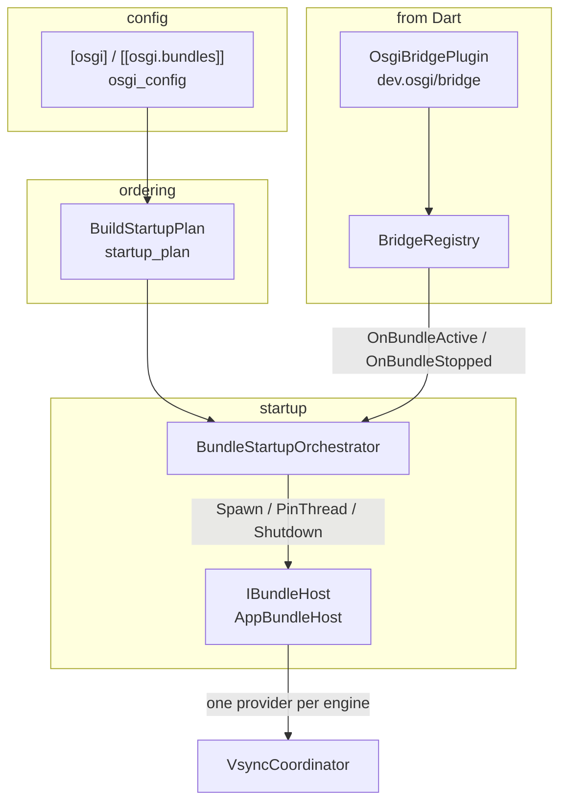

# osgi/

The shell side of the OSGi multi-bundle framework: running several Flutter
bundles in one process as independently managed bundles, each with its own
engine and view, brought up in priority order with a deadline on the ones that
matter.

What lives here is only the half the shell can own — engines, startup order,
deadlines, vsync fan-out, and the channel a bundle reports through. The
lifecycle a bundle's own code sees, the service registry and the event admin are
Dart, in the `osgi_*` packages; this directory never links them.

Compiled only when `ENABLE_OSGI=ON`. With the option off no translation unit
here is built and the binary carries no `ihs::osgi` symbols.

---

## Features

| Capability | Status | Toggle / scope |
|---|---|---|
| Several bundles as `App` views, one engine each | Built-in | `[[osgi.bundles]]` |
| Critical bundles started and awaited before the reactor | Built-in | `priority = 'critical'` |
| Normal bundles staggered after the reactor; background launched immediately | Built-in | `priority = 'normal' \| 'background'` |
| Per-bundle startup deadline, torn down on expiry | Built-in | `startup_timeout_ms` (1…3600000) |
| `dev.osgi/bridge` handshake: a bundle announces itself and reports ACTIVE | Built-in | `OsgiBridgePlugin` |
| Framework isolate port delivered to every bundle, either registration order | Built-in | `BridgeRegistry` |
| One presentation source fanned out to N engines in priority order | Built-in | `VsyncCoordinator` |
| Engine-thread CPU affinity, validated against the process mask | Built-in | `cpu_core`, `framework_core` |
| OSGi lifecycle state machine mirroring the specification's edges | Built-in | `bundle_state.{h,cc}` |

---

## Architecture



`osgi_config` parses the TOML tables into `BundleManifest`s.
`BuildStartupPlan` sorts them into the three phases.
`BundleStartupOrchestrator` is the only thing that blocks: it spawns each
critical bundle through `IBundleHost` and waits for the bundle's own code to
report ACTIVE, then launches the deferred phases without waiting.

Reaching ACTIVE is not observable from C++ — the bundle's Dart activator reports
it over `dev.osgi/bridge`, which reaches the orchestrator through
`IBundleLifecycleObserver`. Without that seam a bundle could run its activator
to completion and still have its critical wait expire.

### Module responsibilities

- **`osgi_config`** — `[osgi]` / `[[osgi.bundles]]` to `BundleManifest`, with
  bounds checking. Per-bundle backend and args tables reach
  `Configuration::get_view_parameters`, so a bundle configures its view exactly
  as a `[[view]]` entry does.
- **`startup_plan`** — phase assignment and order; `StartupPolicy` carries the
  normal-bundle stagger (50 ms) and the critical budget.
- **`startup_orchestrator`** — the state machine driver. Spawn, pin, await
  ACTIVE, and on failure unwind `STARTING → STOPPING → RESOLVED` so the same
  symbolic name can start again. Records a `BundleOutcome` per bundle rather
  than aborting startup: one broken cluster must not take the system with it.
- **`bundle_host`** — `IBundleHost`, the seam over everything needing a live
  engine. `LibFlutterEngine`'s export table is published only by a `Load()`
  that dlopens a real library, so there is no fake to substitute; putting the
  engine behind this interface is what makes deadline expiry, spawn failure and
  refused affinity testable.
- **`app_bundle_host`** — the production `IBundleHost`: bundles become `App`
  views.
- **`osgi_bridge_plugin`** — the `dev.osgi/bridge` channel handler, one instance
  per engine.
- **`bridge_registry`** — isolate ports and the framework port. Registration is
  commutative: a bundle and the framework isolate start concurrently, so
  whichever arrives second triggers delivery. The framework port is posted as a
  `Dart_CObject_kSendPort`, because Dart cannot rebuild a `SendPort` from a port
  id.
- **`vsync_coordinator`** — one vblank in, N ordered batons out.
- **`bundle_state`** — the lifecycle graph, mirrored by the Dart side so a state
  crosses the boundary as an int with no translation.
- **`priority`**, **`cpu_affinity`** — priority parsing; affinity validated
  against `sched_getaffinity` rather than a core count, since the two disagree
  in both directions under a cpuset.

### File map

```
shell/osgi/
├── osgi_config.{h,cc}           [osgi] tables -> BundleManifest
├── bundle_manifest.h            one bundle's parsed configuration
├── priority.{h,cc}              critical | normal | background
├── cpu_affinity.{h,cc}          core validation against the process mask
├── startup_plan.{h,cc}          phase assignment, order, StartupPolicy
├── startup_orchestrator.{h,cc}  spawn, await ACTIVE, unwind, outcomes
├── bundle_host.h                IBundleHost: the live-engine seam
├── app_bundle_host.{h,cc}       production host; bundles as App views
├── osgi_bridge_plugin.{h,cc}    dev.osgi/bridge method channel
├── bridge_registry.{h,cc}       isolate ports, framework port, observer seam
├── vsync_coordinator.{h,cc}     one source -> N engines, priority ordered
└── bundle_state.{h,cc}          OSGi lifecycle states and legal transitions
```

### Threading model

- **Platform thread** — config parsing, the orchestrator's phases, channel
  calls. `StartCriticalPhase` blocks here, before the reactor runs.
- **Bundle engine threads** — one per engine, optionally pinned to `cpu_core`.
- **Source event thread** — `VsyncCoordinator::Tick` runs on the Wayland event
  loop or the DRM fd handler, and dispatches against a snapshot taken under the
  lock and released before delivery: a target must not be able to deadlock the
  coordinator by calling back into it, and the slowest target must not sit on
  the critical path of every later one.
- **Dart isolates** — bridge calls arrive from whichever engine's isolate made
  them. `BridgeRegistry` guards its own state and dispatches the lifecycle
  observer outside its lock, since the observer takes the orchestrator's.

---

## Configure + build

```sh
cmake -B build -G Ninja -DENABLE_OSGI=ON -DBUILD_UNIT_TESTS=ON
ninja -C build
ctest --test-dir build -R osgi
```

`ENABLE_OSGI=ON` requires the vendored Dart DL headers under
`third_party/flutter/third_party/dart/runtime/include/`; configure fails with
the missing file named if they are absent. See that directory's `PROVENANCE.md`
for how they are pinned.

---

## Running

Bundles are declared in the config file, in an `[osgi]` table and one
`[[osgi.bundles]]` entry per bundle. The keys and their bounds:

| key | type | bounds |
|---|---|---|
| `symbolic_name` | string | required; must match what the bundle's activator sends |
| `bundle` | string | required; bundle directory (assets + `libapp.so`) |
| `priority` | string | `critical` \| `normal` \| `background` (default `normal`) |
| `startup_timeout_ms` | int | 1…3600000; only a critical bundle is awaited |
| `cpu_core` | int | −1…`CPU_SETSIZE-1`, validated against the process affinity mask |
| `[osgi] framework_core` | int | as `cpu_core`, for the Dart framework isolate thread |

A bundle also takes the `[[view]]` keys, plus its own
`[osgi.bundles.backend]`, `[osgi.bundles.backend.drm]`, `[osgi.bundles.shell]`,
`[osgi.bundles.output]` and `[osgi.bundles.args]` sub-tables, which mirror the
`[view.*]` tables exactly — each bundle is one engine and one view, so backends
may differ per bundle. `test/unit_test/osgi_config-test/files/` holds worked
examples.

These are not in
[`docs/config-examples/reference.toml`](../../docs/config-examples/reference.toml):
that file is generated by `scripts/gen_config_reference.py`, which scrapes
`shell/configuration/configuration.cc` and does not read
`shell/osgi/osgi_config.cc`. Teaching the generator about these tables is
worth doing separately.

Two deployment rules that are not obvious from the schema:

- **A bundle directory must not contain `lib/libflutter_engine.so`.**
  `LibFlutterEngine::Load()` is one-shot and keyed on the path it first binds, so
  a second bundle carrying its own copy is refused and its view aborts — however
  identical the files are. The engine is supplied once, process-wide; bundle
  directories carry assets and `libapp.so`.
- **A `symbolic_name` must match an `[[osgi.bundles]]` entry.** A name the shell
  does not know is accepted by the bridge and then ignored by the orchestrator,
  so a typo shows up as the correctly named bundle's deadline expiring, with a
  warning in the log rather than an error at the call.

---

## Diagnostics/Debug

- `ENABLE_DLT=ON` routes bundle lifecycle transitions to DLT; each bundle gets
  its own context by symbolic name.
- The startup log lists the plan in dispatch order, and
  `VsyncCoordinator::DispatchOrder()` the vsync order — both stable, since ties
  break by registration sequence.
- `test/osgi_multi_bundle.sh` drives two bundles on real KMS and asserts the
  ordering guarantee end to end. `test/integration/osgi_activator_test` is the
  minimal bundle that completes the handshake, which is what makes that
  assertion possible.

---

## Known limitations

- The bridge trusts the `symbolic_name` in a call. `HandleMethodCall` is static
  and reads the name from the arguments, so a bundle can report ACTIVE for
  another bundle — the plugin instance already identifies the engine, so binding
  identity to it would be strictly stronger.
- A bundle whose isolate dies without calling `shutdown` stays registered until
  something else releases it; the bridge learns a bundle is gone only when it
  says so.

---

## References

- [`docs/specs/ARCHITECTURE.md`](../../docs/specs/ARCHITECTURE.md) §6.5 — where
  this fits in the shell.
- [`docs/config-examples/reference.toml`](../../docs/config-examples/reference.toml)
  — every `[osgi]` key.
- The Dart side lives in the `osgi_*` packages: bundle lifecycle, service
  registry, event admin, and the framework isolate a bundle reaches over the
  port delivered here.
