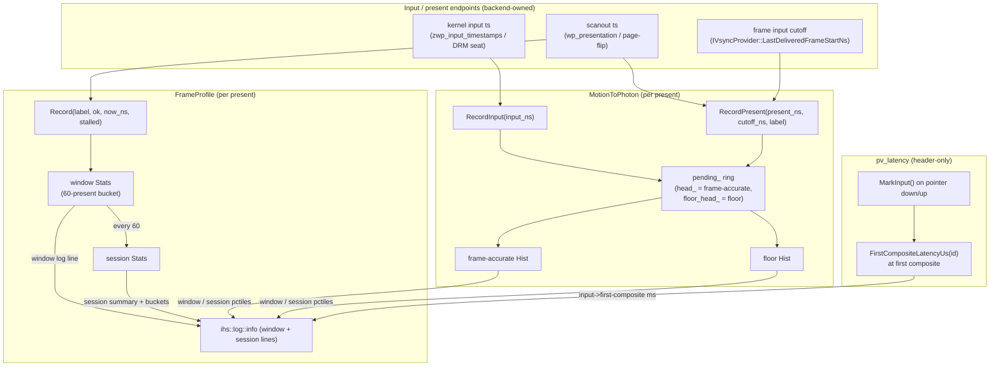

# Profiling

Measures the embedder's presentation performance on real hardware: frame pacing
(inter-present cadence), motion-to-photon latency (kernel input → scanout), and
platform-view input-to-visible latency. Every probe is opt-in via an environment
variable, allocation-free on the hot path, and emits its results through the
normal logging surface — there is no separate collector, socket, or file.

The three probes are independent and share a common style: a fixed-size window
that logs a rolling summary every *N* presents, plus a session-aggregate summary
emitted once on teardown. Backends and the vsync provider own the instances and
feed them from their present/input paths; this folder only holds the meters.

## Features

| Capability | Status | Toggle / scope |
|---|---|---|
| Frame-pacing profiler (`FrameProfile`) | Built-in | `IVI_PROFILE` (or a backend's legacy gate) |
| Per-window cadence summary (every 60 presents) | Built-in | With `FrameProfile` enabled |
| Session cadence summary + interval histogram | Built-in | On backend/provider teardown |
| Discarded-frame and stall counting | Built-in | With `FrameProfile` enabled |
| Motion-to-photon profiler (`MotionToPhoton`) | Built-in | `IVI_M2P_PROFILE` (or `IVI_PROFILE`) |
| Frame-accurate latency (input cutoff → scanout) | Built-in | With `MotionToPhoton` enabled |
| Floor latency (input → earliest possible scanout) | Built-in | With `MotionToPhoton` enabled |
| Latency percentiles (p50 / p95 / p99 / max) | Built-in | With `MotionToPhoton` enabled |
| Cross-thread present marshaling (`MarshalRecordPresent`) | Built-in | DRM/KMS backends |
| Platform-view input→visible probe (`pv_latency`) | Built-in header | `IVI_PV_LATENCY=1` |

---

## Architecture



Each probe is a plain object with no dependencies beyond `CLOCK_MONOTONIC` and
the logger. All timestamps are `CLOCK_MONOTONIC` nanoseconds so the endpoints
(kernel input time, compositor scanout time, and the engine clock) share one
domain and subtract cleanly. `Enabled()` reads the environment once; the callers
cache the result and never re-check it on the per-frame path.

- **`FrameProfile`** (`frame_profile.{h,cc}`) — the unified frame-pacing meter
  shared by every backend and the vsync provider. `Record()` is called once per
  present with an `ok` flag (a superseded / non-scanned-out frame is counted as
  *discarded* and contributes no interval) and an optional `stalled` flag (the
  present had to block on a buffer/flip). It keeps a rolling 60-present window
  and a session accumulator; the inter-present interval feeds a fixed-threshold
  histogram (`≤17 ms` = 60 Hz, `≤33 ms` = 30 Hz, `≤50 ms` = 20 Hz, `≤100 ms` =
  slow, `>100 ms` = idle) so the numbers line up across backends regardless of
  how each drives presents. `LogSessionSummary()` folds the trailing partial
  window into the totals, so short runs and the tail of long runs are not lost.
- **`MotionToPhoton`** (`motion_to_photon.{h,cc}`) — the input-to-scanout meter.
  `RecordInput()` queues a kernel input timestamp in a 256-entry FIFO ring;
  `RecordPresent()` drains it against a scanout, computing two latencies from the
  same queued inputs (see below). Latencies land in a per-millisecond histogram
  (0–200 ms plus an overflow bucket) from which percentiles are read cumulatively
  — cheap, allocation-free, and ±1 ms is finer than the measurement is
  meaningful. A window summary logs every 120 presents; the session summary
  reports mean / p50 / p95 / p99 / max.
- **`MarshalRecordPresent`** (`motion_to_photon.cc`) — a helper for the DRM/KMS
  backends, whose page-flip handler runs on the flip-reader/raster thread rather
  than a shared Wayland event thread. It `asio::post`s the scanout record onto
  the platform task runner's strand — the same strand the DRM input seats post
  `RecordInput()` onto — keeping both endpoints on one thread and preserving
  `MotionToPhoton`'s lock-free single-thread contract. It is a no-op when
  profiling is off (`m2p == nullptr`) or the runner is not yet wired.
- **`pv_latency`** (`pv_latency.h`, header-only) — an opt-in probe for the
  perceived "tap → native box appears" lag of a platform view. `MarkInput()` is
  called on every pointer down/up to stamp the last tap boundary;
  `FirstCompositeLatencyUs(id)` is called the first time a platform view is
  composited and returns the input→visible latency in microseconds (`-1`
  thereafter for that id, when disabled, or when no pointer input preceded the
  view — e.g. a startup view). Ids are never reused, so the seen-set only grows.

### The two motion-to-photon latencies

`MotionToPhoton` reports two numbers per present from the same queued inputs:

- **Frame-accurate (primary)** — true motion-to-photon. Each present carries its
  frame's *input cutoff* (`cutoff_ns`), the `frame_start_time` of the baton that
  drove it (`IVsyncProvider::LastDeliveredFrameStartNs`). An input at or before
  the cutoff was available when that frame's build began, so that frame is the
  one that rendered it; its latency is `present − input`. Inputs after the cutoff
  stay queued for the next frame. A `cutoff_ns` of `0` (unknown) drains nothing
  frame-accurately — those inputs roll to a later present.
- **Floor (secondary)** — `present − input` for the first scanout at or after the
  input, regardless of which frame consumed it. The scanout is the earliest an
  input *could* be visible, so this under-counts by the engine pipeline depth.
  The difference between the two is that pipeline depth, typically one to two
  frames.

The ring uses two cursors chasing `tail_`: `head_` removes entries at the frame
cutoff (frame-accurate); `floor_head_` reads ahead to the present timestamp
(floor) without removing. `floor_head_` is always at or ahead of `head_` because
a cutoff never exceeds its present. On overflow (inputs with no interleaving
present — a stall or idle burst) the oldest entry is dropped, both cursors
advance as needed, and the drop is counted.

### File map

```
shell/profiling/
├── frame_profile.h      # FrameProfile: per-present cadence meter + interval histogram
├── frame_profile.cc     # window/session Stats, bucket thresholds, log formatting
├── motion_to_photon.h   # MotionToPhoton: input→scanout ring + Hist; MarshalRecordPresent decl
├── motion_to_photon.cc  # ring drain (frame-accurate + floor), percentiles, strand marshal
├── pv_latency.h         # header-only tap→platform-view-visible probe (IVI_PV_LATENCY)
└── README.md            # this file
```

Compiled into the `homescreen` binary via [`shell/CMakeLists.txt`](../CMakeLists.txt)
(`profiling/frame_profile.cc`, `profiling/motion_to_photon.cc`; `pv_latency.h` is
header-only). Related, outside this folder:

```
shell/vsync/ivsync_provider.{h,cc}   # owns a FrameProfile; EnableProfile()/DeliverVsync()/DeliverDiscard()
                                     #   and LastDeliveredFrameStartNs() (the input cutoff)
shell/backend/backend.h              # GetMotionToPhoton()/InitMotionToPhoton() hook (DRM/KMS backends)
shell/backend/software/              # SoftwareBackend feeds FrameProfile (IVI_SW_PROFILE) + MotionToPhoton
shell/input/drm_seat.cc              # DRM input endpoint: posts RecordInput onto the platform strand
shell/wayland/display.{h,cc}         # Wayland m2p endpoint (RecordInput from pointer/touch handlers)
shell/backend/wayland_vulkan/        # pv_latency: surface (un)register logging + FirstCompositeLatencyUs
shell/engine.cc                      # pv_latency::MarkInput() on pointer down/up
shell/stats.{h,cc}, shell/timer.{h,cc}  # complementary engine-stats / timer helpers
```

### Threading model

Each probe assumes a single-threaded caller for its hot path and holds **no
locks** there:

- **`FrameProfile`** — all `Record()` calls for one instance come from the same
  present path (the owning backend or vsync provider); `LogSessionSummary()` runs
  from that owner's teardown.
- **`MotionToPhoton`** — `RecordInput()` and `RecordPresent()` must run on one
  thread. On Wayland both are called on the Wayland event thread. On DRM/KMS the
  page-flip handler runs elsewhere, so `MarshalRecordPresent()` reposts the
  present onto the platform task runner's strand — the same strand the DRM seats
  use for `RecordInput()` — restoring the single-thread invariant.
- **`pv_latency`** — the only probe that locks. `MarkInput()` stores the tap
  timestamp with a relaxed atomic (called from the pointer path);
  `FirstCompositeLatencyUs()` guards its `seen` set with a mutex because it is
  called from the raster/composite path, a different thread from input.

---

## Running

No build step or flag is required — the profiling meters are always compiled in
and stay dormant until their environment variable is set. Enable a probe, run the
`homescreen` binary as usual, and read the results from the log (`ihs::log::info`;
raise verbosity with `IHS_LOG_LEVEL` if the default filters info lines).

`IVI_PROFILE` is the master switch: it enables both the frame-pacing profiler and
the motion-to-photon profiler across every backend. The per-subsystem variables
enable one probe at a time, and each backend also honors its historical
per-backend gate (its "legacy" env) so existing scripts keep working.

### Env vars

| Env | Default | Effect |
|------|---------|--------|
| `IVI_PROFILE` | (off) | Master switch — enables `FrameProfile` and `MotionToPhoton` everywhere. |
| `IVI_M2P_PROFILE` | (off) | Enable the motion-to-photon profiler only. |
| `IVI_PV_LATENCY` | (off) | Enable the platform-view input→first-composite probe (value must be `1`). |
| `IVI_VSYNC_PROFILE` | (off) | Legacy gate: `FrameProfile` on the vsync provider's present cadence. |
| `IVI_SW_PROFILE` | (off) | Legacy gate: `FrameProfile` on the `SoftwareBackend` present-call cadence. |
| `IVI_GL_PROFILE` / `IVI_VK_PROFILE` | (off) | Legacy gates: `FrameProfile` on the EGL swap / Vulkan present path. |

`IVI_PROFILE` subsumes every legacy gate — setting it is equivalent to setting
them all. `FrameProfile::Enabled(legacy_env)` returns true if `IVI_PROFILE` is
set *or* the passed legacy variable is set; `MotionToPhoton::Enabled()` returns
true for `IVI_PROFILE` *or* `IVI_M2P_PROFILE`. `pv_latency::Enabled()` is
independent and requires `IVI_PV_LATENCY=1` exactly.

### Reading the output

Frame-pacing window line (every 60 presents), and session summary on teardown:

```
[<label>] profile (n=60): fps=59.94 mean_interval=16683us max_interval=17021us discarded=0 stalls=0 buckets[60Hz/30Hz/20Hz/slow/idle]=60/0/0/0/0
[<label>] session summary: frames=1200 fps=59.90 mean_interval=16694us max_interval=33110us discarded=2 stalls=0
[<label>] session buckets: 60Hz=1190 (99.3%) 30Hz=8 (0.7%) 20Hz=0 (0.0%) slow=0 (0.0%) idle=0 (0.0%)
```

Motion-to-photon window line (every 120 presents) and session summary:

```
[<label>] motion->photon: frame-accurate p50=.. p99=.. max=.. | floor p50=.. p99=.. | n=.. dropped=..
[<label>] motion->photon session (frame-accurate, N samples): mean=.. p50=.. p95=.. p99=.. max=..
[<label>] motion->photon session (floor, N samples): mean=.. p50=.. p95=.. p99=.. max=..
```

Platform-view latency (once per new view; surface (un)register lines bracket it):

```
[pv-latency] surface registered id=.. live=..
[pv-latency] view id=.. input->first-composite .. ms
[pv-latency] surface disposed id=.. live=..
```

`<label>` is the backend/provider tag passed by the caller (e.g. `SoftwareVsync`,
`SoftwareBackend`) so lines are attributable when several meters are active.

---

## Diagnostics/Debug

- **No output at all** — confirm the env var is exported to the process (not just
  the shell), that info-level logging is not filtered (`IHS_LOG_LEVEL`), and that
  the run produced enough presents to cross a window boundary (60 for
  `FrameProfile`, 120 for `MotionToPhoton`). Short runs still get a session
  summary on clean teardown because the trailing partial window is folded in; a
  hard kill (`SIGKILL`) skips destructors, so the session line will be missing.
- **`discarded` climbing** — frames are being superseded / not scanned out;
  `Record()` is being called with `ok=false`. Expected under heavy load or when
  the compositor drops frames.
- **`stalls` nonzero** — a present blocked waiting on a buffer/flip. Under correct
  pacing and buffer depth this stays zero, so any nonzero count flags a pacing or
  buffer-depth problem.
- **`dropped` nonzero (motion-to-photon)** — the 256-entry input ring overflowed
  (inputs with no interleaving present — a stall or idle input burst). The oldest
  inputs were discarded to keep the newest; a persistently high count means
  inputs are arriving far faster than presents.
- **Frame-accurate p50 == 0 or no frame-accurate samples** — presents are
  arriving with `cutoff_ns == 0` (unknown input cutoff), so nothing drains
  frame-accurately. Verify the vsync provider is delivering
  `LastDeliveredFrameStartNs()` and the backend forwards it as the cutoff. The
  floor number is still reported and is a useful lower bound.
- **`pv_latency` returns `-1` for a view** — the view was created without a
  preceding pointer tap (e.g. at startup), or was already reported once (ids are
  reported exactly once). This is expected, not an error.

---

## Benchmarks

This subsystem *is* the measurement apparatus, so there are no fixed reference
numbers checked into the source — the metrics below are captured live from each
run. The `present_census` integration harness drives a steady-state workload with
`IVI_PROFILE` set and parses these same log lines
([`test/present_census.sh`](../../test/present_census.sh),
baselines under [`test/baselines/`](../../test/baselines/)).

### Methodology

- Enable the relevant probe (`IVI_PROFILE` for a full sweep, or a targeted
  `IVI_*_PROFILE`), run a steady-state UI workload, and let it reach a stable
  cadence before reading numbers.
- `FrameProfile` derives fps from the *mean inter-present interval*
  (`1e9 / mean_ns`), not a frame count over wall time, so idle gaps do not skew
  the rate. The first frame of a run has no predecessor, so the interval divisor
  is one less than the frame count.
- `MotionToPhoton` percentiles are read from a per-millisecond cumulative
  histogram; each bucket is reported at its midpoint (`i*1000 + 500` µs), which
  bounds percentile resolution to ±1 ms.
- Compare backends using the fixed cadence buckets and the frame-accurate p50/p99
  — both are computed identically across backends by design.

### Metrics captured

| Metric | Source | Meaning |
|--------|--------|---------|
| `fps`, `mean_interval`, `max_interval` | `FrameProfile` | Present cadence and worst-case gap. |
| `discarded` | `FrameProfile` | Frames superseded / not scanned out. |
| `stalls` | `FrameProfile` | Presents that blocked on a buffer/flip. |
| Cadence buckets (60/30/20 Hz / slow / idle) | `FrameProfile` | Distribution of inter-present intervals. |
| Frame-accurate p50/p95/p99/max, mean | `MotionToPhoton` | True motion-to-photon (input cutoff → scanout). |
| Floor p50/p95/p99/max, mean | `MotionToPhoton` | Earliest-possible visibility (lower bound). |
| `dropped` | `MotionToPhoton` | Input-ring overflows (stalls / idle bursts). |
| `input->first-composite` (ms) | `pv_latency` | Tap → platform view first composited. |

---

## References

- [`docs/specs/ARCHITECTURE.md`](../../docs/specs/ARCHITECTURE.md) — §4.4.5 Frame
  Profiling, and the module map in §3–4.
- [`shell/vsync/ivsync_provider.h`](../vsync/ivsync_provider.h) —
  `EnableProfile()`, `DeliverVsync()`/`DeliverDiscard()`, and
  `LastDeliveredFrameStartNs()` (the input cutoff feeding motion-to-photon).
- [`shell/backend/backend.h`](../backend/backend.h) — the per-backend
  `GetMotionToPhoton()` / `InitMotionToPhoton()` hook.
- [`shell/backend/software/README.md`](../backend/software/README.md) —
  `IVI_SW_PROFILE` / `IVI_VSYNC_PROFILE` wiring in the software backend.
- [`shell/backend/README.md`](../backend/README.md) — backend-side profiler hooks.
- [`test/present_census.sh`](../../test/present_census.sh) and
  [`test/baselines/`](../../test/baselines/) — the present-census harness that
  drives `IVI_PROFILE` and parses these log lines.
- Wayland protocols: `zwp_input_timestamps_v1` (kernel input time) and
  `wp_presentation` feedback (compositor scanout time) — the two endpoints joined
  by `MotionToPhoton`.

---

## Known limitations

- **The `MotionToPhoton` input ring holds at most 256 entries.** Input events
  that arrive during a stall or idle burst without an interleaving present
  overflow the ring; the oldest entry is dropped and the drop is counted. High
  input-event rates without corresponding presents will produce inaccurate
  latency numbers.
- **Frame-accurate latency requires a valid input cutoff.** When `cutoff_ns` is
  `0` (e.g. a vsync provider that does not expose
  `LastDeliveredFrameStartNs`), no inputs are matched frame-accurately on that
  present and they roll forward to the next, understating latency.
- **`pv_latency` fires at most once per platform-view id.** After the first
  composite the id is added to the seen set and `FirstCompositeLatencyUs()`
  returns `-1` for all subsequent composites of the same view. Ids are never
  reused across the process lifetime.
- **The latency histogram has 1 ms granularity and a 200 ms ceiling.** Latencies
  above 200 ms accumulate in an overflow bucket; percentile readout is ±1 ms.
- **The DRM/KMS path requires strand marshaling for `MotionToPhoton`.** If the
  platform task runner is not yet wired when the first page-flip fires,
  `MarshalRecordPresent` is a no-op and the scanout record is silently discarded.
- **Profiling summaries are suppressed if `IHS_LOG_LEVEL` filters `info`.**
  All three probes emit results via `ihs::log::info`; setting `IHS_LOG_LEVEL`
  to `warn` or higher silently discards probe output even when a probe is
  enabled.
