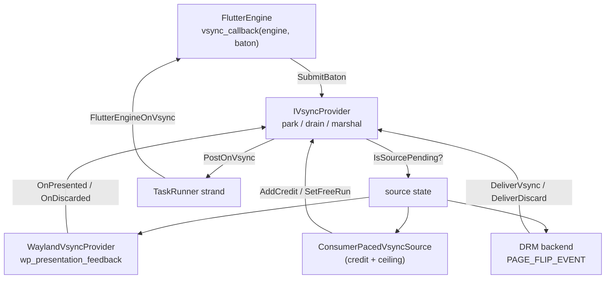

# vsync/

The backend-spanning vsync baton machinery. Flutter hands the embedder an
opaque `baton` via its `vsync_callback` and expects exactly one
`FlutterEngineOnVsync(baton)` back, marshaled onto the platform task runner.
The park/drain/marshal dance is identical across backends; only the *source*
of the vblank signal differs (a Wayland `wp_presentation.presented` event, a
DRM `PAGE_FLIP_EVENT`, or a software page-flip). This directory holds the
shared baton class and the per-source providers.

---

## Features

| Capability | Status | Toggle / scope |
|---|---|---|
| `IVsyncProvider` — baton park/drain/marshal machinery | ✓ | Always compiled |
| Cold-start safety (parked baton survives before runner is wired) | ✓ | Always |
| Frame parking (suspend production, keep engine warm) | ✓ | Always |
| Discard + parked-baton delivery (wall-clock fallback) | ✓ | Always |
| Per-present cadence profiling (window + session summary) | ✓ | `IVI_VSYNC_PROFILE` |
| `WaylandVsyncProvider` — `wp_presentation` → `OnVsync` | ✓ | `-DBUILD_BACKEND_WAYLAND_EGL=ON` or `-DBUILD_BACKEND_WAYLAND_VULKAN=ON` |
| `ConsumerPacedVsyncSource` — backpressure / credit-based pacing | ✓ | Always compiled (used by `headless-egl`) |
| Motion-to-photon hookup on `OnPresented` | ✓ | `IVI_M2P_PROFILE` (or `IVI_PROFILE`) |

---

## Architecture

The Flutter engine's vsync callback is a trampoline — it parks the baton in
the provider and returns. The provider then decides when to hand it back:

- **`IsSourcePending()` true** (a present is already in flight) → wait for the
  source's completion event.
- **`IsSourcePending()` false** (idle pipeline) → drain inline, on the wall
  clock, so Flutter is never stalled.

`DeliverVsync(frame_start_ns)` / `DeliverDiscard()` are called by the source
when a frame is actually presented or dropped. `PostOnVsync` posts
`FlutterEngineOnVsync` onto the platform runner — Flutter rejects it from any
other thread.

### Module responsibilities

- **`IVsyncProvider`** ([ivsync_provider.{h,cc}](ivsync_provider.h)) — the
  baton machinery. State is lock-free atomics; the platform-runner strand is
  the only place `FlutterEngineOnVsync` is called. Sources can either subclass
  (override `IsSourcePending` / `PeriodNs`) or drive the composition path
  (`SetSourcePending` / `SetPeriodNs`).
- **`WaylandVsyncProvider`**
  ([wayland_vsync_provider.{h,cc}](wayland_vsync_provider.h)) — owns
  `wp_presentation`, turns its per-commit `wp_presentation_feedback.presented`
  events into `OnVsync` calls. Presentation feedback corresponds to the
  `wl_surface.commit` made by either the EGL (`eglSwapBuffers`) or Vulkan
  rendering path. One `WpFeedbackHandler` per commit; in-flight feedback
  objects are destroyed race-safely with `Stop()`.
- **`ConsumerPacedVsyncSource`**
  ([consumer_paced_vsync.{h,cc}](consumer_paced_vsync.h)) — drives vsync from
  downstream consumer completion instead of a wall clock. A **credit** is one
  free slot in the producer's pipeline; delivering a baton commits a slot,
  `AddCredit` returns one. An optional `min_period_ns` caps the rate so a fast
  consumer cannot free-run the engine. Used today by the headless-EGL GLES
  encoder; a Vulkan encoder can drive it unchanged.

### Threading model

- **Source thread** (Wayland event thread, DRM page-flip reader thread,
  encoder consumer thread) — calls `DeliverVsync` / `DeliverDiscard` /
  `AddCredit`.
- **Platform task-runner thread** — the only place `FlutterEngineOnVsync` is
  invoked. `PostOnVsync` posts there via the runner's strand.
- **Any thread** — `SubmitBaton`, `AddCredit`, `SetFreeRun`, `SetParked`.
  State is lock-free atomics; `SubmitBaton` and `SetParked` update atomics on
  the caller's thread, and only the callback delivery (`PostOnVsync`) is
  posted. `ConsumerPacedVsyncSource` additionally posts its mutable
  scheduling state (credits, ceiling timer) to the strand.

---

## Build steps

### Configure + build

`IVsyncProvider` and `ConsumerPacedVsyncSource` are always compiled. The
Wayland provider is gated:

| Source | Gate |
|--------|------|
| `vsync/ivsync_provider.cc`, `vsync/consumer_paced_vsync.cc` | Always |
| `vsync/wayland_vsync_provider.cc` | `BUILD_BACKEND_WAYLAND_EGL` or `BUILD_BACKEND_WAYLAND_VULKAN` |

### Dependencies

- **wayland-cxx-scanner** — generated `presentation_time::client` bindings.
- **Asio** — `steady_timer` for the ceiling timer in
  `ConsumerPacedVsyncSource`.

---

## Running

### Vsync sources and completion signals

| Source | Completion / pacing signal |
|--------|----------------------------|
| `WaylandVsyncProvider` | `OnPresented` fires when the compositor's `wp_presentation_feedback.presented` event arrives. |
| DRM page-flip | `DeliverVsync` is called when the kernel delivers `PAGE_FLIP_EVENT` on the card fd. |
| Software page-flip | `DeliverVsync` is called when the sink's page-flip completes. |
| `ConsumerPacedVsyncSource` | A parked baton becomes deliverable when the consumer releases a frame slot (`AddCredit`); no present is recorded. |

### Vsync profiling

`IVI_VSYNC_PROFILE=1` enables per-present cadence diagnostics. A window
summary is logged every 60 presents and a session summary on `Stop()`. The
label tags the log lines (e.g. `[DrmVsync]`, `[WaylandVsync]`,
`[SoftwareVsync]`).

### Motion-to-photon

When `IVI_M2P_PROFILE=1` (or `IVI_PROFILE=1`), `OnPresented` feeds the
motion-to-photon profiler with the real present timestamp. The cutoff
(`frame_start_time`) is stamped at baton delivery and read back by the
profiler to attribute inputs to the frame that consumed them.

### Parking

`SetParked(true)` stops frame production without tearing down the engine.
The baton is simply not handed back — Flutter asked for a vsync and gets no
answer, so it builds no frame and the whole pipeline (UI thread, rasterizer,
GPU, scanout) goes quiet. This is what a view whose display was unplugged
should do. `SetParked(false)` unparks and delivers any parked baton.

---

## Diagnostics/Debug

- **Cold-start leak** — a baton parked before the platform runner is wired is
  *left parked* (not exchanged out and dropped); `SetEngine` drains it via a
  kick latch once the runner arrives. This is the documented fix for #210.
- **Discarded frames** — `DeliverDiscard()` counts a discard and hands the
  baton back on the wall clock so Flutter keeps scheduling. Discards are
  profiled when `IVI_VSYNC_PROFILE` is set.
- **Parked-baton kick** — `DeliverParkedBaton()` is for control-flow kicks where
  no source event will fire to return the baton (a VT resume, a post-modeset
  drain). Unlike `DeliverDiscard` it records no profile discard.
- **Consumer-paced free-run** — `SetFreeRun(true)` paces on the ceiling alone,
  ignoring credits, for when no consumer is attached. Headless EGL enables it
  from the `IVI_HEADLESS_FREERUN` env var; headless Vulkan flips it on and off
  as export consumers attach and detach. Turning it back off resets the credit
  count to the full pipeline depth.

---

## Known limitations

- `ConsumerPacedVsyncSource::SetFreeRun` resets the credit count to the full
  pipeline depth. A consumer that hitched and re-established the pool must
  start with that invariant.
- `WaylandVsyncProvider` leaves vsync unset when `wp_presentation` is not
  usable (unbound, or its announced clock is not `CLOCK_MONOTONIC`); Flutter
  then falls back to its wall-clock scheduler.

---

## References

- [`shell/vsync/ivsync_provider.h`](ivsync_provider.h) — `IVsyncProvider`
- [`shell/vsync/wayland_vsync_provider.h`](wayland_vsync_provider.h) —
  `WaylandVsyncProvider`
- [`shell/vsync/consumer_paced_vsync.h`](consumer_paced_vsync.h) —
  `ConsumerPacedVsyncSource`
- [`shell/profiling/README.md`](../profiling/README.md) —
  `FrameProfile` + `MotionToPhoton`
- [`shell/task_runner.h`](../task_runner.h) — the platform runner that
  `FlutterEngineOnVsync` is marshaled onto
