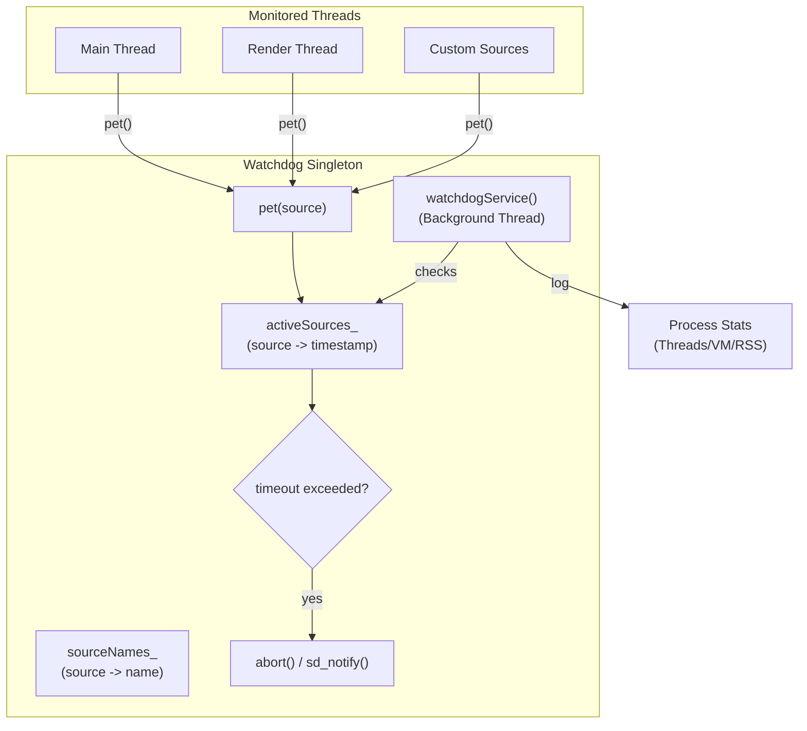

# Watchdog

The Watchdog is a failure-detection subsystem that monitors the health of critical execution threads. It ensures that the embedder remains responsive by triggering a process `abort()`—producing a core dump for triage—if any monitored source fails to "pet" the watchdog within a configured timeout interval.

## Features

| Capability | Status | Toggle / scope |
|---|---|---|
| Enable Watchdog | Optional | `BUILD_WATCHDOG=ON` |
| Main thread monitoring | Built-in | |
| Render thread monitoring | Built-in | |
| Custom source monitoring | Built-in | `start()`/`pet()` |
| Configurable timeout | Built-in | `[watchdog].timeout_ms` in `config.toml` |
| Source name mapping | Built-in | `[watchdog.source_names]` in `config.toml` or `sourceSetName()` |
| systemd integration | Optional | `BUILD_SYSTEMD_WATCHDOG=ON` |
| Process health logging | Built-in | Logs threads/memory on every check |

---

## Architecture



The Watchdog operates as a singleton service that manages a set of active timers.

- **Monitoring Mechanism**: Each monitored source is identified by a `WatchdogSource` (integer). When a source is `start()`ed, a timestamp is recorded in `activeSources_`. The source must periodically call `pet()` to reset its timestamp.
- **The Watchdog Service**: A dedicated background thread runs a loop that wakes up every half-interval (via `select()`). It iterates through all `activeSources_` and calculates the elapsed time since the last pet.
- **Timeout Action**: If the elapsed time exceeds the `intervalMs_`, the watchdog logs a fatal error and calls `abort()`. If systemd integration is enabled, it also sends `WATCHDOG=trigger` via `sd_notify`.
- **Health Telemetry**: On every service wake-up, the watchdog gathers and logs current process statistics (thread count, virtual memory, and resident set size) using the `Stats` utility to provide context in the logs leading up to a potential hang.

### File map

| Path | Role |
|------|------|
| [`watchdog.h`](watchdog.h) | Singleton interface, `WatchdogSource` definitions, and service configuration. |
| [`watchdog.cc`](watchdog.cc) | Service implementation: timer management, `watchdogService` loop, and systemd integration. |
| [`stats.h`](stats.h) | Definition of `ProcessStats` and the `getSelfStats` gathering utility. |
| [`stats.cc`](stats.cc) | Implementation of process stat gathering via `/proc/self/stat`. |

### Threading model

- **Caller Threads**: `start()`, `pet()`, and `stop()` are thread-safe and can be called from any monitored thread (Main, Render, etc.). They use a `std::mutex` to protect the shared source maps.
- **Watchdog Thread**: A single background thread manages the timeout checks and health logging. It is independent of the threads it monitors, ensuring it can detect hangs in the main or render loops.

---

## Build steps

### Dependencies

- **systemd** (optional) — Required for systemd watchdog integration (`libsystemd`).

### Configure + build

The watchdog is gated by CMake options:

- `-DBUILD_WATCHDOG=ON`: Enables the core watchdog subsystem.
- `-DBUILD_SYSTEMD_WATCHDOG=ON`: Enables integration with the systemd watchdog daemon.

### Build matrix

| Config | CMake flags | Effect |
|--------|-------------|--------|
| Standalone | `BUILD_WATCHDOG=ON` | Internal timer-based watchdog; `abort()` on timeout. |
| systemd | `BUILD_SYSTEMD_WATCHDOG=ON` | Syncs interval with systemd; uses `sd_notify` for health and triggers. |

---

## Running

The watchdog is initialized at startup in `main.cc` and runs automatically if compiled in.

### Config.toml

The watchdog is configured via the `[watchdog]` table:

- **`timeout_ms`**: The timeout interval in milliseconds. Defaults to `5000` (5s).
  - *Note*: If `BUILD_SYSTEMD_WATCHDOG=ON` and the systemd daemon provides an interval, the systemd value takes precedence.
- **`[watchdog.source_names]`**: A table mapping source IDs to human-readable names for better log clarity.
  - Example: `"-1" = "Main Thread"`

### Logs

The watchdog logs the following to the shell log:
- **Debug**: Timeout settings, source naming, and periodic process health (Threads, VIRT, RES).
- **Trace**: Pet events and source start/stop actions.
- **Error**: Fatal timeout events, including the name of the source that hung.

---

## Diagnostics/Debug

The purpose of these diagnostics is to verify the long-term stability
of the homescreen system under extreme resource contention.
These tests ensure that the watchdog mechanisms can correctly detect
system hangs or unresponsive threads and that the integration with
`systemd` properly manages service health.

This testing procedure validates the following components under stress:
- **Flutter Engine**: Responsiveness of the main thread and UI rendering.
- **GPU Rendering**: Stability of the rendering backend and frame delivery.
- **Watchdog Subsystem**: Correctness of timeout detection
  and recovery triggers.
- **`systemd` Integration**: Reliable delivery of keep-alive pings
  (`sd_notify`).

### Environment Setup

This test is designed to run on a Ubuntu/Debian system with Wayland and SystemD installed.
In the case of their absence the test will proceed using the `software` rendering backend
and a mock SystemD-socket to simulate the `sd_notify` behavior, but a full installation
is recommended for accurate results.

**Package Dependencies**:
Install the following packages to support the build and stress testing:
```bash
sudo apt update && sudo apt upgrade
sudo apt install --no-install-recommends rpd-wayland-core

# Required tools and libraries
sudo apt-get install \
     stress-ng btop \
     build-essential cmake ninja-build pkg-config \
     git curl wget unzip python3 python3-pip \
     libwayland-dev wayland-protocols \
     mesa-common-dev libegl1-mesa-dev libgles2-mesa-dev \
     libdrm-dev libgbm-dev libinput-dev libudev-dev libseat-dev \
     libpugixml-dev libcurl4-openssl-dev \
     libxkbcommon-dev libsystemd-dev libdbus-1-dev
```

Make sure `emb_cli` and Flutter SDK are installed and configured in your environment.

### Test Configuration

Ensure the project is built with watchdog support enabled:
- `BUILD_WATCHDOG=ON`
- `BUILD_SYSTEMD_WATCHDOG=ON`

#### Stress Parameters
To simulate a high-load scenario, the following `stress-ng` parameters are recommended:
- **CPU**: Full load on all available cores.
- **Memory**: 2 virtual memory workers with 256MB allocation each to
  create memory pressure.
- **I/O**: 2 I/O stress workers to create disk contention.
- **Duration**: 8 hours (43,200 seconds) for stability validation.

#### Watchdog Settings
- **Timeout (`WATCHDOG_MS`)**: set this according to your preference -
the default is 5000ms (5 seconds).

For long-duration tests, a longer timeout (e.g., 100000ms) is recommended
to avoid false positives due to temporary load spikes.

#### Test Application
The `stopwatch_stress_test` Flutter application is used to exercise the system:
- **GPU Stimulation**: Continuous animation of UI elements
  (e.g., `CircularProgressIndicator`) to exercise the GPU through Wayland EGL.
- **Heartbeat**: The application writes per-minute uptime files to verify that
  the main thread remains responsive.
- **Visual Sanity**: The running stopwatch allows for intermittent
  human observation to ensure the UI hasn't frozen.

### Execution Guide
Execute the integration script with the desired stress parameters:

```bash
# Set test duration to 8 hours
export STRESS_SECS=28800 
# Use all available CPU cores
export STRESS_CPU=$(nproc) 
# Set watchdog timeout to 100 seconds
export WATCHDOG_MS=100000

./scripts/stress_watchdog_integration.sh
```

#### Monitoring
It is highly recommended to run `btop` in a separate terminal window
during the test to monitor CPU, memory, and temperature in real-time.

### Verification & Success Criteria

A test run is considered **PASSED** only if all the following conditions are met:

| Check | Requirement | Verification Method |
|-------|-------------|-----------------------|
| **Application Startup** | App must start successfully | Search for `STOPWATCH_STRESS_START` in logs |
| **Watchdog Survival** | Watchdog must not trigger | Exit code must NOT be `134` (SIGABRT) or `6` |
| **Uptime Integrity** | Main thread must remain responsive | $\ge 1$ valid `uptime_seconds=N` entry per minute in `uptime.txt` |
| **`sd_notify` Delivery** | Keep-alives must be sustained | `WATCHDOG=1` messages received by the notify socket |

#### Post-Run Analysis
After the script completes, perform the following checks:

**1. Check Exit Code**:
```bash
echo $?  # 0 = PASS, non-zero = FAIL
```

**2. Verify Uptime File Completeness**:
Count the entries to ensure they match the expected duration (e.g., 480 entries for 8 hours):
```bash
wc -l /path/to/uptime.txt
```

**3. Detect Gaps in Responsiveness**:
Use the following command to find any minutes where the heartbeat was missed:
```bash
cat /path/to/uptime.txt | awk -F= '{print $2}' | sort -n | uniq -c
```

### Test Reliability Considerations & Best Practices

- **Thermal Management**: Extended stress tests can lead to significant heat buildup.
  Monitor CPU/GPU temperatures via `btop`. If thermal throttling is detected, it may
  affect timing and trigger false-positive watchdog timeouts.
  Consider adding active cooling for long-duration tests.

- **Memory Leak Detection**: While the watchdog detects hangs, it does not necessarily
  detect slow memory leaks. It is recommended to monitor the resident set size (RSS)
  of the homescreen process over the 12-hour window to ensure memory usage remains stable.

- **Storage Health**: The test performs continuous writes to the storage medium
  to verify the heartbeat. Frequent, sustained writes can accelerate storage
  wear-out. For repeated long-term testing, use a resilient storage medium.

---

## Known limitations

- **No granular recovery**: The watchdog is designed for fail-fast behavior via
  `abort()`. It cannot restart the hung thread; it can only terminate the process to allow the system manager (e.g., systemd) to restart the application. There is no mechanism to "reset" only a specific hung subsystem without restarting the entire embedder.
- **Symmetric wake-up**: The service wakes up every `intervalMs / 2`. While this
  ensures a timely check, it is a fixed cadence regardless of the number of active sources.

---

## References

- [`shell/platform/homescreen/watchdog_plugin.h`](../platform/homescreen/watchdog_plugin.h) — the Flutter plugin interface for the watchdog.
- [`shell/configuration`](../configuration/README.md) — details on the configuration loader.
- [`systemd.notify` man page](https://man7.org/linux/man-pages/man3/sd_notify.3.html) — documentation for the `sd_notify` API used in systemd integration.
