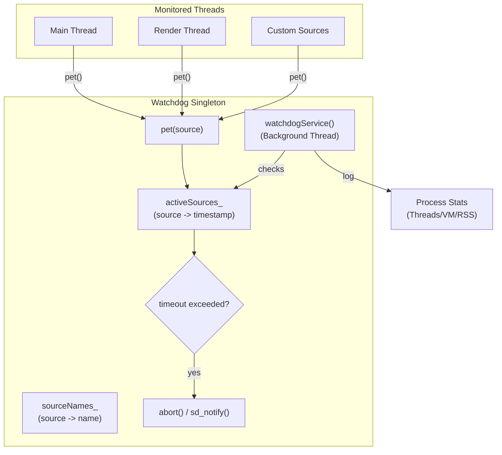

# Watchdog

The Watchdog is a failure-detection subsystem that monitors the health of critical execution threads. It ensures that the embedder remains responsive by triggering a process `abort()`—producing a core dump for triage—if any monitored source fails to "pet" the watchdog within a configured timeout interval.

## Features

| Capability | Status | Toggle / scope |
|---|---|---|
| Enable Watchdog | Optional | `BUILD_WATCHDOG=ON` |
| Main thread monitoring | Built-in | |
| Render thread monitoring | Built-in | |
| Custom source monitoring | Built-in | `start()`/`pet()` |
| Configurable timeout | Built-in | `[watchdog].timeout_ms` in `config.toml` |
| Source name mapping | Built-in | `[watchdog.source_names]` in `config.toml` or `sourceSetName()` |
| systemd integration | Optional | `BUILD_SYSTEMD_WATCHDOG=ON` |
| Process health logging | Built-in | Logs threads/memory on every check |

---

## Architecture

The Watchdog operates as a singleton service that manages a set of active timers.

- **Monitoring Mechanism**: Each monitored source is identified by a `WatchdogSource` (integer). When a source is `start()`ed, a timestamp is recorded in `activeSources_`. The source must periodically call `pet()` to reset its timestamp.
- **The Watchdog Service**: A dedicated background thread runs a loop that wakes up every half-interval (via `select()`). It iterates through all `activeSources_` and calculates the elapsed time since the last pet.
- **Timeout Action**: If the elapsed time exceeds the `intervalMs_`, the watchdog logs a fatal error and calls `abort()`. If systemd integration is enabled, it also sends `WATCHDOG=trigger` via `sd_notify`.
- **Health Telemetry**: On every service wake-up, the watchdog gathers and logs current process statistics (thread count, virtual memory, and resident set size) using the `Stats` utility to provide context in the logs leading up to a potential hang.

### File map

| Path | Role |
|------|------|
| [`watchdog.h`](watchdog.h) | Singleton interface, `WatchdogSource` definitions, and service configuration. |
| [`watchdog.cc`](watchdog.cc) | Service implementation: timer management, `watchdogService` loop, and systemd integration. |
| [`stats.h`](stats.h) | Definition of `ProcessStats` and the `getSelfStats` gathering utility. |
| [`stats.cc`](stats.cc) | Implementation of process stat gathering via `/proc/self/stat`. |

### Threading model

- **Caller Threads**: `start()`, `pet()`, and `stop()` are thread-safe and can be called from any monitored thread (Main, Render, etc.). They use a `std::mutex` to protect the shared source maps.
- **Watchdog Thread**: A single background thread manages the timeout checks and health logging. It is independent of the threads it monitors, ensuring it can detect hangs in the main or render loops.

---

## Build steps

### Dependencies

- **systemd** (optional) — Required for systemd watchdog integration (`libsystemd`).

### Configure + build

The watchdog is gated by CMake options:

- `-DBUILD_WATCHDOG=ON`: Enables the core watchdog subsystem.
- `-DBUILD_SYSTEMD_WATCHDOG=ON`: Enables integration with the systemd watchdog daemon.

### Build matrix

| Config | CMake flags | Effect |
|--------|-------------|--------|
| Standalone | `BUILD_WATCHDOG=ON` | Internal timer-based watchdog; `abort()` on timeout. |
| systemd | `BUILD_SYSTEMD_WATCHDOG=ON` | Syncs interval with systemd; uses `sd_notify` for health and triggers. |

---

## Running

The watchdog is initialized at startup in `main.cc` and runs automatically if compiled in.

### Config.toml

The watchdog is configured via the `[watchdog]` table:

- **`timeout_ms`**: The timeout interval in milliseconds. Defaults to `5000` (5s).
  - *Note*: If `BUILD_SYSTEMD_WATCHDOG=ON` and the systemd daemon provides an interval, the systemd value takes precedence.
- **`[watchdog.source_names]`**: A table mapping source IDs to human-readable names for better log clarity.
  - Example: `"-1" = "Main Thread"`

### Logs

The watchdog logs the following to the shell log:
- **Debug**: Timeout settings, source naming, and periodic process health (Threads, VIRT, RES).
- **Trace**: Pet events and source start/stop actions.
- **Error**: Fatal timeout events, including the name of the source that hung.

---

# Diagnostics

TODO

---

## Known limitations

- **No granular recovery**: The watchdog is designed for fail-fast behavior via
  `abort()`. It cannot restart the hung thread; it can only terminate the process to allow the system manager (e.g., systemd) to restart the application. There is no mechanism to "reset" only a specific hung subsystem without restarting the entire embedder.
- **Symmetric wake-up**: The service wakes up every `intervalMs / 2`. While this
  ensures a timely check, it is a fixed cadence regardless of the number of active sources.

---

## References

- [`shell/platform/homescreen/watchdog_plugin.h`](../platform/homescreen/watchdog_plugin.h) — the Flutter plugin interface for the watchdog.
- [`shell/configuration`](../configuration/README.md) — details on the configuration loader.
- [`systemd.notify` man page](https://man7.org/linux/man-pages/man3/sd_notify.3.html) — documentation for the `sd_notify` API used in systemd integration.
